# C语言笔记

## 1. C语言概述

### 1.1 C语言

​	一提到语言这个词语，自然会想到的是像英语、汉语等这样的自然语言，因为它是人和人交换信息不可缺少的工具。

而今天计算机遍布了我们生活的每一个角落，除了人和人的相互交流之外，我们必须和计算机角落。

用什么的什么样的方式和计算机做最直接的交流呢？人们自然想到的是最古老也最方便的方式——语言，而C语言就是人和计算机交流的一种语言。

语言是用来交流沟通的。有一方说，有另一方听，必须有两方参与，这是语言最重要的功能：

>  说的一方传递信息，听的一方接收信息；

> 说的一方下达指令，听的一方遵循命令做事情。

<font color="red">语言是人和人交流，C语言是人和机器交流</font>。只是，人可以不听另外一个人，但是，计算机是无条件服从。

语言有独特的语法规则和定义，双方必须遵循这些规则和定义才能实现真正的交流。

#### 1.1.1  计算机结构组成


### 1.2 为什么学C语言

#### 1.2.1 C语言特点

- 优点
  - 代码量小
  - 执行速度快
  - 功能强大
  - 编程自由
- 缺点
  - 写代码实现周期长
  - 可移植性较差
  - 过于自由，经验不足易出错
  - 对平台库依赖较多 

#### 1.2.2 学习C语言理由


#### 1.2.3 C语言应用领域

C语言的应用极其广泛，从网站后台，到底层操作系统，从多媒体应用到大型网络游戏，均可使用C语言来开发：

- C语言可以写网站后台程序

- C语言可以专门针对某个主题写出功能强大的程序库

- C语言可以写出大型游戏的引擎

- C语言可以写出另一个语言来

- C语言可以写操作系统和驱动程序，并且只能用C语言编写

- 任何设备只要配置了微处理器，就都支持C语言。从微波炉到手机，都是由C语言技术来推动的


#### 1.2.4 C语言关键字

> C语言仅有32个关键字，9种控制语句，34种运算符，却能完成无数的功能：


### 1.3 第一个C语言程序：HelloWorld

#### 1.3.1 编写C语言代码：hello.c

```c
#include <stdio.h>

int main(){
	// 第一个C语言程序
	printf("hello world\n");
	return 0;
}
```

> C语言的源代码文件是一个普通的文本文件，<font color="red">但扩展名必须是.c</font>


#### 1.3.2 通过gcc编译C代码

 ##### 1. gcc编译器介绍

编辑器(如vi、记事本)是指我用它来写程序的（编辑代码），而我们写的代码语句，电脑是不懂的，我们需要把它转成电脑能懂的语句，编译器就是这样的转化工具。就是说，<font color="red">我们用编辑器编写程序，由编译器编译后才可以运行！</font>

编译器是将易于编写、阅读和维护的高级计算机语言翻译为计算机能解读、运行的低级机器语言的程序

gcc（GNU Compiler Collection，GNU 编译器套件），是由 GNU 开发的编程语言编译器。gcc原本作为GNU操作系统的官方编译器，现已被大多数类Unix操作系统（如Linux、BSD、Mac OS X等）采纳为标准的编译器，gcc同样适用于微软的Windows

gcc最初用于编译C语言，随着项目的发展gcc已经成为了能够编译C、C++、Java、Ada、fortran、Object C、Object C++、Go语言的编译器大家族

编译命令格式：

```cmd
gcc [-option1] ... <filename>
g++ [-option1] ... <filename>
```

- 命令、选项和源文件之间使用空格分隔

- 一行命令中可以有零个、一个或多个选项

- 文件名可以包含文件的绝对路径，也可以使用相对路径

- 如果命令中不包含输出可执行文件的文件名，可执行文件的文件名会自动生成一个默认名，Linux平台为`a.out`，Windows平台为`a.exe`

gcc、g++编译常用选项说明：

| **选项** | **含义**                   |
| -------- | -------------------------- |
| -o file  | 指定生成的输出文件名为file |
| -E       | 只进行预处理               |
| -S(大写) | 只进行预处理和编译         |
| -c(小写) | 只进行预处理、编译和汇编   |

##### 2. Windows平台下gcc环境配置

> windows命令行界面下，默认是没有gcc编译器，我们需要配置一下环境
>
> `MinGW`, 安装使用教程参看：[MinGW安装教程](https://blog.csdn.net/wxh0000mm/article/details/100666329)

##### 3. linux平台下gcc环境配置

> 参考教程：[详解Linux安装GCC方法](https://blog.csdn.net/lydong_/article/details/79812402)

#### 1.3.3 代码分析

```php
#include <stdio.h>

/*
#include的意思是头文件包含,
#include <stdio.h>代表包含stdio.h这个头文件

使用C语言库函数需要提前包含库函数对应的头文件，如这里使用了printf()函数，需要包含stdio.h头文件
*/

int main(){
	// 第一个C语言程序
	printf("hello world\n"); // 可以通过man 3 printf查看printf所需的头文件
	return 0;
}
```

##### 1. include头文件包含

- `#include< >` 与 `#include ""`的区别：

- `< >` 表示系统<font color="red">直接</font>按系统指定的目录检索

- `" "` 表示系统<font color="red">先</font>在` " " `指定的路径(没写路径代表当前路径)查找头文件，如果找不到，<font color="red">再</font>按系统指定的目录检索

`stdio.h` 在操作系统`/usr/include/`目录下


##### 2. main函数

- 一个完整的C语言程序，是由一个、<font color="red">且只能有一个</font>`main()`函数(又称主函数，必须有)和若干个其他函数结合而成（可选）
- `main`函数是C语言程序的入口，程序是从main函数开始执行

##### 3. {} 括号，程序体和代码块

- `{}`叫代码块，一个代码块内部可以有一条或者多条语句
- C语言每句可执行代码都是"`;`"分号结尾
- 所有的`#`开头的行，都代表预编译指令，预编译指令行结尾是没有分号的
- 所有的可执行语句必须是在代码块里面

##### 4.  注释

- `//`叫行注释，注释的内容编译器是忽略的，注释主要的作用是在代码中加一些说明和解释，这样有利于代码的阅读
- `/**/`叫块注释
- 块注释是C语言标准的注释方法
- 行注释是从C++语言借鉴过来的

##### 5. printf函数

- `printf`是C语言库函数，功能是向标准输出设备输出一个字符串

- `printf(“hello world\n”);` //`\n`的意思是回车换行

##### 6.  return语句

- `return` 代表函数执行完毕，返回return代表函数的终止

- 如果main定义的时候前面是`int`，那么return后面就需要写一个整数；如果main定义的时候前面是`void`，那么return后面什么也不需要写

- 在main函数中`return 0`代表程序执行成功，`return -1`代表程序执行失败

- `int main()`和`void main()`在C语言中是一样的，但C++只接受`int main`这种定义方式

### 1.4 system函数

#### 1.4.1 system函数的使用

```php
#include <stdlib.h>

int system(const char *command);
```

> 功能：在已经运行的程序中执行另外一个外部程序
> 参数：外部可执行程序名字
> 返回值：
> 成功：0
> 失败：任意数字

```c
#include <stdio.h>
#include <stdlib.h>

int main()
{
	//system("calc"); //windows平台
	system("ls"); //Linux平台, 需要头文件#include <stdlib.h>

	return 0;
}

```


### 1.5 C语言编译过程

#### 1.5.1 C程序编译步骤

> C代码编译成可执行程序经过4步：

1. 预处理：宏定义展开、头文件展开、条件编译等，同时将代码中的注释删除，这里并不会检查语法
2. 编译：检查语法，将预处理后文件编译生成汇编文件
3. 汇编：将汇编文件生成目标文件(二进制文件)
4. 链接：C语言写的程序是需要依赖各种库的，所以编译之后还需要把库链接到最终的可执行程序中去


> VS 执行结果一闪而过的解决方法：

1. `system("pause");`

2. `项目->属性->配置属性->链接器->系统->子系统->控制台 增加“/SUBSYSTEM:CONSOLE”链接选项即可`

#### 1.5.2 gcc 编译过程

##### 1. 分步编译

> 预处理：`gcc -E introduce.c -o introduce.i`

> 编 译：`gcc -S introduce.i -o introduce.s`

> 汇 编：`gcc -c introduce.s -o introduce.o`

> 链 接：`gcc  introduce.o -o introduce`

| **选项** | **含义**                    |
| -------- | --------------------------- |
| -E       | 只进行预处理                |
| -S(大写) | 只进行预处理和编译          |
| -c(小写) | 只进行预处理、编译和汇编    |
| -o file  | 指定生成的输出文件名为 file |

 

| **文件后缀** | **含义**              |
| ------------ | --------------------- |
| .c           | C 语言文件            |
| .i           | 预处理后的 C 语言文件 |
| .s           | 编译后的汇编文件      |
| .o           | 编译后的目标文件      |

编译的时候最后两倒数第二步的时候用了大写`C`

`gcc -C introduce.s -o introduce.o`

`gcc introduce.o -o introduce`

导致了如下问题， 记录一下

/usr/bin/ld: /usr/lib/gcc/x86_64-linux-gnu/8/../../../x86_64-linux-gnu/Scrt1.o: in function `_start':
(.text+0x20): undefined reference to `main'
collect2: error: ld returned 1 exit status


正确的编译过程

```bash
gcc -E introduce.c -o introduce.i
gcc -S introduce.i -o introduce.s
gcc -c introduce.s -o introduce.o
gcc introduce.o -o introduce
./introduce 
```


##### 2. 一步编译

`gcc introduce.c -o introduce1` // 自动完成：预处理、编译、汇编、链接的过程


#### 1.5.3  查找程序所依赖的动态库

Windows平台下，需要相应软件(`Depends.exe`)：

> 工具下载地址：http://www.dependencywalker.com/


### 1.6 CPU内部结构与寄存器(了解)

#### 1.6.1 64位和32位系统区别

- 寄存器是CPU内部最基本的存储单元
- CPU对外是通过总线(地址、控制、数据)来和外部设备交互的，<font color="red">总线的宽度是8位，同时CPU的寄存器也是8位</font>，那么这个CPU就叫8位CPU

- 如果总线是32位，寄存器也是32位的，那么这个CPU就是32位CPU
- 有一种CPU内部的寄存器是32位的，但总线是16位，准32为CPU
- 所有的64位CPU兼容32位的指令，32位要兼容16位的指令，所以在64位的CPU上是可以识别32位的指令
- 在64位的CPU构架上运行了64位的软件操作系统，那么这个系统是64位
- 在64位的CPU构架上，运行了32位的软件操作系统，那么这个系统就是32位
- 64位的软件不能运行在32位的CPU之上

#### 1.6.2 寄存器名字(了解)

| **8**位 | **16**位 | **32**位 | **64**位 |
| ------- | -------- | -------- | -------- |
| A       | AX       | EAX      | RAX      |
| B       | BX       | EBX      | RBX      |
| C       | CX       | ECX      | RCX      |
| D       | DX       | EDX      | RDX      |

#### 1.6.3 寄存器、缓存、内存三者关系

按与CPU远近来分，离得最近的是寄存器，然后缓存(CPU缓存)，最后内存。

CPU计算时，先预先把要用的数据从硬盘读到内存，然后再把即将要用的数据读到寄存器。于是 CPU<--->寄存器<--->内存，这就是它们之间的信息交换。

那为什么有缓存呢？因为如果经常操作内存中的同一址地的数据，就会影响速度。于是就在寄存器与内存之间设置一个缓存。

因为从存提取的速度远高于内存。当然缓存的价格肯定远远高于内存，不然的话，机器里就没有内存的存在。

由此可以看出，从远近来看：<font color="red">CPU〈---〉寄存器〈---> 缓存 <---> 内存</font>

### 1.7 汇编语言

#### 1.7.1 VS中C语言嵌套汇编代码(了解)

```c
#include <stdio.h>

int main()
{
	//定义整型变量a, b, c
	int a;
	int b;
	int c;

	__asm
	{
		mov a, 3	//3的值放在a对应内存的位置
		mov b, 4	//4的值放在b对应内存的位置
		mov eax, a	//把a内存的值放在eax寄存器
		add eax, b	//eax和b相加，结果放在eax
		mov c, eax	//eax的值放在c中
	}
	
	printf("%d\n",  c);//把c的值输出

	return 0;//成功完成
}
```

#### 1.7.2 VS反编译

```c
#include <stdio.h>

int main()
{
	//定义整型变量a, b, c
	int a;
	int b;
	int c;

	a = 3;
	b = 4;
	c = a + b;
	
	printf("%d\n",  c);//把c的值输出

	return 0;//成功完成
}
```

### 1.8 集成开发环境IDE

集成开发环境（IDE，Integrated Development Environment ）是用于提供程序开发环境的应用程序，<font color="red">一般包括代码编辑器、编译器、调试器和图形用户界面工具</font>。集成了代码编写功能、分析功能、编译功能、调试功能等一体化的开发软件服务套。所有具备这一特性的软件或者软件套（组）都可以叫集成开发环境。

#### 1.8.1 Qt Creator

Qt Creator是跨平台的 Qt IDE， Qt Creator 是 Qt 被 Nokia 收购后推出的一款新的轻量级集成开发环境（IDE）。此 IDE 能够跨平台运行，支持的系统包括 Linux（32 位及 64 位）、Mac OS X 以及 Windows。根据官方描述，Qt Creator 的设计目标是使开发人员能够利用 Qt 这个应用程序框架更加快速及轻易的完成开发任务。

| **快捷键**  | **含义**                   |
| ----------- | -------------------------- |
| Ctrl + i    | 自动格式化代码             |
| Ctrl + /    | 注释/取消注释              |
| Alt + Enter | 自动完成类函数定义         |
| F4          | .h 文件和对应.cpp 文件切换 |
| F9          | 设置断点                   |
| F5          | 调试运行                   |
| Ctrl + r    | 编译，但不调试运行         |

| Ctrl + b | 编译，不运行 |
| -------- | ------------ |
| F10      | next调试     |
| F11      | step调试     |

#### 1.8.2 Microsoft Visual Studio

Microsoft Visual Studio（简称VS）是美国微软公司的开发工具包系列产品。VS是一个基本完整的开发工具集，它包括了整个软件生命周期中所需要的大部分工具，如UML工具、代码管控工具、集成开发环境(IDE)等等,所写的目标代码适用于微软支持的所有平台。Visual Studio是目前最流行的Windows平台应用程序的集成开发环境。

##### 1. VS常用快捷键

| **快捷键**        | **含义**       |
| ----------------- | -------------- |
| Ctrl + k,Ctrl + f | 自动格式化代码 |
| Ctrl + k,Ctrl + c | 注释代码       |
| Ctrl + k,Ctrl + u | 取消注释代码   |
| F9                | 设置断点       |
| F5                | 调试运行       |
| Ctrl + F5         | 不调试运行     |
| Ctrl + Shift + b  | 编译，不运行   |
| F10               | next调试       |
| F11               | step调试       |

##### 2. VS2013的C4996错误

由于微软在VS2013中不建议再使用C的传统库函数scanf,strcpy,sprintf等，所以直接使用这些库函数会提示C4996错误：

VS建议采用带_s的函数，如scanf_s、strcpy_s，但这些并不是标准C函数。

要想继续使用此函数，<font color="red">需要在源文件中添加以下指令就可以避免这个错误提示</font>：

```c
#define _CRT_SECURE_NO_WARNINGS     //这个宏定义最好要放到.c文件的第一行
#pragma warning(disable:4996)	//或者使用这个

```

## 2. 数据类型

### 2.1 常量与变量

#### 2.1.1 关键字


#### 2.1.2 数据类型

> 数据类型的作用：编译器预算对象（变量）分配的内存空间大小


#### 2.1.3 常量

常量：

- 在程序运行过程中，其值不能被改变的量
- 常量一般出现在表达式或赋值语句中

| 整型常量   | 100，200，-100，0      |
| ---------- | ---------------------- |
| 实型常量   | 3.14  ， 0.125，-3.123 |
| 字符型常量 | ‘a’,‘b’,‘1’,‘\n’       |
| 字符串常量 | “a”,“ab”，“12356”      |

#### 2.1.4 变量

##### 1. 变量

- 在程序运行过程中，其值可以改变
- <font color="red">变量在使用前必须先定义，定义变量前必须有相应的数据类型</font>

标识符命名规则：

- 标识符不能是关键字
- 标识符只能由字母、数字、下划线组成
- 第一个字符必须为字母或下划线
- 标识符中字母区分大小写

变量特点：

- 变量在编译时为其分配相应的内存空间
- 可以通过其<font color="red">名字</font>和<font color="red">地址</font>>访问相应内存


##### 2. 声明和定义区别

- 声明变量不需要建立存储空间，如：`extern int a;`
- 定义变量需要建立存储空间，如：`int b;`

```c
#include <stdio.h>

int main()
{
	//extern 关键字只做声明，不能做任何定义，后面还会学习，这里先了解
	//声明一个变量a，a在这里没有建立存储空间
	extern int a;
	a = 10;	//err, 没有空间，就不可以赋值

	int b = 10;	//定义一个变量b，b的类型为int，b赋值为10

	return 0;
}
```

从广义的角度来讲声明中包含着定义，即<font color="red">定义是声明的一个特例</font>，所以并非所有的声明都是定义：

- `int b` 它既是声明，同时又是定义

- 对于 `extern b`来讲它只是声明不是定义

> 一般的情况下，把建立存储空间的声明称之为“定义”，而把不需要建立存储空间的声明称之为“声明”

#### 2.1.5 使用示例

```c
#include <stdio.h>
#define MAX 10 //声明了一个常量，名字叫MAX，值是10，常量的值一旦初始化不可改

int main()
{
	int a;	//定义了一个变量，其类型为int，名字叫a

	const int b = 10; //定义一个const常量，名为叫b，值为10
	//b = 11; //err,常量的值不能改变

	//MAX = 100;	//err,常量的值不能改变

	a = MAX;//将abc的值设置为MAX的值
	a = 123;

	printf("%d\n", a); //打印变量a的值

	return 0;
}
```

### 2.2 整数：int

#### 2.2.1 整型变量的定义和输出

| **打印格式** | **含义**                                               |
| ------------ | ------------------------------------------------------ |
| %d           | 输出一个<font color="red">有符号</font>的10进制int类型 |
| %o(字母o)    | 输出8进制的int类型                                     |
| %x           | 输出16进制的int类型，字母以小写输出                    |
| %X           | 输出16进制的int类型，字母以大写输出                    |
| %u           | 输出一个10进制的<font color="red">无符号</font>数      |

```c
#include <stdio.h>

int main()
{
	int a = 123;	//定义变量a，以10进制方式赋值为123
	int b = 0567;	//定义变量b，以8进制方式赋值为0567
	int c = 0xabc;	//定义变量c，以16进制方式赋值为0xabc

	printf("a = %d\n", a);
	printf("8进制：b = %o\n", b);
	printf("10进制：b = %d\n", b);
	printf("16进制：c = %x\n", c);
	printf("16进制：c = %X\n", c);
	printf("10进制：c = %d\n", c);
	
	unsigned int d = 0xffffffff; //定义无符号int变量d，以16进制方式赋值
	printf("有符号方式打印：d = %d\n", d);
	printf("无符号方式打印：d = %u\n", d);
	return 0;
}
```


#### 2.2.2 整型变量的输入

```c
#include <stdio.h>

int main()
{
	int a;
	printf("请输入a的值：");

	//不要加"\n"
	scanf("%d", &a);
	printf("a = %d\n", a); //打印a的值
    
	return 0;
}

```

#### 2.2.3 short、int、long、long long

| **数据类型**        | **占用空间**                                    |
| ------------------- | ----------------------------------------------- |
| short(短整型)       | 2字节                                           |
| int(整型)           | 4字节                                           |
| long(长整形)        | Windows为4字节，Linux为4字节(32位)，8字节(64位) |
| long long(长长整形) | 8字节                                           |

> 注意：

- 整型数据在内存中占的字节数与所选择的操作系统有关。虽然 C 语言标准中没有明确规定整型数据的长度，但 long 类型整数的长度不能短于 int 类型， short 类型整数的长度不能长于 int 类型
- <font color="red">当一个小的数据类型赋值给一个大的数据类型，不会出错，因为编译器会自动转化。但当一个大的类型赋值给一个小的数据类型，那么就可能丢失高位</font>

| **整型常量** | **所需类型** |
| ------------ | ------------ |
| 10           | 代表int类型  |
| 10l, 10L     | 代表long类型               |
| 10ll, 10LL   | 代表long long类型          |
| 10u, 10U     | 代表unsigned int类型       |
| 10ul, 10UL   | 代表unsigned long类型      |
| 10ull, 10ULL | 代表unsigned long long类型 |

 

| **打印格式**                   | **含义**                                         |
| ------------------------------ | ------------------------------------------------ |
| %hd                            | 输出short类型                                    |
| <font color="red">%d  </font>  | <font color="red">  输出int类型 </font>          |
| %ld                            | 输出long类型                                     |
| %lld                           | 输出long long类型                                |
| %hu                            | 输出unsigned short类型                           |
| <font color="red">%u</font>    | <font color="red">输出unsigned int类型  </font>  |
| <font color="red">%lu  </font> | <font color="red">输出unsigned long类</型</font> |
| %llu                           | 输出unsigned long long类型                       |

```c
#include <stdio.h>

int main()
{
	short a = 10;
	int b = 10;
	long c = 10l; //或者10L
	long long d = 10ll; //或者10LL

	printf("sizeof(a) = %u\n", sizeof(a));
	printf("sizeof(b) = %u\n", sizeof(b));
	printf("sizeof(c) = %u\n", sizeof(c));
	printf("sizeof(c) = %u\n", sizeof(d));

	printf("short a = %hd\n", a);
	printf("int b = %d\n", b);
	printf("long c = %ld\n", c);
	printf("long long d = %lld\n", d);

	unsigned short a2 = 20u;
	unsigned int b2 = 20u;
	unsigned long c2= 20ul; 
	unsigned long long d2 = 20ull; 

	printf("unsigned short a = %hu\n", a2);
	printf("unsigned int b = %u\n", b2);
	printf("unsigned long c = %lu\n", c2);
	printf("unsigned long long d = %llu\n", d2);

	return 0;
}

```

输出：

```bash
tao@Taoc:~/Desktop/C/2$ ./2.2.3 
sizeof(a) = 2
sizeof(b) = 4
sizeof(c) = 8
sizeof(c) = 8
short a = 10
int b = 10
long c = 10
long long d = 10
unsigned short a = 20
unsigned int b = 20
unsigned long c = 20
unsigned long long d = 20
```

#### 2.2.4 有符号数和无符号数区别

##### 1. 有符号数

> 有符号数是最高位为符号位，0代表正数，1代表负数

```c
#include <stdio.h>

int main()
{
	signed int a = -1089474374; //定义有符号整型变量a
	printf("%X\n", a); //结果为 BF0FF0BA

	//B    F    0    F    F    0    B	 A
	//1011 1111 0000 1111 1111 0000 1011 1010

	return 0;
}
```

> 输出： BF0FF0BA

##### 2. 无符号数

<font color="red">无符号数最高位不是符号位</font>, 而就是数的一部分，无符号数不可能是负数


```c
#include <stdio.h>

int main()
{
	unsigned int a = 3236958022; //定义无符号整型变量a
	printf("%X\n", a); //结果为 C0F00F46

	return 0;
}
```

> 当我们写程序要处理一个不可能出现负值的时候，一般用无符号数，这样可以增大数的表达最大值

##### 3. 有符号和无符号整型取值范围

| **数据类型**   | **占用空间** | **取值范围**                                        |
| -------------- | ------------ | --------------------------------------------------- |
| short          | 2字节        | -32768 到 32767 ($-2^{15}$  ~ 2$^{15}$-1)           |
| int            | 4字节        | -2147483648 到  2147483647 ($-2^{31}$ ~ $2^{31}$-1) |
| long           | 4字节        | -2147483648 到  2147483647($-2^{31}$ ~ $2^{31}$-1)  |
| unsigned short | 2字节        | 0 到 65535 (0 ~ 2$^{16}$-1)                         |
| unsigned int   | 4字节        | 0 到 4294967295 (0  ~ 2$^{32}$-1)                   |
| unsigned long  | 4字节        | 0 到 4294967295 (0  ~ 2$^{32}$-1)                   |

### 2.3 sizeof 关键字

- `sizeof`不是函数，所以不需要包含任何头文件，它的功能是<font color="red">计算一个数据类型的大小</font>，单位为字节
- `sizeof`的返回值为`size_t`
- `size_t`类型在32位操作系统下是`unsigned int`，是一个无符号的整数

```c
#include <stdio.h>

int main()
{
	int a;
	int b = sizeof(a);//sizeof得到指定值占用内存的大小，单位：字节
	printf("b = %d\n", b);

	size_t c = sizeof(a);
	printf("c = %u\n", c);//用无符号数的方式输出c的值

	return 0;
}
```

输出：

```bash
tao@Taoc:~/Desktop/C/2$ ./2.3 
b = 4
c = 4
```

### 2.4  字符型：char

#### 2.4.1 字符变量的定义和输出

字符型变量用于存储一个单一字符，在 C 语言中用 char 表示，其中每个字符变量都会占用 1 个字节。在给字符型变量赋值时，需要用一对英文半角格式的单引号(`' '`)把字符括起来

字符变量实际上并不是把该字符本身放到变量的内存单元中去，而是将该字符对应的 ASCII 编码放到变量的存储单元中。<font color="red">char的本质就是一个1字节大小的整型</font>

```c
#include <stdio.h>

int main()
{
	char ch = 'a';
	printf("sizeof(ch) = %u\n", sizeof(ch));

	printf("ch[%%c] = %c\n", ch); //打印字符
	printf("ch[%%d] = %d\n", ch); //打印‘a’ ASCII的值

	char A = 'A';
	char a = 'a';
	printf("a = %d\n", a);		//97
	printf("A = %d\n", A);	//65

	printf("A = %c\n", 'a' - 32); //小写a转大写A
	printf("a = %c\n", 'A' + 32); //大写A转小写a

	ch = ' ';
	printf("空字符：%d\n", ch); //空字符ASCII的值为32
	printf("A = %c\n", 'a' - ' '); //小写a转大写A
	printf("a = %c\n", 'A' + ' '); //大写A转小写a

	return 0;
}
```

输出结果：

```c
ao@Taoc:~/Desktop/C/2$ ./2.4.1 
sizeof(ch) = 1
ch[%c] = a
ch[%d] = 97
a = 97
A = 65
A = A
a = a
空字符：32
A = A
a = a
```

#### 2.4.2 字符变量的输入

```c
#include <stdio.h>

int main()
{
	char ch;
	printf("请输入ch的值：");

	//不要加“\n”
	scanf("%c", &ch);
	printf("ch = %c\n", ch); //打印ch的字符

	return 0;
}
```

输出：

```bash
tao@Taoc:~/Desktop/C/2$ ./2.4.2 
请输入ch的值：a
ch = a
```

#### 2.4.3 ASCII 对照表

| <font color="blue">**ASCII值**</font> | <font color="blue"> **控制字符**  </font> | <font color="blue">**ASCII值**</font> | <font color="blue"> **字符**  </font> | <font color="blue">**ASCII值**</font> | <font color="blue"> **字符**  </font> | <font color="blue">**ASCII值**</font> | <font color="blue"> **字符**  </font> |
| ------------------------------------- | ----------------------------------------- | ------------------------------------- | ------------------------------------- | ------------------------------------- | ------------------------------------- | ------------------------------------- | ------------------------------------- |
| 0                                     | NUT                                       | 32                                    | (space)                               | 64                                    | @                                     | 96                                    | 、                                    |
| 1                                     | SOH                                       | 33                                    | !                                     | 65                                    | A                                     | 97                                    | a                                     |
| 2                                     | STX                                       | 34                                    | "                                     | 66                                    | B                                     | 98                                    | b                                     |
| 3                                     | ETX                                       | 35                                    | #                                     | 67                                    | C                                     | 99                                    | c                                     |
| 4                                     | EOT                                       | 36                                    | $                                     | 68                                    | D                                     | 100                                   | d                                     |
| 5                                     | ENQ                                       | 37                                    | %                                     | 69                                    | E                                     | 101                                   | e                                     |
| 6                                     | ACK                                       | 38                                    | &                                     | 70                                    | F                                     | 102                                   | f                                     |
| 7                                     | BEL                                       | 39                                    | ,                                     | 71                                    | G                                     | 103                                   | g                                     |
| 8                                     | BS                                        | 40                                    | (                                     | 72                                    | H                                     | 104                                   | h                                     |
| 9                                     | HT                                        | 41                                    | )                                     | 73                                    | I                                     | 105                                   | i                                     |
| 10                                    | LF                                        | 42                                    | *                                     | 74                                    | J                                     | 106                                   | j                                     |
| 11                                    | VT                                        | 43                                    | +                                     | 75                                    | K                                     | 107                                   | k                                     |
| 12                                    | FF                                        | 44                                    | ,                                     | 76                                    | L                                     | 108                                   | l                                     |
| 13                                    | CR                                        | 45                                    | -                                     | 77                                    | M                                     | 109                                   | m                                     |
| 14                                    | SO                                        | 46                                    | .                                     | 78                                    | N                                     | 110                                   | n                                     |
| 15                                    | SI                                        | 47                                    | /                                     | 79                                    | O                                     | 111                                   | o                                     |
| 16                                    | DLE                                       | 48                                    | 0                                     | 80                                    | P                                     | 112                                   | p                                     |
| 17                                    | DCI                                       | 49                                    | 1                                     | 81                                    | Q                                     | 113                                   | q                                     |
| 18                                    | DC2                                       | 50                                    | 2                                     | 82                                    | R                                     | 114                                   | r                                     |
| 19                                    | DC3                                       | 51                                    | 3                                     | 83                                    | S                                     | 115                                   | s                                     |
| 20                                    | DC4                                       | 52                                    | 4                                     | 84                                    | T                                     | 116                                   | t                                     |
| 21                                    | NAK                                       | 53                                    | 5                                     | 85                                    | U                                     | 117                                   | u                                     |
| 22                                    | SYN                                       | 54                                    | 6                                     | 86                                    | V                                     | 118                                   | v                                     |
| 23                                    | TB                                        | 55                                    | 7                                     | 87                                    | W                                     | 119                                   | w                                     |
| 24                                    | CAN                                       | 56                                    | 8                                     | 88                                    | X                                     | 120                                   | x                                     |
| 25                                    | EM                                        | 57                                    | 9                                     | 89                                    | Y                                     | 121                                   | y                                     |
| 26                                    | SUB                                       | 58                                    | :                                     | 90                                    | Z                                     | 122                                   | z                                     |
| 27                                    | ESC                                       | 59                                    | ;                                     | 91                                    | [                                     | 123                                   | {                                     |
| 28                                    | FS                                        | 60                                    | <                                     | 92                                    | /                                     | 124                                   | \|                                    |
| 29                                    | GS                                        | 61                                    | =                                     | 93                                    | ]                                     | 125                                   | }                                     |
| 30                                    | RS                                        | 62                                    | >                                     | 94                                    | ^                                     | 126                                   | `                                     |
| 31                                    | US                                        | 63                                    | ?                                     | 95                                    | _                                     | 127                                   | DEL                                   |

ASCII 码大致由以下两部分组成：

- ASCII 非打印控制字符： ASCII 表上的数字 0-31 分配给了控制字符，用于控制像打印机等一些外围设备
- ASCII 打印字符：数字 32-126 分配给了能在键盘上找到的字符，当查看或打印文档时就会出现。数字 127 代表 Del 命令

#### 2.4.4 转义字符

| **转义字符**                   | **含义**                            | **ASCII****码值（十进制）** |
| ------------------------------ | ----------------------------------- | --------------------------- |
| <font color="red">\a</font>    | 警报                                | 007                         |
| <font color="red">\b  </font>  | 退格(BS) ，将当前位置移到前一列     | 008                         |
| <font color="red">\f  </font>  | 换页(FF)，将当前位置移到下页开头    | 012                         |
| <font color="red">\n  </font>  | 换行(LF) ，将当前位置移到下一行开头 | 010                         |
| <font color="red"> \r  </font> | 回车(CR) ，将当前位置移到本行开头   | 013                         |
| <font color="red">\t  </font>  | 水平制表(HT)  （跳到下一个TAB位置） | 009                         |
| <font color="red"> \v  </font> | 垂直制表(VT)                        | 011                         |
| `\\  `                         | 代表一个反斜线字符"\"               | 092                         |
| ` \'  `                        | 代表一个单引号（撇号）字符          | 039                         |
| `\" `                          | 代表一个双引号字符                  | 034                         |
| ` \?  `                        | 代表一个问号                        | 063                         |
| `\0 `                          | 数字0                               | 000                         |
| ` \ddd  `                      | 8进制转义字符，d范围0~7             | 3位8进制                    |
| `  \xhh `                      | 16进制转义字符，h范围0~9，a~f，A~F  | 3位16进制                   |

> 注意：红色字体标注的为不可打印字符

```c
#include <stdio.h>

int main()
{
	printf("abc");
	printf("\refg\n"); //\r切换到句首， \n为换行键

	printf("abc");
	printf("\befg\n");//\b为退格键， \n为换行键

	printf("%d\n", '\123');// '\123'为8进制转义字符，0123对应10进制数为83
	printf("%d\n", '\x23');// '\x23'为16进制转义字符，0x23对应10进制数为35

	return 0;
}

```

输出结果：

```bash
tao@Taoc:~/Desktop/C/2$ ./2.4.4 
efg
abefg
83
35
```

### 2.5 实型(浮点型)：float、double

实型变量也可以称为浮点型变量，浮点型变量是用来存储小数数值的。在C语言中， 浮点型变量分为两种： 单精度浮点数(`float`)、 双精度浮点数(`double`)， 但是`double`型变量所表示的浮点数比 float 型变量更精确。

由于浮点型变量是由有限的存储单元组成的，因此只能提供有限的有效数字。在有效位以外的数字将被舍去，这样可能会产生一些误差。

不以f结尾的常量是`double`类型，以f结尾的常量(如3.14f)是`float`类型

```c
#include <stdio.h>

int main()
{
	//传统方式赋值
	float a = 3.14f; //或3.14F
	double b = 3.14;

	printf("a = %f\n", a);
	printf("b = %lf\n", b);

	//科学法赋值
	a = 3.2e3f; //3.2*1000 = 3200，e可以写E
	printf("a1 = %f\n", a);

	a = 100e-3f; //100*0.001 = 0.1
	printf("a2 = %f\n", a);

	a = 3.1415926f;
	printf("a3 = %f\n", a); //结果为3.141593

	return 0;
}
```

输出结果：

```bash
tao@Taoc:~/Desktop/C/2$ ./2.5 
a = 3.140000
b = 3.140000
a1 = 3200.000000
a2 = 0.100000
a3 = 3.141593
```

### 2.6 进制

进制也就是进位制，是人们规定的一种进位方法。 对于任何一种进制—X进制，就表示某一位置上的数运算时是逢X进一位。 十进制是逢十进一，十六进制是逢十六进一，二进制就是逢二进一，以此类推，x进制就是逢x进位

| **十进制** | **二进制** | **八进制** | **十六进制** |
| ---------- | ---------- | ---------- | ------------ |
| 0          | 0          | 0          | 0            |
| 1          | 1          | 1          | 1            |
| 2          | 10         | 2          | 2            |
| 3          | 11         | 3          | 3            |
| 4          | 100        | 4          | 4            |
| 5          | 101        | 5          | 5            |
| 6          | 110        | 6          | 6            |
| 7          | 111        | 7          | 7            |
| 8          | 1000       | 10         | 8            |
| 9          | 1001       | 11         | 9            |
| 10         | 1010       | 12         | A            |
| 11         | 1011       | 13         | B            |
| 12         | 1100       | 14         | C            |
| 13         | 1101       | 15         | D            |
| 14         | 1110       | 16         | E            |
| 15         | 1111       | 17         | F            |
| 16         | 10000      | 20         | 10           |

#### 2.6.1 二进制

二进制是计算技术中广泛采用的一种数制。二进制数据是用0和1两个数码来表示的数。它的基数为2，进位规则是“逢二进一”，借位规则是“借一当二”

> 当前的计算机系统使用的基本上是二进制系统，<font color="red">数据在计算机中主要是以补码的形式存储的</font>

| **术语**     | **含义**                                                     |
| ------------ | ------------------------------------------------------------ |
| bit(比特)    | 一个二进制代表一位，一个位只能表示0或1两种状态。数据传输是习惯以“位”（bit）为单位。 |
| Byte(字节)   | 一个字节为8个二进制，称为8位，<font color="red">计算机中存储的最小单位是字节</font>。数据存储是习惯以“字节”（Byte）为单位。 |
| WORD(双字节) | 2个字节，16位                                                |
| DWORD        | 两个WORD，4个字节，32位                                      |
| 1b           | 1bit，1位                                                    |
| 1B           | 1Byte,1字节，8位                                             |
| 1k，1K       | 1024                                                         |
| 1M(1兆)      | 1024k, 1024*1024                                             |
| 1G           | 1024M                                                        |
| 1T           | 1024G                                                        |
| 1Kb(千位)    | 1024bit,1024位                                               |
| 1KB(千字节)  | 1024Byte，1024字节                                           |
| 1Mb(兆位)    | 1024Kb = 1024 * 1024bit                                      |
| 1MB(兆字节)  | 1024KB = 1024 * 1024Byte                                     |

十进制转化二进制的方法：用十进制数除以2，分别取余数和商数，商数为0的时候，将余数倒着数就是转化后的结果


十进制的小数转换成二进制：小数部分和2相乘，取整数，不足1取0，<font color="red">每次相乘都是小数部分</font>，顺序看取整后的数就是转化后的结果


#### 2.6.2 八进制

八进制，`Octal`，缩写OCT或O，一种以8为基数的计数法，采用0，1，2，3，4，5，6，7八个数字，逢八进1。一些编程语言中常常以数字0开始表明该数字是八进制

八进制的数和二进制数可以按位对应（<font color="red">八进制一位对应二进制三位</font>），因此常应用在计算机语言中


十进制转化八进制的方法：

用十进制数除以8，分别取余数和商数，商数为0的时候，将余数倒着数就是转化后的结果


#### 2.6.3 十六进制

十六进制（英文名称：Hexadecimal），同我们日常生活中的表示法不一样，它由0-9，A-F组成，<font color="red">字母不区分大小写</font>。与10进制的对应关系是：0-9对应0-9，A-F对应10-15

十六进制的数和二进制数可以按位对应（<font color="red">十六进制一位对应二进制四位</font>），因此常应用在计算机语言中


十进制转化十六进制的方法：

用十进制数除以16，分别取余数和商数，商数为0的时候，将余数倒着数就是转化后的结果


#### 2.6.4 C语言如何表示相应进制数

| 十进制   | 以正常数字1-9开头，如123  |
| -------- | ------------------------- |
| 八进制   | 以数字0开头，如0123       |
| 十六进制 | 以0x开头，如0x123         |
| 二进制   | C语言不能直接书写二进制数 |

```c
#include <stdio.h>

int main()
{
	int a = 123;		//十进制方式赋值
	int b = 0123;		//八进制方式赋值， 以数字0开头
	int c = 0xABC;	//十六进制方式赋值

	//如果在printf中输出一个十进制数那么用%d，八进制用%o，十六进制是%x
	printf("十进制：%d\n",a );
	printf("八进制：%o\n", b);	//%o,为字母o,不是数字
	printf("十六进制：%x\n", c);

	return 0;
}
```

输出：

```bash
tao@Taoc:~/Desktop/C/2$ ./2.6.4 
十进制：123
八进制：123
十六进制：abc
```

### 2.7 计算机内存数值存储方式

>  [原码, 反码, 补码 详解](https://www.cnblogs.com/zhangziqiu/archive/2011/03/30/ComputerCode.html)

#### 2.7.1 原码

一个数的原码(原始的二进制码)有如下特点：

- 最高位做为符号位，0表示正,为1表示负
- 其它数值部分就是数值本身绝对值的二进制数
- 负数的原码是在其绝对值的基础上，最高位变为1

下面数值以1字节的大小描述：

| **十进制数** | **原码**  |
| ------------ | --------- |
| +15          | 0000 1111 |
| -15          | 1000 1111 |
| +0           | 0000 0000 |
| -0           | 1000 0000 |

原码表示法简单易懂，与带符号数本身转换方便，只要符号还原即可，但当两个正数相减或不同符号数相加时，必须比较两个数哪个绝对值大，才能决定谁减谁，才能确定结果是正还是负，所以原码不便于加减运算

#### 2.7.2 反码

- 对于正数，反码与原码相同
- <font color="red">对于负数，符号位不变，其它部分取反(1变0,0变1)</font>

| **十进制数** | **反码**  |
| ------------ | --------- |
| +15          | 0000 1111 |
| -15          | 1111 0000 |
| +0           | 0000 0000 |
| -0           | 1111 1111 |

>  反码运算也不方便，通常用来作为求补码的中间过渡

#### 2.7.3 补码

<font color="red">**在计算机系统中，数值一律用补码来存储**</font>

补码特点：

- 对于正数，原码、反码、补码相同
- <font color="red">对于负数，其补码为它的反码加1</font>
- 补码符号位不动，其他位求反，最后整个数加1，得到原码

| **十进制数** | **补码**  |
| ------------ | --------- |
| +15          | 0000 1111 |
| -15          | 1111 0001 |
| +0           | 0000 0000 |
| -0           | 0000 0000 |

```c
#include <stdio.h>

int main()
{
	int  a = -15;

	printf("%x\n", a);
	//结果为 fffffff1
	//fffffff1对应的二进制：1111 1111 1111 1111 1111 1111 1111 0001
	//符号位不变，其它取反：1000 0000 0000 0000 0000 0000 0000 1110
	//上面加1：1000 0000 0000 0000 0000 0000 0000 1111  最高位1代表负数，就是-15

	return 0;
}
```

#### 2.7.4 补码的意义

示例1：用8位二进制数分别表示+0和-0

| **十进制数** | **原码**  |
| ------------ | --------- |
| +0           | 0000 0000 |
| -0           | 1000 0000 |

| **十进制数** | **反码**  |
| ------------ | --------- |
| +0           | 0000 0000 |
| -0           | 1111 1111 |

不管以原码方式存储，还是以反码方式存储，0也有两种表示形式。为什么同样一个0有两种不同的表示方法呢？

但是如果以补码方式存储，补码统一了零的编码：

| **十进制数** | **补码**                                              |
| ------------ | ----------------------------------------------------- |
| +0           | 0000 0000                                             |
| -0           | 10000 0000由于只用8位描述，最高位1丢弃，变为0000 0000 |

示例2：计算9-6的结果

以原码方式相加：

| **十进制数** | **原码**  |
| ------------ | --------- |
| 9            | 0000 1001 |
| -6           | 1000 0110 |


结果为-15，不正确。

以补码方式相加：

| **十进制数** | **补码**  |
| ------------ | --------- |
| 9            | 0000 1001 |
| -6           | 1111 1010 |


最高位的1溢出,剩余8位二进制表示的是3，正确

<font color="red">**在计算机系统中，数值一律用补码来存储**</font>主要原因是：

- 统一了零的编码
- 将符号位和其它位统一处理
- 将减法运算转变为加法运算
- 两个用补码表示的数相加时，如果最高位(符号位)有进位，则进位被舍弃

#### 2.7.5 数值溢出

当超过一个数据类型能够存放最大的范围时，数值会溢出

有符号位最高位溢出的区别：符号位溢出会导致数的正负发生改变，但最高位的溢出会导致最高位丢失

| **数据类型**  | **占用空间** | **取值范围**                      |
| ------------- | ------------ | --------------------------------- |
| char          | 1字节        | -128到 127(-2$^{7}$  ~ 2$^{7}$-1) |
| unsigned char | 1字节        | 0 到 255(0 ~ 2$^{8}$-1)           |

```c
#include <stdio.h>

int main()
{
	char ch;

	//符号位溢出会导致数的正负发生改变
	ch = 0x7f + 2; //127+2
	printf("%d\n", ch);
	//	0111 1111
	//+2后 1000 0001，这是负数补码，其原码为 1111 1111，结果为-127

	//最高位的溢出会导致最高位丢失
	unsigned char ch2;
	ch2 = 0xff+1; //255+1
	printf("%u\n", ch2);
	//	  1111 1111
	//+1后 10000 0000， char只有8位最高位的溢出，结果为0000 0000，十进制为0

	ch2 = 0xff + 2; //255+1
	printf("%u\n", ch2);
	//	  1111 1111
	//+1后 10000 0001， char只有8位最高位的溢出，结果为0000 0001，十进制为1

	return 0;
}
```

```c
tao@Taoc:~/Desktop/C/2$ gcc 2.7.5.c -o 2.7.5
2.7.5.c: In function ‘main’:
2.7.5.c:15:8: warning: unsigned conversion from ‘int’ to ‘unsigned char’ changes value from ‘256’ to ‘0’ [-Woverflow]
  ch2 = 0xff+1; //255+1
        ^~~~
2.7.5.c:20:8: warning: unsigned conversion from ‘int’ to ‘unsigned char’ changes value from ‘257’ to ‘1’ [-Woverflow]
  ch2 = 0xff + 2; //255+1
        ^~~~
tao@Taoc:~/Desktop/C/2$ ./2.7.5 
-127
0
1
```

### 2.8 类型限定符

| **限定符** | **含义**                                                     |
| ---------- | ------------------------------------------------------------ |
| extern     | 声明一个变量，extern声明的变量没有建立存储空间。  extern int a;//变量在定义的时候创建存储空间 |
| const      | 定义一个常量，常量的值不能修改。  const int a = 10;          |
| Volatile   | 防止编译器优化代码                                           |
| register   | 定义寄存器变量，提高效率。register是建议型的指令，而不是命令型的指令，如果CPU有空闲寄存器，那么register就生效，如果没有空闲寄存器，那么register无效。 |

### 2.9 字符串格式化输出和输入

#### 2.9.1 字符串常量

- 字符串是内存中一段连续的char空间，以'`\0`'(数字0)结尾
- 字符串常量是由双引号括起来的字符序列，如“china”、“C program”，“$12.5”等都是合法的字符串常量

字符串常量与字符常量的不同：


每个字符串的结尾，编译器会自动的添加一个结束标志位'`\0`'，即 "a" 包含两个字符'`a`'和’`\0`’

#### 2.9.2  printf函数和putchar函数

`printf`是输出一个字符串，`putchar`输出一个char

printf格式字符：

| **打印格式** | **对应数据类型** | **含义**                                                     |
| ------------ | ---------------- | ------------------------------------------------------------ |
| %d           | int              | 接受整数值并将它表示为有符号的十进制整数                     |
| %hd          | short int        | 短整数                                                       |
| %hu          | unsigned short   | 无符号短整数                                                 |
| %o           | unsigned int     | 无符号8进制整数                                              |
| %u           | unsigned int     | 无符号10进制整数                                             |
| %x,%X        | unsigned int     | 无符号16进制整数，x对应的是abcdef，X对应的是ABCDEF           |
| %f           | float            | 单精度浮点数                                                 |
| %lf          | double           | 双精度浮点数                                                 |
| %e,%E        | double           | 科学计数法表示的数，此处"e"的大小写代表在输出时用的"e"的大小写 |
| %c           | char             | 字符型。可以把输入的数字按照ASCII码相应转换为对应的字符      |
| %s           | char *           | 字符串。输出字符串中的字符直至字符串中的空字符（字符串以'\0‘结尾，这个'\0'即空字符） |
| %p           | void *           | 以16进制形式输出指针                                         |
| %%           | %                | 输出一个百分号                                               |

printf附加格式：

| **字符**          | **含义**                                                     |
| ----------------- | ------------------------------------------------------------ |
| l(字母l)          | 附加在d,u,x,o前面，表示长整数                                |
| -                 | 左对齐                                                       |
| m(代表一个整数)   | 数据最小宽度                                                 |
| 0(数字0)          | 将输出的前面补上0直到占满指定列宽为止不可以搭配使用-         |
| m.n(代表一个整数) | m指域宽，即对应的输出项在输出设备上所占的字符数。n指精度，用于说明输出的实型数的小数位数。对数值型的来说，未指定n时，隐含的精度为n=6位。 |

```c
#include <stdio.h>
int main()
{
	int a = 100;
	printf("a = %d\n", a);//格式化输出一个字符串
	printf("%p\n", &a);//输出变量a在内存中的地址编号
	printf("%%d\n");

	char c = 'a';
	putchar(c);//putchar只有一个参数，就是要输出的char
	long a2 = 100;
	printf("%ld, %lx, %lo\n", a2, a2, a2);

	long long a3 = 1000;
	printf("%lld, %llx, %llo\n", a3, a3, a3);

	int abc = 10;
	printf("abc = '%6d'\n", abc);
	printf("abc = '%-6d'\n", abc);
	printf("abc = '%06d'\n", abc);
	printf("abc = '%-06d'\n", abc);

	double d = 12.3;
	printf("d = \' %-10.3lf \'\n", d);

	return 0;
}
```

输出结果：

```bash
tao@Taoc:~/Desktop/C/2$ ./2.9.2 
a = 100
0x7ffd3443b718
%d
a100, 64, 144
1000, 3e8, 1750
abc = '    10'
abc = '10    '
abc = '000010'
abc = '10    '
d = ' 12.300     '
```

#### 2.9.3 scanf函数与getchar函数

- getchar是从标准输入设备读取一个char
- scanf通过%转义的方式可以得到用户通过标准输入设备输入的数据

```c
#include <stdio.h>

int main()
{
	char ch1;
	char ch2;
	char ch3;
	int a;
	int b;

	printf("请输入ch1的字符：");
	ch1 = getchar();
	printf("ch1 = %c\n", ch1);

	getchar(); //测试此处getchar()的作用

	printf("请输入ch2的字符：");
	ch2 = getchar();
	printf("\'ch2 = %ctest\'\n", ch2);

	getchar(); //测试此处getchar()的作用
	printf("请输入ch3的字符：");
	scanf("%c", &ch3);//这里第二个参数一定是变量的地址，而不是变量名
	printf("ch3 = %c\n", ch3);

	printf("请输入a的值：");
	scanf("%d", &a);
	printf("a = %d\n", a);

	printf("请输入b的值：");
	scanf("%d", &b);
	printf("b = %d\n", b);

	return 0;
}

```

```bash
tao@Taoc:~/Desktop/C/2$ gcc 2.9.3.c -o 2.9.3
tao@Taoc:~/Desktop/C/2$ ./2.9.3 
请输入ch1的字符：a
ch1 = a
请输入ch2的字符：b
'ch2 = btest'
请输入ch3的字符：c
ch3 = c
请输入a的值：d
a = 1513391056
请输入b的值：b = 32765
```

## 3. 运算符与表达式

### 3.1 常用运算符分类

| **运算符类型** | **作用**                               |
| -------------- | -------------------------------------- |
| 算术运算符     | 用于处理四则运算                       |
| 赋值运算符     | 用于将表达式的值赋给变量               |
| 比较运算符     | 用于表达式的比较，并返回一个真值或假值 |
| 逻辑运算符     | 用于根据表达式的值返回真值或假值       |
| 位运算符       | 用于处理数据的位运算                   |
| sizeof运算符   | 用于求字节数长度                       |

### 3.2 算术运算符

| **运算符** | **术语**   | **示例**    | **结果**  |
| ---------- | ---------- | ----------- | --------- |
| +          | 正号       | +3          | 3         |
| -          | 负号       | -3          | -3        |
| +          | 加         | 10 + 5      | 15        |
| -          | 减         | 10 - 5      | 5         |
| *          | 乘         | 10 * 5      | 50        |
| /          | 除         | 10 / 5      | 2         |
| %          | 取模(取余) | 10 % 3      | 1         |
| ++         | 前自增     | a=2; b=++a; | a=3; b=3; |
| ++         | 后自增     | a=2; b=a++; | a=3; b=2; |
| --         | 前自减     | a=2; b=--a; | a=1; b=1; |
| --         | 后自减     | a=2; b=a--; | a=1; b=2; |

### 3.3 赋值运算符

| **运算符** | **术语** | **示例**   | **结果**  |
| ---------- | -------- | ---------- | --------- |
| =          | 赋值     | a=2; b=3;  | a=2; b=3; |
| +=         | 加等于   | a=0; a+=2; | a=2;      |
| -=         | 减等于   | a=5; a-=3; | a=2;      |
| *=         | 乘等于   | a=2; a*=2; | a=4;      |
| /=         | 除等于   | a=4; a/=2; | a=2;      |
| %=         | 模等于   | a=3; a%2;  | a=1;      |

### 3.4 比较运算符

> C 语言的比较运算中， “`真`”用数字“`1`”来表示， “`假`”用数字“`0`”来表示

| **运算符** | **术语** | **示例** | **结果** |
| ---------- | -------- | -------- | -------- |
| ==         | 相等于   | 4 == 3   | 0        |
| !=         | 不等于   | 4 != 3   | 1        |
| <          | 小于     | 4 < 3    | 0        |
| >          | 大于     | 4 > 3    | 1        |
| <=         | 小于等于 | 4 <= 3   | 0        |
| >=         | 大于等于 | 4 >= 1   | 1        |

### 3.5 逻辑运算符

| **运算符** | **术语** | **示例** | **结果**                                                 |
| ---------- | -------- | -------- | -------------------------------------------------------- |
| !          | 非       | !a       | 如果a为假，则!a为真；  如果a为真，则!a为假。             |
| &&         | 与       | a && b   | 如果a和b都为真，则结果为真，否则为假。                   |
| \|\|       | 或       | a \|\| b | 如果a和b有一个为真，则结果为真，二者都为假时，结果为假。 |

### <font color="red">3.6 运算符优先级</font>


### 3.7 类型转换

数据有不同的类型，不同类型数据之间进行混合运算时必然涉及到类型的转换问题

转换的方法有两种：

- 自动转换(隐式转换)：遵循一定的规则,由编译系统自动完成。
- 强制类型转换：把表达式的运算结果强制转换成所需的数据类型。

类型转换的原则：<font color="red">占用内存字节数少(值域小)的类型，向占用内存字节数多(值域大)的类型转换，以保证精度不降低</font>


#### 3.7.1 隐式转换

```c
#include <stdio.h>

int main()
{
	int num = 5;
	printf("s1=%d\n", num / 2);
	printf("s2=%lf\n", num / 2.0);

	return 0;
}
```

输出结果：

```c
tao@Taoc:~/Desktop/C/3$ ./3.7.1 
S1 = 2
S2 = 2.500000
```

#### 3.7.2 强制转换

强制类型转换指的是使用强制类型转换运算符，将一个变量或表达式转化成所需的类型，其基本语法格式如下所示：

`(类型说明符) (表达式)`

```c
#include <stdio.h>

int main(){
	float x = 0;
	int i = 0;
	x = 3.6f;
	
	i = x;
	i = (int)x;
	
	printf("x=%f, i=%d\n", x, i);
	
	return 0;
}
```

输出结果：

```bash
tao@Taoc:~/Desktop/C/3$ ./3.7.2 
x=3.600000, i=3
```

## 4. 程序流程结构

### 4.1 概述

C语言支持最基本的三种程序运行结构：顺序结构、选择结构、循环结构。

- 顺序结构：程序按顺序执行，不发生跳转。

- 选择结构：依据是否满足条件，有选择的执行相应功能。

- 循环结构：依据条件是否满足，循环多次执行某段代码。

### 4.2 选择结构

#### 4.2.1 if语句


```c
#include <stdio.h>

int main()
{
	int a = 1;
	int b = 2;

	if (a > b)
	{
		printf("%d\n", a);
	}

	return 0;
} 
```

#### 4.2.2 if…else语句


```c
#include <stdio.h>
int main()
{
	int a = 1;
	int b = 2;

	if (a > b)
	{
		printf("%d\n", a);
	}
	else
	{
		printf("%d\n", b);
	}
	return 0;
}

```

#### 4.2.3 if…else if…else语句


```c
#include <stdio.h>

int main()
{
	unsigned int a;
	scanf("%u", &a);

	if (a < 10)
	{
		printf("个位\n");
	}
	else if (a < 100)
	{
		printf("十位\n");
	}
	else if (a < 1000)
	{
		printf("百位\n");
	}
	else
	{
		printf("很大\n");
	}

	return 0;
}
```

#### 4.2.4 三目运算符


```c
#include <stdio.h>

int main()
{
	int a = 10;
	int b = 20;
	int c;

	if (a > b)
	{
		c = a;
	}
	else
	{
		c = b;
	}
	printf("c1 = %d\n", c);

	a = 1;
	b = 2;
	c = ( a > b ? a : b );
	printf("c2 = %d\n", c);

	return 0;
}

```

#### 4.2.5 switch语句

```c
#include <stdio.h>

int main()
{
	char c;
	c = getchar();

	switch (c) //参数只能是整型变量
	{
	case '1':
		printf("OK\n");
		break;//switch遇到break就中断了
	case '2':
		printf("not OK\n");
		break;
	default://如果上面的条件都不满足，那么执行default
		printf("are u ok?\n");
	}
	return 0;
}
```

输出结果：

```bash
tao@Taoc:~/Desktop/C/4$ ./4.2.5 
t
are u ok?
```

### 4.3 循环语句

#### 4.3.1 while语句


```c
#include <stdio.h>

int main()
{
	int a = 20;
	while (a > 10)
	{
		scanf("%d", &a);
		printf("a = %d\n", a);
	}

	return 0;
}
```

#### 4.3.2 do…while语句


```c
#include <stdio.h>

int main()
{
	int a = 1;
	do
	{
		a++;
		printf("a = %d\n", a);
	} while (a < 10);

	return 0;
}

```

#### 4.3.3 for 语句

```cmd
#include <stdio.h>

int main()
{
	int i;
	int sum = 0;
	for (i = 0; i <= 100; i++)
	{
		sum += i;

	}

	printf("sum = %d\n", sum);

	return 0;
}
```

#### 4.3.4 嵌套循环

```c
#include <stdio.h>

int main()
{
	int num = 0;
	int i, j, k;
	for (i = 0; i < 10; i++)
	{
		for (j = 0; j < 10; j++)
		{
			for (k = 0; k < 10; k++)
			{
				printf("hello world\n");
				num++;
			}
		}
	}

	printf("num = %d\n", num);

	return 0;
}

```

### 4.4 跳转语句break、continue、goto

#### 4.3.1 break 语句

在switch条件语句和循环语句中都可以使用`break`语句：

- 当它出现在`switch`条件语句中时，作用是终止某个`case`并跳出`switch`结构。
- 当它出现在循环语句中，作用是跳出当前内循环语句，执行后面的代码。
- 当它出现在嵌套循环语句中，跳出最近的内循环语句，执行后面的代码

```bash
#include <stdio.h>

int main()
{
	int i = 0;
	while (1)
	{
		i++;
		printf("i = %d\n", i);

		if (i == 10)
		{
			break; //跳出while循环
		}
	}

	int flag = 0;
	int m = 0;
	int n = 0;

	for (m = 0; m < 10; m++)
	{
		for (n = 0; n < 10; n++)
		{
			if (n == 5)
			{
				flag = 1;
				break; //跳出for (n = 0; n < 10; n++)
			}
		}

		if (flag == 1)
		{
			break; //跳出for (m = 0; m < 10; m++)
		}
	}

	return 0;
}
```

输出结果：

```bash
tao@Taoc:~/Desktop/C/4$ ./4.3.1
i = 1
i = 2
i = 3
i = 4
i = 5
i = 6
i = 7
i = 8
i = 9
i = 10
```

#### 4.4.2 continue语句

在循环语句中，如果希望立即终止本次循环，并执行下一次循环，此时就需要使用`continue`语句

```c
#include<stdio.h>

int main()
{
	int sum = 0;           //定义变量sum

	for (int i = 1; i <= 100; i++)
	{
		if (i % 2 == 0)   //如果i是一个偶数，执行if语句中的代码
		{
			continue;      //结束本次循环
		}
		sum += i;          //实现sum和i的累加
	}

	printf("sum = %d\n", sum);

	return 0;
}
```

```bash
tao@Taoc:~/Desktop/C/4$ ./4.4.2
sum = 2500
```

#### 4.4.3 goto语句(无条件跳转，尽量少用)

```c
#include <stdio.h>

int main()
{
	goto End; //无条件跳转到End的标识
	printf("aaaaaaaaa\n");

End:
	printf("bbbbbbbb\n");

	return 0;
}
```

输出结果：

```c
tao@Taoc:~/Desktop/C/4$ ./4.4.3 
bbbbbbbb
```

## 5. 数组和字符串

### 5.1 概述

> 在程序设计中，为了方便处理数据把具有相同类型的若干变量按有序形式组织起来——称为数组

<font color="red">数组就是在内存中连续的相同类型的变量空间</font>。同一个数组所有的成员都是相同的数据类型，同时所有的成员在内存中的地址是连续的


数组属于构造数据类型：

- 一个数组可以分解为多个数组元素：这些数组元素可以是基本数据类型或构造类型

- ```c
  int a[10];
  struct Stu boy[10]
  ```

- 按数组元素类型的不同，数组可分为：数值数组、字符数组、指针数组、结构数组等类别

- ```c
  int a[10];
  char s[10];
  char *p[10];
  ```

  通常情况下，数组元素下标的个数也称为维数，根据维数的不同，可将数组分为一维数组、二维数组、三维数组、四维数组等。通常情况下，<font color="red">我们将二维及以上的数组称为多维数组</font>

### 5.2 一维数组

#### 5.2.1  一维数组的定义和使用

- 数组名字符合标识符的书写规定(数字、英文字母、下划线)

- <font color="red">数组名不能与其它变量名相同，同一作用域内是唯一的</font>

- 方括号[]中常量表达式表示数组元素的个数

- ```c
  int a[3]表示数组a有3个元素
  其下标从0开始计算，因此3个元素分别a[0],a[1],a[2]
  ```

- <font color="red">定义数组时[]内最好是常量，使用数组时[]内即可是常量，也可以是变量</font>

```c
#include <stdio.h>

int main()
{
	int a[10];//定义了一个数组，名字叫a，有10个成员，每个成员都是int类型
	//a[0]…… a[9]，没有a[10]
	//没有a这个变量，a是数组的名字，但不是变量名，它是常量
	a[0] = 0;
	//……
	a[9] = 9;

	int i = 0;
	for (i = 0; i < 10; i++)
	{
		a[i] = i; //给数组赋值
	}

	//遍历数组，并输出每个成员的值
	for (i = 0; i < 10; i++)
	{
		printf("%d ", a[i]);
	}
	printf("\n");

	return 0;
}
```

输出结果：

```bash
tao@Taoc:~/Desktop/C/5$ ./5.2.1 
0123456789
```

#### 5.2.2 一维数组的初始化

在定义数组的同时进行赋值，称为初始化。全局数组若不初始化，编译器将其初始化为零。<font color="red">局部数组若不初始化，内容为随机值。</font>

```c
int a[10] = { 1, 2, 3, 4, 5, 6, 7, 8, 9, 10 };//定义一个数组，同时初始化所有成员变量
int a[10] = { 1, 2, 3 };//初始化前三个成员，后面所有元素都设置为0
int a[10] = { 0 };//所有的成员都设置为0
//[]中不定义元素个数，定义时必须初始化
int a[] = { 1, 2, 3, 4, 5 };//定义了一个数组，有5个成员
```

#### 5.2.3 数组名

<font color="red">数组名是一个地址的常量，代表数组中首元素的地址</font>

```c
#include <stdio.h>

int main()
{
	int a[10] = { 1, 2, 3, 4, 5, 6, 7, 8, 9, 10 };//定义一个数组，同时初始化所有成员变量

	printf("a = %p\n", a);
	printf("&a[0] = %p\n", &a[0]);

	int n = sizeof(a); //数组占用内存的大小，10个int类型，10 * 4  = 40
	int n0 = sizeof(a[0]);//数组第0个元素占用内存大小，第0个元素为int，4

	int i = 0;
	for (i = 0; i < sizeof(a) / sizeof(a[0]); i++)
	{
		printf("%d ", a[i]);
	}
	printf("\n");

	return 0;
}

```

输出结果：

```bash
tao@Taoc:~/Desktop/C/5$ ./5.2.3 
a = 0x7ffcfbfe16d0
&a[0]=0x7ffcfbfe16d0
12345678910
```

#### 5.2.4 强化训练

##### 1. 一维数组的最值

```c
#include <stdio.h>

int main()
{
	int a[] = {  1, -2, 3,- 4, 5, -6, 7, -8, -9, 10 };//定义一个数组，同时初始化所有成员变量

	int i = 0;
	int max = a[0];
	for (i = 1; i < sizeof(a) / sizeof(a[0]); i++)
	{
		if (a[i] > max)
		{
			max = a[i];
		}
	}
	printf("数组中最大值为：%d\n", max);

	return 0;
}
```

输出结果：

```bash
tao@Taoc:~/Desktop/C/5$ ./5.2.4-1 
数组中最大值为:10
```

##### 2. 一维数组的逆置

```c
#include <stdio.h>

int main(){
	int a[] = {  1, -2, 3,- 4, 5, -6, 7, -8, -9, 10 };
	int i = 0;
	int j = sizeof(a) / sizeof(a[0]) - 1;
	int tmp;

	while (i < j){
		tmp = a[i];
		a[i] = a[j];
		a[j] = tmp;	
		i++;
		j--;
	}
	for(i = 0; i < sizeof(a)/sizeof(a[0]); i++){
		printf("%d, ", a[i]);
	}
	printf("\n");

	return 0;
}

```

输出结果：

```
tao@Taoc:~/Desktop/C/5$ ./5.2.4-2 
10, -9, -8, 7, -6, 5, -4, 3, -2, 1, 
```

> 源文件的代码是有问题的，因为它`i++, j++` 放在了交换位置的前面，导致数组的第一个没有反转

##### 3. 冒泡排序

```bash
#include <stdio.h>

int main()
{
	int a[] = {  1, -2, 3,- 4, 5, -6, 7, -8, -9, 10 };
	int i = 0;
	int j = 0;
	int n = sizeof(a)/sizeof(a[0]);
	int tmp;

	// 1. 流程
	// 2. 试数
	for(i = 0; i < n; i++)
	{
		for(j = 0; j < n - i - 1; j++)
		{
			if(a[j] > a[j+1])
			{
				tmp = a[j];
				a[j] = a[j+1];
				a[j+1] = tmp;
			}
		}
	}

	for(i = 0; i < n; i++)
	{
		printf("%d",a[i]);
	}
	printf("\n");

	return 0;

}
```

输出结果：

```bash
tao@Taoc:~/Desktop/C/5$ ./5.2.4-3 
-9-8-6-4-2135710
```

### 5.3 二维数组

####  5.3.1 二维数组的定义和使用

> 二维数组定义的一般形式是：
>
> `类型说明符 数组名[常量表达式1][常量表达式2]`

其中常量表达式1表示第一维下标的长度，常量表达式2 表示第二维下标的长度。

`int a[3][4];`

- 命名规则同一维数组
- 定义了一个三行四列的数组，数组名为a其元素类型为整型，该数组的元素个数为3×4个，即：


二维数组a是按行进行存放的，先存放a[0]行，再存放a[1]行、a[2]行，并且每行有四个元素，也是依次存放的

- 二维数组在概念上是二维的：其下标在两个方向上变化，对其访问一般需要两个下标。
- 在内存中并不存在二维数组，二维数组实际的硬件存储器是连续编址的，<font color="red">也就是说内存中只有一维数组</font>，即放完一行之后顺次放入第二行，和一维数组存放方式是一样的。

```c
#include <stdio.h>

int main()
{
	// 定义一个二维数组，名字叫a
    // 由3个一维数组组成，这个一维数组是int[4]
    // 这3个一维数组的数组名分别为a[0],a[1],a[2]
    int a[3][4];
    
    a[0][0] = 0;
    
    a[2][3] = 12;
    
    // 给数组每个元素赋值
    int i = 0;
    int j = 0;
    int num = 0;
    
    for(i=0; j < 4; i++)
    {
        for(j = 0; j < 4; j++)
        {
            a[i][j] = num++;
        }
    }
    
    // 遍历数组，并输出每个成员的值
    for(i = 0; i < 3; i++)
    {
        for(j = 0; j < 4; j++)
        {
            printf("%d", a[i][j]);
        }
        printf("\n");
    }
    
    return 0;
    
}
```

#### 5.3.2 二维数组的初始化

```c
//分段赋值 	int a[3][4] = {{ 1, 2, 3, 4 },{ 5, 6, 7, 8, },{ 9, 10, 11, 12 }};

int a[3][4] = 
	{ 
		{ 1, 2, 3, 4 },
		{ 5, 6, 7, 8, },
		{ 9, 10, 11, 12 }
	};
	// 连续赋值
	int a[3][4] = { 1, 2, 3, 4 , 5, 6, 7, 8, 9, 10, 11, 12  };
	// 可以只给部分元素赋初值，未初始化则为0
	int a[3][4] = { 1, 2, 3, 4  };
	
	//所有的成员都设置为0
	int a[3][4] = {0};
	
	//[]中不定义元素个数，定义时必须初始化
	int a[][4] = { 1, 2, 3, 4, 5, 6, 7, 8};
```

#### 5.3.3 数组名

<font color="red">数组名是一个地址的常量，代表数组中首元素的地址</font>

```c
#include <stdio.h>

int main()
{
	//定义了一个二维数组，名字叫a
	//二维数组是本质上还是一维数组，此一维数组有3个元素
//每个元素又是一个一维数组int[4]
	int a[3][4] = { 1, 2, 3, 4 , 5, 6, 7, 8, 9, 10, 11, 12  };

	//数组名为数组首元素地址，二维数组的第0个元素为一维数组
	//第0个一维数组的数组名为a[0]
	printf("a = %p\n", a);
	printf("a[0] = %p\n", a[0]);
	
	//测二维数组所占内存空间，有3个一维数组，每个一维数组的空间为4*4
	//sizeof(a) = 3 * 4 * 4 = 48
	printf("sizeof(a) = %d\n", sizeof(a));

	//测第0个元素所占内存空间，a[0]为第0个一维数组int[4]的数组名，4*4=16
	printf("sizeof(a[0]) = %d\n", sizeof(a[0]) );

	//测第0行0列元素所占内存空间，第0行0列元素为一个int类型，4字节
	printf("sizeof(a[0][0]) = %d\n", sizeof(a[0][0]));

	//求二维数组行数
	printf("i = %d\n", sizeof(a) / sizeof(a[0]));

	// 求二维数组列数
	printf("j = %d\n", sizeof(a[0]) / sizeof(a[0][0]));

	//求二维数组行*列总数
	printf("n = %d\n", sizeof(a) / sizeof(a[0][0]));

	return 0;
}

```

输出结果：

```c
tao@Taoc:~/Desktop/C/5$ ./5.3.3 
a = 0x7ffe09fd1e60
a[0] = 0x7ffe09fd1e60
sizeof(a) = 48
sizeof(a[0]) = 16
sizeof(a[0][0]) = 4
i = 3
j = 4
n = 12
```

#### 5.3.4 强化训练

```php
#include <stdio.h>

int main()
{
    //二维数组：  五行、三列
	//行代表人：  老大到老五
	//列代表科目：语、数、外

    float a[5][3] =  { { 80, 75, 56 }, { 59, 65, 71 }, { 59, 63, 70 }, { 85, 45, 90 }, { 76, 77, 45 } };
   	
    int i,j,person_low[3] = {0};
    float s=0,lesson_aver[3] = {0};
    
    for(i = 0; i < 3; i++)
    {
        for(j = 0;j < 5; j++)
        {
            s = s + a[i][j];
            if(a[i][j] < 60)
            {
                person_low[i]++;
            }
        }
        lesson_aver[i] = s/5;
        s = 0;
    }
    printf("各科的平均成绩:\n");
	for (i = 0; i < 3; i++)
	{
		printf("%.2f\n", lesson_aver[i]);
	}
		
	printf("各科不及格的人数:\n");
	for (i = 0; i < 3; i++)
	{
		printf("%d\n", person_low[i]);
	}
		
	return 0;
}
```

输出结果：

```bash
tao@Taoc:~/Desktop/C/5$ ./5.3.4 
各科的平均成绩:
67.00
63.40
64.40
各科不及格的人数:
2
2
2
```

### 5.4 多维数组(了解)

多维数组的定义与二维数组类似，其语法格式具体如下：

`数组类型修饰符 数组名 [n1][n2]…[nn];`

```c
int a[3][4][5];
```

定义了一个三维数组，数组的名字是a，数组的长度为3，每个数组的元素又是一个二维数组，这个二维数组的长度是4，并且这个二维数组中的每个元素又是一个一维数组，这个一维数组的长度是5，元素类型是`int`;

```c
#include <stdio.h>

int main(){
	// int a[3][4][5]; //定义了一个三维数组，有3个二维数组int[4][5]
	int a[3][4][5] = { { { 1, 2, 3, 4, 5 }, { 6, 7, 8, 9, 10 }, { 0 }, { 0 } }, { { 0 }, { 0 }, { 0 }, { 0 } }, { { 0 }, { 0 }, { 0 }, { 0 } } };
    int i, j, k;
	for (i = 0; i < 3; i++)
	{
		for (j = 0; j < 4; j++)
		{
			for (k = 0; k < 5; k++)
			{
				//添加访问元素代码
				printf("%d, ", a[i][j][k]);
			}
			printf("\n");
		}
	}
	return 0;
}
```

输出结果：

```c
tao@Taoc:~/Desktop/C/5$ ./5.4 
1, 2, 3, 4, 5, 
6, 7, 8, 9, 10, 
0, 0, 0, 0, 0, 
0, 0, 0, 0, 0, 
0, 0, 0, 0, 0, 
0, 0, 0, 0, 0, 
0, 0, 0, 0, 0, 
0, 0, 0, 0, 0, 
0, 0, 0, 0, 0, 
0, 0, 0, 0, 0, 
0, 0, 0, 0, 0, 
0, 0, 0, 0, 0, 
```

### 5.5 字符数组与字符串

#### 5.5.1 字符数组与字符串区别

- C语言中没有字符串这种数据类型，可以通过char的数组来替代；
- 字符串一定是一个char的数组，但char的数组未必是字符串；
- <font color="red">数字0(和字符‘`\0`’等价)结尾的char数组就是一个字符串</font>，但如果char数组没有以数字0结尾，那么就不是一个字符串，只是普通字符数组，所以<font color="red">字符串是一种特殊的char的数组</font>

```c
#include <stdio.h>

int main()
{
	char c1[] = { 'c', ' ', 'p', 'r', 'o', 'g' }; //普通字符数组
	printf("c1 = %s\n", c1); //乱码，因为没有’\0’结束符

	//以‘\0’(‘\0’就是数字0)结尾的字符数组是字符串
	char c2[] = { 'c', ' ', 'p', 'r', 'o', 'g', '\0'}; 
	printf("c2 = %s\n", c2);

	//字符串处理以‘\0’(数字0)作为结束符，后面的'h', 'l', 'l', 'e', 'o'不会输出
	char c3[] = { 'c', ' ', 'p', 'r', 'o', 'g', '\0', 'h', 'l', 'l', 'e', 'o', '\0'};
	printf("c3 = %s\n", c3);

	return 0;
}

```


#### 5.5.2 字符串的初始化

```c
#include <stdio.h>

// C语言没有字符串类型，通过字符数组模拟
// C语言字符串，以字符'\0', 数字0

int main()
{
    //不指定长度, 没有0结束符，有多少个元素就有多长
    char buf[] = {'a', 'b', 'c'};
    printf("buf = %s\n", buf);	//乱码
    
    //指定长度，后面没有赋值的元素，自动补0
	char buf2[100] = { 'a', 'b', 'c' };
	char buf[1000]={"hello"};
	printf("buf2 = %s\n", buf2);

    //所有元素赋值为0
	char buf3[100] = { 0 };
    //char buf4[2] = { '1', '2', '3' };//数组越界
    char buf5[50] = { '1', 'a', 'b', '0', '7' };
	printf("buf5 = %s\n", buf5);

	char buf6[50] = { '1', 'a', 'b', 0, '7' };
	printf("buf6 = %s\n", buf6);
    
    char buf7[50] = { '1', 'a', 'b', '\0', '7' };
	printf("buf7 = %s\n", buf7);

    //使用字符串初始化，编译器自动在后面补0，常用
	char buf8[] = "agjdslgjlsdjg";

    //'\0'后面最好不要连着数字，有可能几个数字连起来刚好是一个转义字符
	//'\ddd'八进制字义字符，'\xdd'十六进制转移字符
	// \012相当于\n
	char str[] = "\012abc";
	printf("str == %s\n", str);	
    
    return 0;
}
```

#### 5.5.3 字符串的输入输出

> 由于字符串采用了'\0'标志，字符串的输入输出将变得简单方便

```c
#include <stdio.h>

int main()
{
	char str[100];
   
	printf("input string1 : \n");
	scanf("%s", str);//scanf(“%s”,str)默认以空格分隔
	printf("output:%s\n", str);

	return 0;
}
```

##### 1. gets()

```c
#include <stdio.h>
char *gets(char *s);
```

功能：从标准输入读入字符，并保存到s指定的内存空间，直到出现换行符或读到文件结尾为止。
参数：
	`s`：字符串首地址
返回值：
	成功：读入的字符串
	失败：NULL

`gets(str)`与`scanf(“%s”,str)`的区别：

- `gets(str)`允许输入的字符串含有空格
- `scanf(“%s”,str)`不允许含有空格

> 注意：由于`scanf()`和`gets()`无法知道字符串s大小，必须遇到换行符或读到文件结尾为止才接收输入，因此容易导致字符数组越界(缓冲区溢出)的情况

```c
char str[100];
	printf("请输入str: ");
	gets(str);
	printf("str = %s\n", str);
```

##### 2. fgets()

```c
#include <stdio.h>
char *fgets(char *s, int size, FILE *stream);
```

>  功能：从stream指定的文件内读入字符，保存到s所指定的内存空间，直到出现换行字符、读到文件结尾或是已读了`size - 1`个字符为止，最后会自动加上字符 '`\0`' 作为字符串结束。
> 参数：
> 	`s`：字符串
> 	`size`：指定最大读取字符串的长度（size - 1）
> 	`stream`：文件指针，如果读键盘输入的字符串，固定写为stdin
> 返回值：
> 	成功：成功读取的字符串
> 	读到文件尾或出错： NULL
>
> 

>  `fgets()`在读取一个用户通过键盘输入的字符串的时候，同时把用户输入的回车也做为字符串的一部分。通过`scanf`和`gets`输入一个字符串的时候，不包含结尾的“`\n`”，但通过`fgets`结尾多了“`\n`”。`fgets()`函数是安全的，不存在缓冲区溢出的问题

```c
char str[100];
	printf("请输入str: ");
	fgets(str, sizeof(str), stdin);
	printf("str = \"%s\"\n", str);
```

##### 3. puts()

```c
#include <stdio.h>
int puts(const char *s);
```

> 功能：标准设备输出s字符串，<font color="red">在输出完成后自动输出一个'\n'。</font>
>
> 参数：
>
> ​    s：字符串首地址
>
> 返回值：
>
> ​    成功：非负数
>
> ​    失败：-1

```c
#include <stdio.h>

int main()
{
	printf("hello world");
	puts("hello world");

	return 0;
}
```

##### 4. fputs()

```c
#include <stdio.h>
int fputs(const char * str, FILE * stream);
```

> 功能：将str所指定的字符串写入到stream指定的文件中， 字符串结束符 '\0'  不写入文件。 
>
> 参数：
>
> ​    str：字符串
>
> ​    stream：文件指针，<font color="red">如果把字符串输出到屏幕，固定写为stdout</font>
>
> 返回值：
>
> ​    成功：0
>
> ​    失败：-1

`fputs()`是`puts()`的文件操作版本，但`fputs()`<font color="red">不会</font>自动输出一个'`\n`'

```c
    printf("hello world");
    puts("hello world");
    fputs("hello world", stdout);
```

##### 5. strlen()

```c
#include <string.h>
size_t strlen(const char *s);
```

> 功能：计算指定指定字符串s的长度，<font color="red">不包含字符串结束符‘`\0`’</font>
>
> 参数：
>
> ​	s：字符串首地址
>
> 返回值：字符串s的长度，size_t为unsigned int类型

```c
	char str[] = "abc\0defg";
	int n = strlen(str);
	printf("n = %d\n", n);

// 输出 n = 3
```

#### 5.5.4 字符串追加

```c
#include <stdio.h>

int main()
{
	char str1[] = "abcdef";
	char str2[] = "123456";
	char dst[100];

	int i = 0;
	while (str1[i] != 0)
	{
		dst[i] = str1[i];
		i++;
	}

	int j = 0;
	while (str2[j] != 0)
	{
		dst[i + j] = str2[j];
		j++;
	}
	dst[i + j] = 0; //字符串结束符

	printf("dst = %s\n", dst);

	return 0;
}
```

## 6. 函数

### 6.1 概述

#### 6.1.1 函数分类

C 程序是由函数组成的，我们写的代码都是由主函数 main()开始执行的。函数是 C 程序的基本模块，是用于完成特定任务的程序代码单元

从函数定义的角度看，函数可分为系统函数和用户定义函数两种：

- 系统函数，即库函数：这是由编译系统提供的，用户不必自己定义这些函数，可以直接使用它们，如我们常用的打印函数printf()。

- 用户定义函数：用以解决用户的专门需要

#### 6.1.2 函数的作用

> 函数的使用可以省去重复代码的编写，降低代码重复率

```c
#include <stdio.h>
// 求两数的最大值
int max(int a, int b)
{
	if (a > b)
	{
		return a;
	}
	else
	{
		return b;
	}
}

int main()
{
    int a1 = 10, b1 = 20, c1 = 0;
    c1 = max(a1, b1); // 调用max()
    
    int a2 = 11, b2 = 21, c2 = 0;
    c2 = max(a2, b2);
    
    return 0;
}
```

输出结果：

```c
tao@Taoc:~/Desktop/C/6$ ./6.1.2 
c1= 20, c2 = 21
```

> 函数可以让程序更加模块化，从而有利于程序的阅读，修改和完善

假如我们编写一个实现以下功能的程序：读入一行数字；对数字进行排序；找到它们的平均值；打印出一个柱状图。如果我们把这些操作直接写在main()里，这样可能会给用户感觉代码会有点凌乱。但，假如我们使用函数，这样可以让程序更加清晰、模块化：

```c
#include <stdio.h>

int main()
{
	float list[50];

	// 这里只是举例，函数还没有实现
	readlist(list, 50);
	sort(list, 50);
	average(list, 50);
	bargraph(list, 50);

	return 0;
}

```

这里我们可以这么理解，<font color="red">程序就像公司，公司是由部门组成的，这个部门就类似于C程序的函数</font>。默认情况下，公司就是一个大部门( 只有一个部门的情况下 )，相当于C程序的`main()`函数。如果公司比较小( 程序比较小 )，因为任务少而简单，一个部门即可( `main()`函数 )胜任。但是，如果这个公司很大( 大型应用程序 )，任务多而杂，如果只是一个部门管理( 相当于没有部门，没有分工 )，我们可想而知，公司管理、运营起来会有多混乱，不是说这样不可以运营，只是这样不完美而已，如果根据公司要求分成一个个部门( 根据功能封装一个一个函数 )，招聘由行政部门负责，研发由技术部门负责等，这样就可以分工明确，结构清晰，方便管理，各部门之间还可以相互协调

#### 6.1.3 函数的调用：产生随机数

当调用函数时，需要关心5要素：

- 头文件：包含指定的头文件

- 函数名字：函数名字必须和头文件声明的名字一样

- 功能：需要知道此函数能干嘛后才调用

- 参数：参数类型要匹配

- 返回值：根据需要接收返回值

```c
#include <time.h>
time_t time(time_t *t);
```

> 功能：获取当前系统时间
>
> 参数：常设置为NULL
>
> 返回值：当前系统时间, *time_t* 相当于long类型，单位为毫秒

```c
#include <stdlib.h>
void srand(unsigned int seed);
```

> 功能：用来设置`rand()`产生随机数时的随机种子
>
> 参数：如果每次seed相等，`rand()`产生随机数相等
>
> 返回值：无

```c
#include <stdlib.h>
int rand(void);
```

> 功能：返回一个随机数值
>
> 参数：无
>
> 返回值：随机数

### 6.2 函数的定义

#### 6.2.1 函数定义格式

函数定义的一般形式：

```c
返回类型 函数名(形式参数列表)
	{
		数据定义部分;
		执行语句部分;
}
```

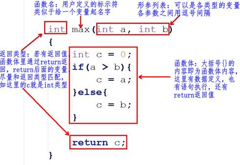

#### 6.2.2 函数名字、形参、函数体、返回值

##### 1. 函数名

理论上是可以随意起名字，最好起的名字见名知意，应该让用户看到这个函数名字就知道这个函数的功能。注意，函数名的后面有个圆换号()，代表这个为函数，不是普通的变量名。

##### 2. 形参列表

在定义函数时指定的形参，<font color="red">在未出现函数调用时，它们并不占内存中的存储单元</font>，因此称它们是形式参数或虚拟参数，简称形参，表示它们并不是实际存在的数据，所以，形参里的变量不能赋值

```c
void max(int a = 10, int b = 20) // error, 形参不能赋值
{
}
```

> 在定义函数时指定的形参，必须是，类型+变量的形式：

```c
//1: right, 类型+变量
void max(int a, int b)
{
}

//2: error, 只有类型，没有变量
void max(int, int)
{
}

//3: error, 只有变量，没有类型
int a, int b;
void max(a, b)
{
}
```

在定义函数时指定的形参，可有可无，根据函数的需要来设计，<font color="red">如果没有形参，圆括号内容为空，或写一个`void`关键字：</font>

```c
// 没形参， 圆括号内容为空
void max()
{
}

// 没形参， 圆括号内容为void关键字
void max(void)
{
}
```

##### 3. 函数体

花括号{ }里的内容即为函数体的内容，这里<font color="red">为函数功能实现的过程</font>，这和以前的写代码没太大区别，以前我们把代码写在main()函数里，现在只是把这些写到别的函数里。

##### 4. 返回值

函数的返回值是通过函数中的return语句获得的，return后面的值也可以是一个表达式

- 尽量保证return语句中表达式的值和函数返回类型是同一类型

- ```c
  int max() // 函数的返回值为int类型
  {
  	int a = 10;
  	return a;// 返回值a为int类型，函数返回类型也是int，匹配
  }
  ```

- 如果函数返回的类型和return语句中表达式的值不一致，则以函数返回类型为准，即<font color="red">函数返回类型决定返回值的类型</font>。对数值型数据，可以自动进行类型转换

- ```c
  double max() // 函数的返回值为double类型
  {
  	int a = 10;
  	return a;// 返回值a为int类型，它会转为double类型再返回
  }
  ```

  > 注意：如果函数返回的类型和return语句中表达式的值不一致，而它又无法自动进行类型转换，程序则会报错

- return语句的另一个作用为中断return所在的执行函数，类似于break中断循环、switch语句一样

- ```c
  int max()
  {
  	return 1;// 执行到，函数已经被中断，所以下面的return 2无法被执行到
  	return 2;// 没有执行
  }
  ```

- 如果函数带返回值，return后面必须跟着一个值，如果函数没有返回值，函数名字的前面必须写一个`void`关键字，这时候，我们写代码时也可以通过return中断函数(也可以不用)，只是这时，`return`后面不带内容( 分号“`;`”除外)

- ```c
  void max()// 最好要有void关键字
  {
  	return; // 中断函数，这个可有可无
  }
  ```

### 6.3 函数的调用

<font color="red">定义函数后，我们需要调用此函数才能执行到这个函数里的代码段</font>。这和main()函数不一样，main()为编译器设定好自动调用的主函数，无需人为调用，我们都是在main()函数里调用别的函数，<font color="red">一个 C 程序里有且只有一个main()函数</font>

#### 6.3.1 函数执行流程

```c
#include <stdio.h>

void print_test()
{
	printf("this is for test\n");
}

int main()
{
	print_test();	// print_test函数的调用

	return 0;
}
```

- 1.进入`mian()`函数
- 2.调用`print_test()`函数
  - a. 它会在main()函数的前寻找有没有一个名字叫“print_test”的函数定义；
  - b. 如果找到，接着检查函数的参数，这里调用函数时没有传参，函数定义也没有形参，参数类型匹配；
  - c. 开始执行`print_test()`函数，这时候，`main()`函数里面的执行会阻塞( 停 )在`print_test()`这一行代码，等待`print_test()`函数的执行
- `print_test()`函数执行完( 这里打印一句话 )，`main()`才会继续往下执行，执行到`return 0`, 程序执行完毕

#### 6.3.2 函数的形参和实参

- 形参出现在函数定义中，在整个函数体内都可以使用，离开该函数则不能使用
- 实参出现在主调函数中，进入被调函数后，实参也不能使用
- 实参变量对形参变量的数据传递是“值传递”，即单向传递，只<font color="red">由实参传给形参，而不能由形参传回来给实参</font>
- 在调用函数时，编译系统临时给形参分配存储单元。调用结束后，形参单元被释放
- 实参单元与形参单元是不同的单元。调用结束后，形参单元被释放，函数调用结束返回主调函数后则不能再使用该形参变量。实参单元仍保留并维持原值。<font color="red">因此，在执行一个被调用函数时，形参的值如果发生改变，并不会改变主调函数中实参的值</font>

#### 6.3.3 无参函数调用

> 如果是调用无参函数，则不能加上“实参”，但括号不能省略

```c
// 函数的定义
void test()
{
}

int main()
{
	// 函数的调用
	test();	// right, 圆括号()不能省略
	test(250); // error, 函数定义时没有参数

return 0;
}
```

#### 6.3.4 有参函数调用

> 如果实参表列包含多个实参，则各参数间用逗号隔开

```c
// 函数的定义
void test(int a, int b)
{
}

int main()
{
	int p = 10, q = 20;
	test(p, q);	// 函数的调用

	return 0;
}
```

- 实参与形参的个数应相等，类型应匹配(相同或赋值兼容)。实参与形参按顺序对应，一对一地传递数据
- 实参可以是常量、变量或表达式，<font color="red">无论实参是何种类型的量，在进行函数调用时，它们都必须具有确定的值，以便把这些值传送给形参</font>。所以，这里的变量是在圆括号( )外面定义好、赋好值的变量

```c
// 函数的定义
void test(int a, int b)
{
}

int main()
{
	// 函数的调用
	int p = 10, q = 20;
	test(p, q);	// right
	test(11, 30 - 10); // right

	test(int a, int b); // error, 不应该在圆括号里定义变量

	return 0;
}
```

#### 6.3.5 函数返回值

> 如果函数定义没有返回值，函数调用时不能写`void`关键字，调用函数时也不能接收函数的返回值

```c
// 函数的定义
void test()
{
}

int main()
{
	// 函数的调用
	test(); // right
	void test(); // error, void关键字只能出现在定义，不可能出现在调用的地方
	int a = test();	// error, 函数定义根本就没有返回值

	return 0;
}
```

如果函数定义有返回值，这个返回值我们根据用户需要可用可不用，但是，假如我们需要使用这个函数返回值，<font color="red">我们需要定义一个匹配类型的变量来接收</font>

```c
// 函数的定义, 返回值为int类型
int test()
{
}

int main()
{
	// 函数的调用
	int a = test(); // right, a为int类型
	int b;
	b = test();	// right, 和上面等级

	char *p = test(); // 虽然调用成功没有意义, p为char *, 函数返回值为int, 类型不匹配

	// error, 必须定义一个匹配类型的变量来接收返回值
	// int只是类型，没有定义变量
	int = test();	
	
	// error, 必须定义一个匹配类型的变量来接收返回值
	// int只是类型，没有定义变量
	int test();
	
	return 0;
}

```

### 6.4 函数的声明

如果使用用户自己定义的函数，而该函数与调用它的函数（即主调函数）不在同一文件中，或者<font color="red">函数定义的位置在主调函数之后</font>，则必须在调用此函数之前对被调用的函数作声明

所谓函数声明，就是在函数尚在未定义的情况下，事先将该函数的有关信息通知编译系统，相当于告诉编译器，函数在后面定义，以便使编译能正常进行

> 注意：一个函数只能被定义一次，但可以声明多次

```c
#include <stdio.h>

int max(int x, int y); // 函数的声明，分号不能省略
// int max(int, int); // 另一种方式

int main()
{
	int a = 10, b = 25, num_max = 0;
	num_max = max(a, b); // 函数的调用

	printf("num_max = %d\n", num_max);

	return 0;
}

// 函数的定义
int max(int x, int y)
{
	return x > y ? x : y;
}
```

**函数定义和声明的区别：**

- 定义是指对函数功能的确立，包括指定函数名、函数类型、形参及其类型、函数体等，它是一个完整的、独立的函数单位
- 声明的作用则是把函数的名字、函数类型以及形参的个数、类型和顺序(注意，不包括函数体)通知编译系统，以便在对包含函数调用的语句进行编译时，据此对其进行对照检查（例如函数名是否正确，实参与形参的类型和个数是否一致）

### 6.5 main函数与exit函数

在`main`函数中调用`exit`和`return`结果是一样的，但在子函数中调用`return`只是代表子函数终止了，在子函数中调用`exit`，那么程序终止

```c
#include <stdio.h>
#include <stdlib.h>

void fun()
{
	printf("fun\n");
	// return;
	exit(0);
}

int main()
{
	fun();
	while (1);

	return 0;
}
```

### 6.6 多文件(分文件)编程

#### 6.6.1 分文件编程

- 把函数声明放在头文件`xxx.h`中，在主函数中包含相应头文件
- 在头文件对应的`xxx.c`中实现`xxx.h`声明的函数

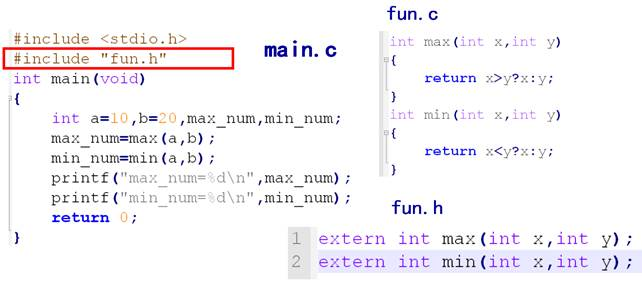

#### 6.6.2 防止头文件重复包含

> 当一个项目比较大时，往往都是分文件，这时候有可能不小心把同一个头文件 include 多次，或者头文件嵌套包含

a.h 中包含 b.h ：`#include "b.h"`

b.h 中包含 a.h：`#include "a.h"`

main.c中使用其中头文件：

```c
#include "a.h"

int main()
{
	return 0;
}
```

编译报错!!!

为了避免同一个文件被include多次，C/C++中有两种方式解决：

- 法1：

  ```c
  #ifndef __SOMEFILE_H__
  #define __SOMEFILE_H__
  // 声明语句
  #endif
  ```

- 法2：

  ```c
  #pragma once
  // 声明语句
  ```

## 7. 指针

### 7.1 概述

#### 7.1.1 内存

内存含义：

- 存储器：计算机的组成中，用来存储程序和数据，辅助CPU进行运算处理的重要部分。

- 内存：内部存贮器，暂存程序/数据——掉电丢失 SRAM、DRAM、DDR、DDR2、DDR3。

- 外存：外部存储器，长时间保存程序/数据—掉电不丢ROM、ERRROM、FLASH（NAND、NOR）、硬盘、光盘

内存是沟通CPU与硬盘的桥梁：

- 暂存放CPU中的运算数据

- 暂存与硬盘等外部存储器交换的数据

#### 7.1.2 物理存储器和存储地址空间

> 有关内存的两个概念：物理存储器和存储地址空间

物理存储器：实际存在的具体存储器芯片。

- 主板上装插的内存条

- 显示卡上的显示RAM芯片

- 各种适配卡上的RAM芯片和ROM芯片

存储地址空间：对存储器编码的范围。我们在软件上常说的内存是指这一层含义

- 编码：对每个物理存储单元（一个字节）分配一个号码
- 寻址：可以根据分配的号码找到相应的存储单元，完成数据的读写

#### 7.1.3 内存地址

- 将内存抽象成一个很大的一维字符数组

- 编码就是对内存的每一个字节分配一个32位或64位的编号（与32位或者64位处理器相关）

- 这个内存编号我们称之为内存地址。

  内存中的每一个数据都会分配相应的地址：

  - `char`:占一个字节分配一个地址
  - `int`: 占四个字节分配四个地址
  - `float`、`struct`、函数、数组等

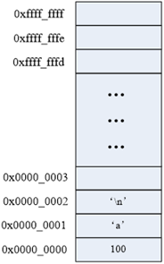

#### 7.1.4 指针和指针变量

- <font color="red">内存区的每一个字节都有一个编号，这就是“地址”</font>
- 如果在程序中定义了一个变量，在对程序进行编译或运行时，系统就会给这个变量分配内存单元，并确定它的内存地址(编号)
- 指针的实质就是内存“地址”。指针就是地址，地址就是指针
- <font color="red">指针是内存单元的编号，指针变量是存放地址的变量</font>
- 通常我们叙述时会把指针变量简称为指针，实际他们含义并不一样

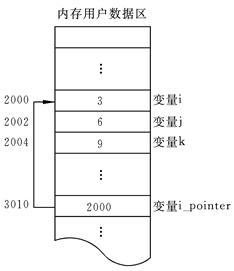

### 7.2 指针基础知识

#### 7.2.1 指针变量的定义和使用

- 指针也是一种数据类型，指针变量也是一种变量

- 指针变量指向谁，就把谁的地址赋值给指针变量
- “*”操作符操作的是指针变量指向的内存空间

```c
#include <stdio.h>

int main()
{
	int a = 0;
	char b = 100;
	printf("%p, %p\n", &a, &b); //打印a, b的地址

	//int *代表是一种数据类型，int*指针类型，p才是变量名
	//定义了一个指针类型的变量，可以指向一个int类型变量的地址
	int *p;
	p = &a;//将a的地址赋值给变量p，p也是一个变量，值是一个内存地址编号
	printf("%d\n", *p);//p指向了a的地址，*p就是a的值

	char *p1 = &b;
	printf("%c\n", *p1);//*p1指向了b的地址，*p1就是b的值

	return 0;
}
```

> 注意：`&`可以取得一个变量在内存中的地址。但是，<font color="red">不能取寄存器变量</font>，因为寄存器变量不在内存里，而在CPU里面，所以是没有地址的

```bash
tao@Taoc:~/Desktop/C/7$ ./7.2.1 
0x7ffda2091cf4, 0x7ffda2091cf3
0
100
```

#### 7.2.2 通过指针间接修改变量的值

```c
	int a = 0;
	int b = 11;
	int *p = &a;
	
	*p = 100;
	printf("a=%d, *p=%d\n", a, *p);
	
	p = &b
	*p = 22;
	printf("b = %d, *p = %d\n", b, *p);
```

#### 7.2.3 指针大小

- <font color="red">使用sizeof()测量指针的大小，得到的总是：4或8</font>
- `sizeof()`测的是指针变量指向存储地址的大小
- 在32位平台，所有的指针（地址）都是32位(4字节)
- 在64位平台，所有的指针（地址）都是64位(8字节)

```c
#include <stdio.h>
int main()
{
    int *p1;
    int **p2;
    char *p3;
    char **p4;

    printf("sizeof(p1) = %d\n", sizeof(p1));
    printf("sizeof(p2) = %d\n", sizeof(p2));
    printf("sizeof(p3) = %d\n", sizeof(p3));
    printf("sizeof(p4) = %d\n", sizeof(p4));
    printf("sizeof(double *) = %d\n", sizeof(double *));
    
    return 0;
}
```

输出结果：

```c
sizeof(p1) = 8
sizeof(p2) = 8
sizeof(p3) = 8
sizeof(p4) = 8
sizeof(double *) = 8
```

#### 7.2.4 野指针和空指针

指针变量也是变量，是变量就可以任意赋值，不要越界即可（32位为4字节，64位为8字节），但是，<font color="red">任意数值赋值给指针变量没有意义，因为这样的指针就成了野指针</font>，此指针指向的区域是未知(操作系统不允许操作此指针指向的内存区域)。所以，<font color="red">野指针不会直接引发错误，操作野指针指向的内存区域才会出问题</font>。

```c
	int a = 100;
	int *p;
	p = a; //把a的值赋值给指针变量p，p为野指针， ok，不会有问题，但没有意义

	p = 0x12345678; //给指针变量p赋值，p为野指针， ok，不会有问题，但没有意义

	*p = 1000;  //操作野指针指向未知区域，内存出问题，err
```

但是，野指针和有效指针变量保存的都是数值，为了标志此指针变量没有指向任何变量(空闲可用)，C语言中，可以把NULL赋值给此指针，这样就标志此指针为空指针，没有任何指针

```c
int *p = NULL;
```

NULL是一个值为0的宏常量：

```c
#define NULL    ((void *)0)
```

#### 7.2.5 万能指针void *

> `void *`指针可以指向任意变量的内存空间

```c
	void *p = NULL;

	int a = 10;
	p = (void *)&a; //指向变量时，最好转换为void *

	//使用指针变量指向的内存时，转换为int *
	*( (int *)p ) = 11;
	printf("a = %d\n", a);
```

#### 7.2.6 const修饰的指针变量

```c
int a = 100;
int b = 200;
//指向常量的指针
//修饰*，指针指向内存区域不能修改，指针指向可以变
const int * p1 = &a;
// *p1 = 111 // err
p1 = &b; // ok
//指针常量
//修饰p1，指针指向不能变，指针指向的内存可以修改

int * const p2 = &a;
// p2 = &b; //err
*p2 = 333; //ok
```

<font color="red">在编辑程序时，指针作为函数参数，如果不想修改指针对应内存空间的值，需要使用const修饰指针数据类型</font>

### 7.3 指针和数组

#### 7.3.1 数组名

数组名字是数组的首元素地址，但它是一个地址常量：

```c
int a[] = { 1, 2, 3, 4, 5, 6, 7, 8, 9 }; 
	printf("a = %p\n", a);
	printf("&a[0] = %p\n", &a[0]);

	//a = 10; //err, 数组名只是常量，不能修改
```

#### 7.3.2 指针操作数组元素

```c
#include <stdio.h>

int main()
{
    int a[] = { 1, 2, 3, 4, 5, 6, 7, 8, 9 };
    int i = 0;
    int n = sizeof(a)/sizeof(a[0]);
    
    for(i = 0; i < n; i++)
    {
    	// printf("%d, " a[i]);
        printf("%d,", *(a+i));
    }
    printf("\n");
    
    int *p = a;
    for(i = 0; i < n; i++)
    {
    	p[i] = 2 * i;
    }
    
    for(i = 0; i < n; i++)
    {
        printf("%d", *(p+i));
    }
    printf("\n");
    
    return 0;
    
}
```

```c
tao@Taoc:~/Desktop/C/7$ ./7.3.2 
1,2,3,4,5,6,7,8,9,
0246810121416
```

#### 7.3.3 指针加减运算

##### 1. 加法运算

- <font color="red">指针计算不是简单的整数相加</font>
- 如果是一个`int *`，+1的结果是增加一个int的大小
- 如果是一个`char *`，+1的结果是增加一个char大小

```c
#include <stdio.h>

int main()
{
    int a;
    int *p = &a;
    printf("%d\n", p);
    p += 2; //移动了2个int
    printf("%d\n", p);
    
    char b = 0;
    char *p1 = &b;
   	printf("%d\n", p1);
    p1 += 2;	// 移动了2个char
    printf("%d\n",p1);
    
    return 0;
}
```

> 通过改变指针指向操作数组元素：

```c
#include <stdio.h>

int main()
{
	int a[] = { 1, 2, 3, 4, 5, 6, 7, 8, 9 };
	int i = 0;
	int n = sizeof(a) / sizeof(a[0]);

	int *p = a;
	for (i = 0; i < n; i++)
	{
		printf("%d, ", *p);
		p++;
	}
	printf("\n");
	
	return 0;
}
```

##### 2. 减法运算

```c
#include <stdio.h>

int main()
{
	int a[] = { 1, 2, 3, 4, 5, 6, 7, 8, 9 };
	int i = 0;
	int n = sizeof(a) / sizeof(a[0]);

	int *p = a+n-1;
	for (i = 0; i < n; i++)
	{
		printf("%d, ", *p);
		p--;
	}
	printf("\n");

	return 0;
}
```

输出结果：

```bash
tao@Taoc:~/Desktop/C/7$ ./7.3.3-2 
9, 8, 7, 6, 5, 4, 3, 2, 1, 
```

```c
#include <stdio.h>

int main()
{
	int a[] = { 1, 2, 3, 4, 5, 6, 7, 8, 9 };
	int *p2 = &a[2]; //第2个元素地址
	int *p1 = &a[1]; //第1个元素地址
	printf("p1 = %p, p2 = %p\n", p1, p2);

	int n1 = p2 - p1; //n1 = 1
	int n2 = (int)p2 - (int)p1; //n2 = 4
	printf("n1 = %d, n2 = %d\n", n1, n2);
	
	return 0;
}
```

#### 7.3.4  指针数组

指针数组，它是数组，数组的每个元素都是指针类型

```c
#include <stdio.h>

int main()
{
	// 指针数组
	int *p[3];
	int a = 1;
	int b = 2;
	int c = 3;
	int i = 0;
	
	p[0] = &b;
	p[1] = &b;
	p[2] = &c;
	
	for(i = 0; i < sizeof(p)/sizeof(p[0]);i++)
	{
		printf("%d, ", *(p[i]));
	}
	printf("\n");


	return 0;
}
```

### 7.4 多级指针 

- C语言允许有多级指针存在，在实际的程序中一级指针最常用，其次是二级指针
- 二级指针就是指向一个一级指针变量地址的指针
- 三级指针基本用不着，但考试会考

```c
	int a = 10;
	int *p = &a; //一级指针
	*p = 100; //*p就是a

	int **q = &p;
	//*q就是p
	//**q就是a

	int ***t = &q;
	//*t就是q
	//**t就是p
	//***t就是a
```

### 7.5 指针和函数

#### 7.5.1 函数形参改变实参的值

```c
#include <stdio.h>

void swap1(int x, int y)
{
	int tmp;
	tmp = x;
	x = y;
	y = tmp;
	printf("x=%d, y=%d\n", x, y);
}
void swap2(int *x, int *y)
{
	int tmp;
	tmp = *x;
	*x = *y;
	*y = tmp;
}
int main()
{
	int a = 3;
	int b = 5;
	swap1(a, b); // 值传递
	printf("a = %d, b = %d\n", a, b);

	a = 3;
	b = 5;
	swap2(&a, &b);	// 地址传递
	printf("a2 = %d, b2=%d\n", a, b);

	return 0;
}

```

输出结果：

```bash
tao@Taoc:~/Desktop/C/7$ ./7.5.1 
x=5, y=3
a = 3, b = 5
a2 = 5, b2=3
```

#### 7.5.2 数组名做函数参数

> 数组名做函数参数，函数的形参会退化为指针：

```c
#include <stdio.h>

void printArrary(int *a, int n)	
{
	int i = 0;
	for (i = 0; i < n; i++)
	{
		printf("%d, ", a[i]);
	}
	printf("\n");
}

int main()
{
	int a[] = { 1, 2, 3, 4, 5, 6, 7, 8, 9 };
	int n = sizeof(a) / sizeof(a[0]);

	//数组名做函数参数
	printArrary(a, n); 
	return 0;
}
```

输出结果:

```c
1, 2, 3, 4, 5, 6, 7, 8, 9, 
```

#### 7.5.3 指针做为函数的返回值

```c
#include <stdio.h>

int a = 10;

int *getA()
{
	return &a;
}

int main()
{	
	*(getA()) = 111;
	printf("a = %d\n", a);
	// 输出： a = 111;
	return 0;
}
```

### 7.6 指针和字符串

#### 7.6.1 字符指针

```c
#include <stdio.h>

int main()
{
	char str[] = "hello world";
	char *p = str;
	*p = 'm';
	p++;
	*p='i';
	printf("%s\n", str);
	
	p = "mike Tao";
	printf("%s\n", p);
	
	char *q = "test";
	printf("%s\n", q);
	
	return 0;
}
```

输出结果：

```c
tao@Taoc:~/Desktop/C/7$ ./7.6.1 
millo world
mike Tao
test
```

#### 7.6.2 字符指针做函数参数

```c
#include <stdio.h>

void mystract(char *dest, const char *src)
{
    int len1 = 0;
    int len2 = 0;
    while(dest[len1])
    {
        len1++;
    }
    while(src[len2])
    {
        len2++;
    }
    int i;
    for(i = 0; i < len2; i++)
    {
        dest[len1 + i] = src[i];
    }
}

int main()
{
    char dst[100] = "hello mike";
    char src[] = "123456";
    
    mystract(dst,src);
    printf("dst = %s\n", dst);
    
    return 0;
}
```

输出结果；

```c
tao@Taoc:~/Desktop/C/7$ ./7.7.3 
dst = hello mike123456
```

#### 7.6.3 const 修饰的指针变量

```c
#include <stdio.h>
#include <stdlib.h>
#include <string.h>

int main(void)
{
    // const 修饰一个变量为只读
    const int a = 10;
    // a = 100; 	//error
    
    /指针变量， 指针指向的内存， 2个不同概念
	char buf[] = "aklgjdlsgjlkds";

    //从左往右看，跳过类型，看修饰哪个字符
	//如果是*， 说明指针指向的内存不能改变
	//如果是指针变量，说明指针的指向不能改变，指针的值不能修改
	const char *p = buf;
    // 等价于上同  char const *p1 = buf;
    //p[1] = '2'; //err
    
    p = "agdlsjaglkdsajgl"; //ok
	char * const p2 = buf;
    p2[1] = '3';
	//p2 = "salkjgldsjaglk"; //err
	
    //p3为只读，指向不能变，指向的内存也不能变
	const char * const p3 = buf;

    return 0;
}
```

#### 7.6.4 指针数组做为main函数的形参

```c
int main(int argc, char *argv[]);
```

- `main`函数是操作系统调用的，第一个参数标明`argc`数组的成员数量，`argv`数组的每个成员都是`char *`类型
- `argv`是命令行参数的字符串数组
- `argc`代表命令行参数的数量，程序名字本身算一个参数

```c
#include <stdio.h>

//argc: 传参数的个数（包含可执行程序）
//argv：指针数组，指向输入的参数
int main(int argc, char *argv[])
{

	//指针数组，它是数组，每个元素都是指针
	char *a[] = { "aaaaaaa", "bbbbbbbbbb", "ccccccc" };
	int i = 0;

	printf("argc = %d\n", argc);
	for (i = 0; i < argc; i++)
	{
		printf("%s\n", argv[i]);
	}
	return 0;
}
```

#### 7.6.5 项目开发常用字符串应用模型

##### 1. strstr中的while和do-while模型

> 利用strstr标准库函数找出一个字符串中substr出现的个数

###### a. while模型

```c
#include <stdio.h>
#include <stdlib.h>
#include <string.h>

int main(void)
{
	char *p = "11abcd111122abcd333abcd3322abcd3333322qqq";
	int n = 0;
	
	while((p = strstr(p, "abcd")) != NULL)
    {
        //能进来，肯定有匹配的子串
		//重新设置起点位置
        p = p + strlen("abcd");
        n++;
        
        if(*p == 0) // 结束符
        {
            break;
        }
    }
    printf("n = %d\n", n);
    
    return 0;
}

// 输出 n = 4
```

###### b. do-while

```c
#include <stdio.h>
#include <stdlib.h>
#include <string.h>

int main(void)
{
	char *p = "11abcd111122abcd333abcd3322abcd3333322qqq";
	int n = 0;
	
	do
	{
		p = strstr(p, "abcd");
		if(p != NULL)
		{
			n++;
			// 重新设置查找的起点
			p = p + strlen("abcd");
		}
		else
		{
			break;
		}
	}while(*p != 0);
	
	printf("n=%d\n", n);
	
	return 0;
}
```

##### 5. 两头堵模型

```c
#include <stdio.h>
#include <stdlib.h>
#include <string.h>
#include <stype.h>

int fun(char *p, int *n)
{
    if(p = NULL || n = NULL)
    {
        return -1;
    }
    int begin = 0;
    int end = strlen(p) - 1;
    
   	//从左边开始
	//如果当前字符为空，而且没有结束
    while(p[begin] = '' && p[begin] != 0)
    {
        begin++;
    }
    
    //从右往左移动
	while (p[end] == ' ' && end > 0)
	{
		end--; //往左移动
	}

    
	if (end == 0)
	{
		return -2;
	}

	//非空元素个数
	*n = end - begin + 1;

	return 0;
}


int main(void)
{
    char *p = "      abcddsgadsgefg      ";
    int ret = 0;
    int n = 0;
    
    ret = fun(p, &n);
    if(ret != 0)
    {
        return ret;
    }
    printf("非空字符串元素个数：%d\n", n);
    
    return 0;
}
```

输出结果：

```c
tao@Taoc:~/Desktop/C/7$ ./7.6.5-2 
非空字符串元素个数：14
```

##### 3. 字符串反转模型(逆置)


```c
#include <stdio.h>
#include <stdlib.h>
#include <string.h>

int inverse(char *p)
{
    if(p == NULL)
    {
        return -1;
    }
    char *str = p;
    int begin = 0;
    int end = strlen(str) - 1;
    char tmp;
    
    while(begin < end)
    {
        // 交换元素
        tmp = str[begin];
        str[begin] = str[end];
        str[end] = tmp;
        
        begin++;  //往右移动位置
        end--;	// 往左移动位置
    }
       
    return 0;
}
int main(void)
{
        //char *str = "abcdefg"; //文件常量区，内容不允许修改
        char str[] = "abcdef";
        
        int ret = inverse(str);
       
        if(ret != 0)
        {
            return ret;
        }
    
    printf("str = %s\n", str);
    
    return 0;
}
```

输出结果：

```c
tao@Taoc:~/Desktop/C/7$ ./7.6.5-3 
str = fedcba
```

#### 7.6.6 字符串处理函数

##### 1. strcpy()

```c
#include <string.h>
char *strcpy(char *dest, const char *src);
```

> 功能：把src所指向的字符串复制到dest所指向的空间中，<font color="red">'\0'也会拷贝过去</font>
>
> 参数：
>
> ​    dest：目的字符串首地址
>
> ​    src：源字符首地址
>
> 返回值：
>
> ​    成功：返回dest字符串的首地址
>
> ​    失败：NULL

<font color="red">注意：如果参数dest所指的内存空间不够大，可能会造成缓冲溢出的错误情况</font>

```c
char dest[20] = "123456789";
char src[] = "hello world";
strcpy(dest, src);
printf("%s\n", dest);
```

##### 2. strncpy()

```c
#include <string.h>
char *strncpy(char *dest, const char *src, size_t n);
```

> 功能：把src指向字符串的前n个字符复制到dest所指向的空间中，<font color="red">是否拷贝结束符看指定的长度是否包含'\0'。</font>>
>
> 参数：
>
> ​    dest：目的字符串首地址
>
> ​    src：源字符首地址
>
> ​    n：指定需要拷贝字符串个数
>
> 返回值：
>
> ​    成功：返回dest字符串的首地址
>
> ​    失败：NULL

```c
	char dest[20] ;
	char src[] = "hello world";

	strncpy(dest, src, 5);
	printf("%s\n", dest);

	dest[5] = '\0';
	printf("%s\n", dest);

```

##### 3. strcat()

```c
#include <string.h>
char *strcat(char *dest, const char *src);
```

> 功能：将src字符串连接到dest的尾部，‘\0’也会追加过去
>
> 参数：
>
> ​    dest：目的字符串首地址
>
> ​    src：源字符首地址
>
> 返回值：
>
> ​    成功：返回dest字符串的首地址
>
> ​    失败：NULL

```c
    char str[20] = "123";
	char *src = "hello world";
	printf("%s\n", strcat(str, src));
```

##### 4. strncat

```c
#include <string.h>
char *strncat(char *dest, const char *src, size_t n);
```

> 功能：将src字符串前n个字符连接到dest的尾部，‘\0’也会追加过去
>
> 参数：
>
> ​    dest：目的字符串首地址
>
> ​    src：源字符首地址
>
> ​    n：指定需要追加字符串个数
>
> 返回值：
>
> ​    成功：返回dest字符串的首地址
>
> ​    失败：NULL

```c
	char str[20] = "123";
	char *src = "hello world";
	printf("%s\n", strncat(str, src, 5));
```

##### 5. strcmp

```c
#include <string.h>
int strcmp(const char *s1, const char *s2);
```

> 功能：比较 s1 和 s2 的大小，<font color="red">比较的是字符ASCII码大小。</font>
>
> 参数：
>
> ​    s1：字符串1首地址
>
> ​    s2：字符串2首地址
>
> 返回值：
>
> ​    相等：0
>
> ​    大于：>0 在不同操作系统strcmp结果会不同  返回ASCII差值
>
> ​    小于：<0

```c
	char *str1 = "hello world";
	char *str2 = "hello mike";

	if (strcmp(str1, str2) == 0)
	{
		printf("str1==str2\n");
	}
	else if (strcmp(str1, str2) > 0)
	{
		printf("str1>str2\n");
	}	
	else
	{
		printf("str1<str2\n");
	}

```

##### 6. strncmp()

```c
#include <string.h>
int strncmp(const char *s1, const char *s2, size_t n);
```

> 功能：比较 s1 和 s2 前n个字符的大小，<font color="red">比较的是字符ASCII码大小。</font>
>
> 参数：
>
> ​    s1：字符串1首地址
>
> ​    s2：字符串2首地址
>
> ​    n：指定比较字符串的数量
>
> 返回值：
>
> ​    相等：0
>
> ​    大于： > 0
>
> ​    小于： < 0

```c
	char *str1 = "hello world";
	char *str2 = "hello mike";

	if (strncmp(str1, str2, 5) == 0)
	{
		printf("str1==str2\n");
	}
	else if (strcmp(str1, "hello world") > 0)
	{
		printf("str1>str2\n");
	}
	else
	{
		printf("str1<str2\n");
	}
```

##### 7. sprintf()

```c
#include <stdio.h>
int sprintf(char *str, const char *format, ...);
```

> 功能：根据参数format字符串来转换并格式化数据，然后将结果输出到str指定的空间中，直到出现字符串结束符 '`\0`' 为止。
>
> 参数：
>
> ​    str：字符串首地址
>
> ​    format：字符串格式，用法和printf()一样
>
> 返回值：
>
> ​    成功：实际格式化的字符个数
>
> ​    失败： - 1

```c
	char dst[100] = { 0 };
	int a = 10;
	char src[] = "hello world";
	printf("a = %d, src = %s", a, src);
	printf("\n");

	int len=sprintf(dst, "a = %d, src = %s", a, src);
	printf("dst = \" %s\"\n", dst);
	printf("len = %d\n", len);
```

##### 8. sscanf()

```c
#include <stdio.h>
int sscanf(const char *str, const char *format, ...);
```

> 功能：从str指定的字符串读取数据，并根据参数format字符串来转换并格式化数据。
>
> 参数：
>
> ​    str：指定的字符串首地址
>
> ​    format：字符串格式，用法和scanf()一样
>
> 返回值：
>
> ​    成功：参数数目，成功转换的值的个数
>
> ​    失败： - 1

```c
	char src[] = "a=10, b=20";
	int a;
	int b;
	sscanf(src, "a=%d,  b=%d", &a, &b);
	printf("a:%d, b:%d\n", a, b);
```

##### 9.strchr()

```c
#include <string.h>
char *strchr(const char *s, int c);
```

> **功能**：在字符串s中查找字母c出现的位置
>
> **参数**：
>
> ​    s：字符串首地址
>
> ​    c：匹配字母(字符)
>
> **返回值**：
>
> ​    成功：返回第一次出现的c地址
>
> ​    失败：NULL

```c
	char src[] = "ddda123abcd";
	char *p = strchr(src, 'a');
	printf("p = %s\n", p);
```

##### 10. strstr()

```c
#include <string.h>
char *strstr(const char *haystack, const char *needle);
```

> 功能：在字符串haystack中查找字符串needle出现的位置
>
> 参数：
>
> ​    haystack：源字符串首地址
>
> ​    needle：匹配字符串首地址
>
> 返回值：
>
> ​    成功：返回第一次出现的needle地址
>
> ​    失败：NULL

```c
	char src[] = "ddddabcd123abcd333abcd";
	char *p = strstr(src, "abcd");
	printf("p = %s\n", p);
```

##### 11. strtok()

```c
#include <string.h>
char *strtok(char *str, const char *delim);
```

> 功能：来将字符串分割成一个个片段。当`strtok()`在参数s的字符串中发现参数delim中包含的分割字符时, 则会将该字符改为\0 字符，当连续出现多个时只替换第一个为\0。
>
> 参数：
>
> ​    str：指向欲分割的字符串
>
> ​    delim：为分割字符串中包含的所有字符
>
> 返回值：
>
> ​    成功：分割后字符串首地址
>
> ​    失败：NULL

- 在第一次调用时：`strtok()`必需给予参数s字符串
- 往后的调用则将参数s设置成NULL，每次调用成功则返回指向被分割出片段的指针

```c
	char a[100] = "adc*fvcv.ebcy*hghbdfg$casdert";
	char *s = strtok(a, ".*$");//将"*"分割的子串取出
	while (s != NULL)
	{
		printf("%s\n", s);
		s = strtok(NULL, "*");
	}
```

##### 12. atoi()

```c
#include <stdlib.h>
int atoi(const char *nptr);
```

> 功能：`atoi()`会扫描nptr字符串，跳过前面的空格字符，直到遇到数字或正负号才开始做转换，而遇到非数字或字符串结束符('\0')才结束转换，并将结果返回返回值。
>
> 参数：
>
> ​    nptr：待转换的字符串
>
> 返回值：成功转换后整数

类似的函数有：

- `atof()`：把一个小数形式的字符串转化为一个浮点数
- `atol()`：将一个字符串转化为long类型

```d
	char str1[] = "          -10";
	int num1 = atoi(str1);
	printf("num1 = %d\n", num1);

	char str2[] = "0.123";
	double num2 = atof(str2);
	printf("num2 = %lf\n", num2);

	char str3[] = "123L";
	long num3 = atol(str3);
	printf("num3 = %ld\n", num3);
```

### 7.7 指针小结

| **定义**      | **说明**                                     |
| ------------- | -------------------------------------------- |
| `int i`       | 定义整形变量                                 |
| `int *p`      | 定义一个指向int的指针变量                    |
| `int a[10]`   | 定义一个有10个元素的数组，每个元素类型为int  |
| `int *p[10]`  | 定义一个有10个元素的数组，每个元素类型为int* |
| `int func()`  | 定义一个函数，返回值为int型                  |
| `int *func()` | 定义一个函数，返回值为int *型                |
| `int **p `    | 定义一个指向int的指针的指针，二级指针        |

## 8. 内存管理

### 8.1 作用域

C语言变量的作用域分为：

- 代码块作用域(代码块是{}之间的一段代码)

- 函数作用域

- 文件作用域

#### 8.1.1 局部变量

局部变量也叫`auto自动变量`(auto可写可不写)，一般情况下代码块`{}`内部定义的变量都是自动变量，它有如下特点：

- 在一个函数内定义，只在函数范围内有效
- 在复合语句中定义，只在复合语句中有效
- <font color="red">随着函数调用的结束或复合语句的结束局部变量的声明声明周期也结束</font>
- 如果没有赋初值，内容为随机

```c
#include <stdio.h>

void test()
{
	// auto 写不写是一样的
	// auto 只能出现在{}内部
	auto int b = 10;
}

int main(void)
{
	// b = 100; //err 在main作用域中没有b
	if(1)
	{
		// 在复合语句中定义，只在复合语句中有效
		int a = 10;
		printf("a = %d\n", a);
	}
	
	// a = 10;//err离开if()的复合语句，a已经不存在
	
	return 0;
}
```

#### 8.1.2 静态(static)局部变量

- static局部变量的作用域也是在定义的函数内有效
- static局部变量的生命周期和程序运行周期一样，<font color="red">同时staitc局部变量的值只初始化一次，但可以赋值多次</font>
- static局部变量若未赋以初值，则由系统自动赋值：数值型变量自动赋初值0，字符型变量赋空字符

```c
#include <stdio.h>

void fun1()
{
	int i = 0;
	i++;
	printf("i = %d\n", i);
}
void fun2()
{
    // 静态局部变量，没有赋值，系统赋值为0，而且只会初始化一次
    static int a;
    a++;
    printf("a = %d\n");
}

int main(void)
{
    fun1();
    fun1();
    fun2();
    fun2();
    
    return 0;
}
```

#### 8.1.3 全局变量

- 在函数外定义，可被本文件及其它文件中的函数所共用，若其它文件中的函数调用此变量,须用`extern`声明
- 全局变量的生命周期和程序运行周期一样
- 不同文件的全局变量不可重名

#### 8.1.4 静态(static)全局变量

- 在函数外定义,作用范围被限制在所定义的文件中
- 不同文件静态全局变量可以重名,但作用域不冲突
- `static`全局变量的生命周期和程序运行周期一样，同时staitc全局变量的值只初始化一次

#### 8.1.5  extern全局变量声明

`extern int a;`声明一个变量，这个全局变量在别的文件中已经定义了，这里只是声明，而不是定义

#### 8.1.6 全局函数和静态函数

在C语言中函数默认都是全局的，使用关键字`static`可以将函数声明为静态，函数定义为`static`就意味着这个函数只能在定义这个函数的文件中使用，在其他文件中不能调用，即使在其他文件中声明这个函数都没用

对于不同文件中的`staitc`函数名字可以相同

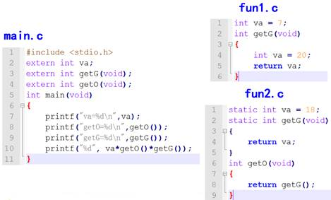

注意：

- 允许在不同的函数中使用相同的变量名，它们代表不同的对象，分配不同的单元，互不干扰。

- 同一源文件中,允许全局变量和局部变量同名，在局部变量的作用域内，全局变量不起作用。

- 所有的函数默认都是全局的，意味着所有的函数都不能重名，但如果是`staitc`函数，那么作用域是文件级的，所以不同的文件`static`函数名是可以相同的

#### 8.1.7 总结

| **类型**       | **作用域** | **生命周期**   |
| -------------- | ---------- | -------------- |
| auto变量       | 一对{}内   | 当前函数       |
| static局部变量 | 一对{}内   | 整个程序运行期 |
| extern变量     | 整个程序   | 整个程序运行期 |
| static全局变量 | 当前文件   | 整个程序运行期 |
| extern函数     | 整个程序   | 整个程序运行期 |
| static函数     | 当前文件   | 整个程序运行期 |
| register变量   | 一对{}内   | 当前函数       |
| 全局变量       | 整个程序   | 整个程序运行期 |

### 8.2 内存布局

#### 8.2.1 内存分区

C代码经过<font color="red">预处理、编译、汇编、链接</font>4步后生成一个可执行程序。

在 Windows 下，程序是一个普通的可执行文件，以下列出一个二进制可执行文件的基本情况：

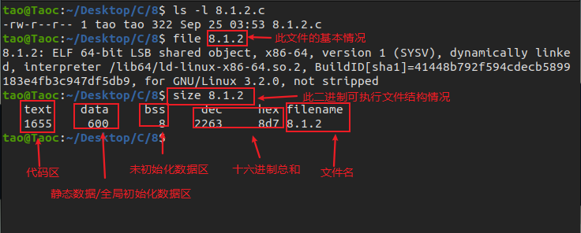

通过上图可以得知，在没有运行程序前，也就是说<font color="red">程序没有加载到内存前</font>，可执行程序内部已经分好3段信息，分别为<font color="red">代码区（text）、数据区（data）和未初始化数据区（bss）</font>3 个部分（有些人直接把data和bss合起来叫做静态区或全局区）。

- 代码区
  - 存放 CPU 执行的机器指令。通常代码区是可共享的（即另外的执行程序可以调用它），使其可共享的目的是对于频繁被执行的程序，只需要在内存中有一份代码即可。<font color="red">代码区通常是只读的</font>，使其只读的原因是防止程序意外地修改了它的指令。另外，代码区还规划了局部变量的相关信息
- 全局初始化数据区/静态数据区（data段）
  - 该区包含了在程序中明确被初始化的全局变量、已经初始化的静态变量（包括全局静态变量和局部静态变量）和常量数据（如字符串常量）
- 未初始化数据区（又叫 bss 区）
  - 存入的是全局未初始化变量和未初始化静态变量。未初始化数据区的数据在程序开始执行之前被内核初始化为 0 或者空（NULL）
  - 程序在加载到内存前，<font color="red">代码区和全局区(data和bss)的大小就是固定的</font>，程序运行期间不能改变。然后，运行可执行程序，系统把程序加载到内存，<font color="red">除了根据可执行程序的信息分出代码区（text）、数据区（data）和未初始化数据区（bss）之外，还额外增加了栈区、堆区</font>

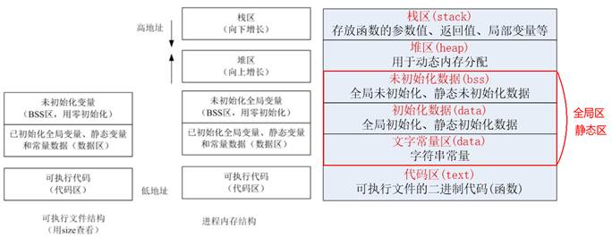

- 代码区（text segment）
  - 加载的是可执行文件代码段，所有的可执行代码都加载到代码区，这块内存是不可以在运行期间修改的。

- 未初始化数据区（BSS）
  - 加载的是可执行文件BSS段，位置可以分开亦可以紧靠数据段，存储于数据段的数据（全局未初始化，静态未初始化数据）的生存周期为整个程序运行过程。

- 全局初始化数据区/静态数据区（data segment）
  - 加载的是可执行文件数据段，存储于数据段（全局初始化，静态初始化数据，文字常量(只读)）的数据的生存周期为整个程序运行过程。

- 栈区（stack）
  - 栈是一种先进后出的内存结构，由编译器自动分配释放，存放函数的参数值、返回值、局部变量等。在程序运行过程中实时加载和释放，因此，局部变量的生存周期为申请到释放该段栈空间。

- 堆区（heap）
  - 堆是一个大容器，它的容量要远远大于栈，但没有栈那样先进后出的顺序。用于动态内存分配。堆在内存中位于BSS区和栈区之间。一般由程序员分配和释放，若程序员不释放，程序结束时由操作系统回收

#### 8.2.2 存储类型总结

| **类型**       | **作用域** | **生命周期**   | **存储位置**                    |
| -------------- | ---------- | -------------- | ------------------------------- |
| auto变量       | 一对{}内   | 当前函数       | 栈区                            |
| static局部变量 | 一对{}内   | 整个程序运行期 | 初始化在data段，未初始化在BSS段 |
| extern变量     | 整个程序   | 整个程序运行期 | 初始化在data段，未初始化在BSS段 |
| static全局变量 | 当前文件   | 整个程序运行期 | 初始化在data段，未初始化在BSS段 |
| extern函数     | 整个程序   | 整个程序运行期 | 代码区                          |
| static函数     | 当前文件   | 整个程序运行期 | 代码区                          |
| register变量   | 一对{}内   | 当前函数       | 运行时存储在CPU寄存器           |
| 字符串常量     | 当前文件   | 整个程序运行期 | data段                          |

```c
#include <stdio.h>
#include <stdlib.h>

int e;
static int f;
int g = 10;
static int h = 10;

int main()
{
	int a;
	int b = 10;
	static int c;
	static int d = 10;
	char *i = "test";
	char *k = NULL;
    
    printf("&a\t %p\t //局部未初始化变量\n", &a);
	printf("&b\t %p\t //局部初始化变量\n", &b);

	printf("&c\t %p\t //静态局部未初始化变量\n", &c);
	printf("&d\t %p\t //静态局部初始化变量\n", &d);

	printf("&e\t %p\t //全局未初始化变量\n", &e);
	printf("&f\t %p\t //全局静态未初始化变量\n", &f);

	printf("&g\t %p\t //全局初始化变量\n", &g);
	printf("&h\t %p\t //全局静态初始化变量\n", &h);

	printf("i\t %p\t //只读数据(文字常量区)\n", i);
    
	k = (char *)malloc(10);
	printf("k\t %p\t //动态分配的内存\n", k);

	return 0;

}
```

输出结果：

```c
tao@Taoc:~/Desktop/C/8$ ./8.2.2 
&a	 0x7ffe96a0a7e0	 //局部未初始化变量
&b	 0x7ffe96a0a7e4	 //局部初始化变量
&c	 0x559add9ab024	 //静态局部未初始化变量
&d	 0x559add9ab018	 //静态局部初始化变量
&e	 0x559add9ab028	 //全局未初始化变量
&f	 0x559add9ab020	 //全局静态未初始化变量
&g	 0x559add9ab010	 //全局初始化变量
&h	 0x559add9ab014	 //全局静态初始化变量
i	 0x559add9a9008	 //只读数据(文字常量区)
k	 0x559adeaac670	 //动态分配的内存
```

#### 8.2.3 内存操作函数

##### 1. memset()

```c
#include <string.h>
void *memset(void *s, int c, size_t n);
```

> 功能：将s的内存区域的前n个字节以参数c填入
>
> 参数：
>
> ​    s：需要操作内存s的首地址
>
> ​    c：填充的字符，c虽然参数为int，但必须是unsigned char , 范围为0~255
>
> ​    n：指定需要设置的大小
>
> 返回值：s的首地址

```c
	int a[10];

	memset(a, 0, sizeof(a));
	memset(a, 97, sizeof(a));
	int i = 0;
	for (i = 0; i < 10; i++)
	{
		printf("%c\n", a[i]);
	}
```

##### 2. memcpy()

```c
#include <string.h>
void *memcpy(void *dest, const void *src, size_t n);
```

> 功能：拷贝src所指的内存内容的前n个字节到dest所值的内存地址上。
>
> 参数：
>
> ​    dest：目的内存首地址
>
> ​    src：源内存首地址，<font color='red'>注意：dest和src所指的内存空间不可重叠，可能会导致程序报错</font>
>
> ​    n：需要拷贝的字节数
>
> 返回值：dest的首地址

```c
	int a[10] = { 1, 2, 3, 4, 5, 6, 7, 8, 9, 10 };
	int b[10];
	
	memcpy(b, a, sizeof(a));
	int i = 0;
	for (i = 0; i < 10; i++)
	{
		printf("%d, ", b[i]);
	}
	printf("\n");

	//memcpy(&a[3], a, 5 * sizeof(int)); //err, 内存重叠
```

##### 3.  memmove()

memmove()功能用法和memcpy()一样，区别在于：dest和src所指的内存空间重叠时，memmove()仍然能处理，不过执行效率比memcpy()低些

##### 4.  memcmp()

```c
#include <string.h>
int memcmp(const void *s1, const void *s2, size_t n);
```

> 功能：比较s1和s2所指向内存区域的前n个字节
>
> 参数：
>
> ​    s1：内存首地址1
>
> ​    s2：内存首地址2
>
> ​    n：需比较的前n个字节
>
> 返回值：
>
> ​    相等：=0
>
> ​    大于：>0
>
> ​    小于：<0

```c
	int a[10] = { 1, 2, 3, 4, 5, 6, 7, 8, 9, 10 };
	int b[10] = { 1, 2, 3, 4, 5, 6, 7, 8, 9, 10 };

	int flag = memcmp(a, b, sizeof(a));
	printf("flag = %d\n", flag);
```

#### 8.2.4 堆区内存分配和释放

##### 1. malloc() 

```c
#include <stdlib.h>
void *malloc(size_t size);
```

> 功能：在内存的动态存储区(堆区)中分配一块长度为size字节的连续区域，用来存放类型说明符指定的类型。分配的内存空间内容不确定，一般使用memset初始化。
>
> 参数：
>
> ​    size：需要分配内存大小(单位：字节)
>
> 返回值：
>
> 成功：分配空间的起始地址
>
> 失败：NULL

```c
#include <stdio.h>
#include <stdlib.h>
#include <string.h>

int main()
{
	int count, *array, n;
    printf("请输入要申请数组的个数：\n");
    scanf("%d", &n);
    
    array = (int *)malloc(n * sizeof(int));
    if(array == NULL)
    {
        printf("申请空间失败!\n");
        return -1;
    }
    //将申请到空间清0
    memset(array, 0, sizeof(int)*n);
    
    for(count = 0; count < n; count++)
        array[count] = count;
    for(count = 0; count < n; count++)
        printf("%2d", array[count]);
    
    free(array);
    
    return 0;
    
}
```

输出结果：

```c
/8$ ./8.2.4-1 
请输入要申请数组的个数：
5
 0 1 2 3 4tao@Taoc:~/Desktop/C/8$ 
```

##### 2. free()

```c
#include <stdlib.h>
void free(void *ptr);
```

> 功能：释放ptr所指向的一块内存空间，ptr是一个任意类型的指针变量，指向被释放区域的首地址。对同一内存空间多次释放会出错。
>
> 参数：
>
> ptr：需要释放空间的首地址，被释放区应是由malloc函数所分配的区域。
>
> 返回值：无

### 8.3 内存分区代码分析

#### 1. 返回栈区地址

```c
#include <stdio.h>
int *fun()
{
    int a = 10;
    return &a;
}
int main(int argc, char *argv[])
{
    int *p = NULL;
    p = fun();
    *p = 100; // 操作野指针指向的内存，err
    
    return 0;
}
```

#### 2. 返回data区地址

```c
#include <stdio.h>

int *fun()
{
	static int a = 10;
    
	return &a; // 函数调用完毕,a不释放
}

int main(int argc, char *argv[])
{
    int *p = NULL;
    p = func();
    *p = 100; // ok
    printf("*p = %d\n", *p);
    
    return 0;
}
```

#### 3. 值传递1

```c
#include <stdio.h>
#include <stdlib.h>

void fun(int *tmp)
{
	tmp = (int *)malloc(sizeof(int));
	*tmp = 100;
}
int main(int argc, char *argc[])
{
	int *p = NULL;
	fun(p); // 值传递，形参修改不会影响实参
	printf("*p = %d\n", *p);
	
	return 0;
}
```

#### 4. 值传递2

```c
#include <stdio.h>
#include <stdlib.h>

void fun(int *tmp)
{
	*tmp = 100;
}

int main(int argc, char *argv[])
{
	int *p = NULL;
	p = (int *)malloc(sizeof(int));

	fun(p); //值传递
	printf("*p = %d\n", *p); //ok，*p为100

	return 0;
}
```

#### 5. 返回堆区地址

```c
#include <stdio.h>
#include <stdlib.h>

int *fun()
{
	int *tmp = NULL;
	tmp = (int *)malloc(sizeof(int));
	*tmp = 100;
	return tmp; // 返回堆区地址，函数调用完毕，不释放
}

int main(int argc, char *argv[])
{
	int *p = NULL;
	p = fun();
    printf("*p = %d\n", *p);//ok

    //堆区空间，使用完毕，手动释放
    if( p != NULL)
    {
        free(p);
        p = NULL;
    }
    
    return 0;
}
```

## 9. 复合类型(自定义类型)

### 9.1 结构体

#### 9.1.1 概述

数组：描述一组具有相同类型数据的有序集合，用于处理大量相同类型的数据运算

有时我们需要将不同类型的数据组合成一个有机的整体，如：一个学生有学号/姓名/性别/年龄/地址等属性。显然单独定义以上变量比较繁琐，数据不便于管理

Ｃ语言中给出了另一种构造数据类型——结构体

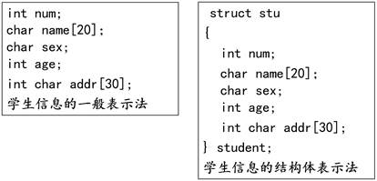

#### 9.1.2 结构体变量的定义和初始化

定义结构体变量的方式：

- 先声明结构体类型再定义变量名

- 在声明类型的同时定义变量

- 直接定义结构体类型变量（无类型名）

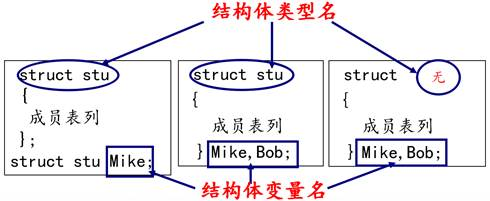

结构体类型和结构体变量关系：

- 结构体类型：指定了一个结构体类型，它相当于一个模型，但其中并无具体数据，系统对之也不分配实际内存单元
- 结构体变量：系统根据结构体类型（内部成员状况）为之分配空间

```c
// 结构体类型的定义
struct stu
{
    char name[50];
    int age;
};

// 先定义类型，再定义变量（常用）
struct stu s1 = {"Taoy", 18};

// 定义类型同时定义变量
struct stu2
{
    char name[50];
    int age;
}s2 = {"Tao", 19};

struct
{
    char name[50];
    int age;
}s3 = {"Taooo", 21};
```

#### 9.1.3  结构体成员的使用

```c
#include <stdio.h>
#include <sring.h>

// 结构体类型的定义
struct stu
{
    char name[50];
    int age;
}

int main()
{
    struct stu s1;
    
    // 如果是普通变量，通过点运算符操作结构体成员
    strcpy(s1.name, "abc");
    s1.age = 18;
    printf("s1.name = %s, s1.age = %d\n", s1.name, s1.age);
    
    // 如果是指针变量，通过->操作结构体成员
    strcpy((&s1)->name, "test");
    (&s1)->age = 22;
    printf("(&s1)->name = %s, (&s1)->age = %d\n", (&s1)->name, (&s1)->age);
    
    return 0;
}
```

#### 9.1.4 结构体数组

```c
#include <stdio.h>

// 统计学生成绩

struct stu
{
	int num;
	char name[20];
	char sex;
	float score;
}

int main()
{
    struct stu boy[5] = {
		{ 101, "Li ping", 'M', 45 },			
		{ 102, "Zhang ping", 'M', 62.5 },
		{ 103, "He fang", 'F', 92.5 },
		{ 104, "Cheng ling", 'F', 87 },
		{ 105, "Wang ming", 'M', 58 }};
	
    int i = 0;
    int c = 0;
    float ave,s = 0;
    for(i = 0; i < 5; i++)
    {
        s += boy[i].score; //计算总分
        if(boy[i].score < 60)
        {
            c += 1;	//统计不及格人的分数
        }
    }
    
    printf("s = %f\n", s); // 打印总分数
    ave = s / 5;
    printf("average = %f\n count=%d\n\n", ave, c);
    
    for(i = 0; i < 5; i++)
    {
        printf("name = %s, score = %f\n",boy[i].name, boy[i].score);
        // printf(" name=%s,  score=%f\n", (boy + i )->name, (boy + i)->score);
    }
    
    return 0;
}
```

#### 9.1.5 结构体套结构体

```c
#include <stdio.h>

struct person
{
    char name[20];
    char sex;
}

struct stu
{
    int id;
    struct person info;
}

int main()
{
    struct stu s[2] = {1, "Lily", 'F', 2, "yuri", "M"};
    
    int i = 0;
    for(i = 0; i < 2; i++)
    {
        printf("id = %d\tinfo.name=%s\tinfo.sex=%c\n", s[i].id, s[i].info.name, s[i].info.sex);
    }
    
    return 0;
}
```

#### 9.1.6 结构体赋值

```c
#include <stdio.h>
#include <string.h>

struct stu
{
    char name[50];
    int age;
}

int main()
{
    struct stu s1;
    //如果是普通变量，通过点运算符操作结构体成员
    strcpy(s1.name, "abc");
    s1.age = 18;
    
    printf("s1.name = %s, s1.age = %d\n", s1.name, s1.age);
    
    //相同类型的两个结构体变量，可以相互赋值
	//把s1成员变量的值拷贝给s2成员变量的内存
	//s1和s2只是成员变量的值一样而已，它们还是没有关系的两个变量
	struct stu s2 = s1;
    //memcpy(&s2, &s1, sizeof(s1));
    printf("s2.name = %s, s2.gae = %d\n", s2.name, s2.age);
    
    return 0;
}
```

#### 9.1.7 结构体和指针

##### 1. 指向普通结构体变量的指针

```c
#include <stdio.h>

// 结构类型的定义
struct stu
{
    char name[50];
    int age;
}

int main()
{
    struct stu s1 = {"Tao", 18};
    // 如果是指针变量，通过->操作结构体成员
    struct stu *p = &s1;
    printf("p->name = %s, p->age=%d\n", p->name, p->age);
	printf("(*p).name = %s, (*p).age=%d\n",  (*p).name,  (*p).age);
    
    return 0;
}
```

##### 2. 堆区结构体变量

```c
#include <stdio.h>
#include <string.h>
#include <stdlib.h>

struct stu 
{
	char name[50];
	int age;
}

int main()
{
	struct stu *p = NULL;
    p = (struct stu *)malloc(sizeof(struct stu));
    // 如果是指针变量，通过->操作结构体成员
    strcpy(p->name, "test");
    p->age = 22;
    
    printf("p->name = %s, p->age=%d\n", p->name, p->age);
	printf("(*p).name = %s, (*p).age=%d\n", (*p).name,  (*p).age);

    free(p);
    p = NULL;
    
    return 0;
}
```

##### 3. 结构体套一级指针

```c
#include <stdio.h>
#include <string.h>
#include <stdlib.h>

// 机构体类型的定义
struct stu 
{
	char *name; // 一级指针
	int age;
};

int main()
{
    struct stu *p = NULL;
    p = (struct stu *)malloc(sizeof(struct stu));
    
    p->name = malloc(strlen("test") + 1);
    strcpy(p->name, "test");
    p->age = 19;
    
    printf("p->name = %s, p->age = %d\n", p->name, p->age);
    printf("(*p).name = %s, (*p).age=%d\n", (*p).name, (*p).age);
    if(p->name != NULL)
    {
        free(p->name);
        p->name = NULL;
    }
    
    if(p != NULL)
    {
        free(p);
        p = NULL;
    }
    
    return 0;
}
```

#### 9.1.8 结构体做函数参数

##### 1. 结构体普通变量做函数参数

```c
#include <stdio.h>
#include <string.h>

// 结构类型的定义
struct stu 
{
	char name[50];
	int age;
}

// 函数参数为结构体普通变量

void set_stu(struct stu tmp)
{
    strcpy(tmp.name, "Tao");
    tmp.age = 18;
    printf("tmp.name = %s, tmp.age = %d\n", tmp.name, tmp.age);
}

int main()
{
    struct stu s = {0};
    set_stu(s);	// 值传递
    printf("s.name = %s, s.age = %d\n", s.name, s.age);
    
    return 0;
}
```

##### 2. 结构体指针变量做函数参数

```c
#include <stdio.h>
#include <string.h>

// 结构体类型的定义
struct stu 
{
	char name[50];
	int age;
};

void set_stu_pro(struct stu *tmp)
{
	strcpy(tmp->name, "Tao");
	tmp->age = 18;
}

int main()
{
	struct stu s = {0};
	set_stu_pro(&s); // 地址传递
	printf("s.name = %s, s.age = %d\n", s.name, s.age);
	
	return 0;
}
```

##### 4. const修饰结构体指针形参变量

```c
// 结构体类型的定义
struct stu
{
	char name[50];
	int age;
}

void fun1(struct stu * const p)
{
    //p = NULL; // err
    p->age = 18;
}
// void(struct stu const* p)
void(const struct stu * p)
{
    p = NULL; // ok
    // p->age = 10; //err
}
void fun3(const struct stu * const p)
{
	//p = NULL; //err
	//p->age = 10; //err
}
```

### 9.2 共用体(联合体)

- 联合union是一个能在同一个存储空间存储不同类型数据的类型；
- 联合体所占的内存长度等于其最长成员的长度倍数，也有叫做共用体；
- 同一内存段可以用来存放几种不同类型的成员，但每一瞬时只有一种起作用；
- 共用体变量中起作用的成员是最后一次存放的成员，在存入一个新的成员后原有的成员的值会被覆盖；
- 共用体变量的地址和它的各成员的地址都是同一地址

```c
#include <stdio.h>

// 共用体也叫联合体
union Test
{
    unsigned char a;
    unsigned int b;
    unsigned short c;
}

int main()
{
    // 定义共用体变量
    union Test tmp;
    
    // 1. 所有成员的首地址是一样的
    printf("%p, %p, %p\n", &(tmp.a), &(tmp.b), &(tmp.c));
    
    //2、共用体大小为最大成员类型的大小
    printf("%lu\n", sizeof(union Test));
    
    // 3、一个成员赋值，会影响另外的成员
    
    //左边是高位，右边是低位
	//低位放低地址，高位放高地址
	tmp.b = 0x44332211;
	
    printf("%x\n", tmp.a); //11
	printf("%x\n", tmp.c); //2211

	tmp.a = 0x00;
	printf("short: %x\n", tmp.c); //2200
	printf("int: %x\n", tmp.b); //44332200

	return 0;

    
}
```

### 9.3 枚举

枚举：将变量的值一一列举出来，变量的值只限于列举出来的值的范围内。

枚举类型定义：

```c
enum  枚举名
{
	枚举值表
};
```

- 在枚举值表中应列出所有可用值，也称为枚举元素
- 枚举值是常量，不能在程序中用赋值语句再对它赋值
- 举元素本身由系统定义了一个表示序号的数值从0开始顺序定义为0，1，2 …

```c
#include <stdio.h>

enum weekday
{
	sun = 2, mon, tue, wed, thu, fri, sat
};
enum bool 
{
	false, true
};

int main()
{
	enum weekday a,b,c;
	a = sun;
	b = mon;
	c = tue;
	
	printf("%d,%d,%d\n", a, b, c);
	
	enum bool flag;
	flag = true;
	
	if(flag == 1)
	{
		printf("flag为真\n");
	}
	
	return 0;
}

```

输出结果：

```c
Taoc:~/Desktop/C/9$ ./9.3 
2,3,4
flag为真
```

### 9.4 typedef

typedef为C语言的关键字，作用是为一种数据类型(基本类型或自定义数据类型)定义一个新名字，<font color="red">不能创建新类型</font>

- 与`#define`不同，`typedef`仅限于数据类型，而不是能是表达式或具体的值
- `#define`发生在预处理，typedef发生在编译阶段

```c
#include <stdio.h>

typedef int INT;
typedef char BYTE;
typedef BYTE T_BYTE;
typedef unsigned char UBYTE;

typedef struct unsigned char UBYTE;

typedef struct type
{
	UBYTE a;
	INT b;
	T_BYTE c;
}TYPE, *PTYPE;

int main()
{
	TYPE t;
	t.a = 254;
	t.b = 10;
	t.c = 'c';

	PTYPE p = &t;
	printf("%u, %d, %c\n", p->a, p->b, p->c);

	return 0;
}


```

## 10. 文件操作

### 10.1 概述

#### 10.1.1磁盘文件和设备文件

- 磁盘文件

  - 指一组相关数据的有序集合,通常存储在外部介质(如磁盘)上，使用时才调入内存
- 设备文件
  - 在操作系统中把每一个与主机相连的输入、输出设备看作是一个文件，把它们的输入、输出等同于对磁盘文件的读和写

#### 10.1.2 磁盘文件的分类

计算机的存储在物理上是二进制的，所以物理上所有的磁盘文件本质上都是一样的：以字节为单位进行顺序存储

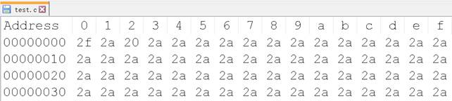

从用户或者操作系统使用的角度（逻辑上）把文件分为：

- 文本文件：基于字符编码的文件 

- 二进制文件：基于值编码的文件

#### 10.1.3 文本文件和二进制文件

##### 1. 文本文件

- 基于字符编码，常见编码有ASCII、UNICODE等

- 一般可以使用文本编辑器直接打开

- 数5678的以ASCII存储形式(ASCII码)为：

  00110101 00110110 00110111 00111000

##### 2. 二进制文件

- 基于值编码,自己根据具体应用,指定某个值是什么意思
- 把内存中的数据按其在内存中的存储形式原样输出到磁盘上
- 数5678的存储形式(二进制码)为：
- 00010110 00101110

### 10.2 文件的打开和关闭

#### 10.2.1 文件指针

在C语言中用一个指针变量指向一个文件，这个指针称为文件指针

```c
typedef struct
{
	short           level;	//缓冲区"满"或者"空"的程度 
	unsigned        flags;	//文件状态标志 
	char            fd;		//文件描述符
	unsigned char   hold;	//如无缓冲区不读取字符
	short           bsize;	//缓冲区的大小
	unsigned char   *buffer;//数据缓冲区的位置 
	unsigned        ar;	 //指针，当前的指向 
	unsigned        istemp;	//临时文件，指示器
	short           token;	//用于有效性的检查 
}FILE;
```

FILE是系统使用typedef定义出来的有关文件信息的一种结构体类型，<font color="red">结构中含有文件名、文件状态和文件当前位置等信息</font>

声明FILE结构体类型的信息包含在头文件“stdio.h”中，一般设置一个指向FILE类型变量的指针变量，然后通过它来引用这些FILE类型变量。通过文件指针就可对它所指的文件进行各种操作

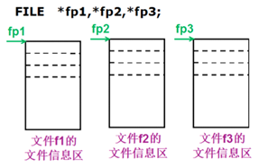

C语言中有三个特殊的文件指针由系统默认打开，<font color="red">用户无需定义即可直接使用:</font>

- `stdin`：标准输入，默认为当前终端（键盘），我们使用的scanf、getchar函数默认从此终端获得数据
- `stdout`: 标准输出，默认为当前终端（屏幕），我们使用的printf、puts函数默认输出信息到此终端
- `stderr`: 标准出错，默认为当前终端（屏幕），我们使用的perror函数默认输出信息到此终端

#### 10.2.2 文件的打开

任何文件使用之前必须打开：

```c
#include <stdio.h>
FILE * fopen(const char * filename, const char * mode);
```

> 功能：打开文件
>
> 参数：
>
> ​    filename：需要打开的文件名，根据需要加上路径
>
> ​    mode：打开文件的模式设置
>
> 返回值：
>
> ​    成功：文件指针
>
> ​    失败：NULL

第一个参数的几种形式:

```c
FILE *fp_passwd = NULL;

//相对路径：
//打开当前目录passdw文件：源文件(源程序)所在目录
FILE *fp_passwd = fopen("passwd.txt", "r");

//打开当前目录(test)下passwd.txt文件
fp_passwd = fopen(". / test / passwd.txt", "r");

//打开当前目录上一级目录（相对当前目录）passwd.txt文件
fp_passwd = fopen(".. / passwd.txt", "r");

//绝对路径：
//打开C盘test目录下一个叫passwd.txt文件
fp_passwd = fopen("c:/test/passwd.txt","r");
```

第二个参数的几种形式(打开文件的方式)：

| **打开模式** | **含义**                                                     |
| ------------ | ------------------------------------------------------------ |
| r或rb        | 以只读方式打开一个文本文件（不创建文件，若文件不存在则报错） |
| w或wb        | 以写方式打开文件(如果文件存在则清空文件，文件不存在则创建一个文件) |
| a或ab        | 以追加方式打开文件，在末尾添加内容，若文件不存在则创建文件   |
| r+或rb+      | 以可读、可写的方式打开文件(不创建新文件)                     |
| w+或wb+      | 以可读、可写的方式打开文件(如果文件存在则清空文件，文件不存在则创建一个文件) |
| a+或ab+      | 以添加方式打开可读、可写的文件。若文件不存在则创建文件；如果文件存在，则写入的数据会被加到文件尾后，即文件原先的内容会被保留。 |

注意：

- b是二进制模式的意思，b只是在Windows有效，在Linux用r和rb的结果是一样的
- Unix和Linux下所有的文本文件行都是\n结尾，而Windows所有的文本文件行都是\r\n结尾
- 在Windows平台下，以“文本”方式打开文件，不加b：
  - n 当读取文件的时候，系统会将所有的 "\r\n" 转换成 "\n"
  - 当写入文件的时候，系统会将 "\n" 转换成 "\r\n" 写入
  - <font color="red">n 以"二进制"方式打开文件，则读写都不会进行这样的转换</font>
- 在Unix/Linux平台下，“文本”与“二进制”模式没有区别，"\r\n" 作为两个字符原样输入输出

```c
int main()
{
	FILE *fp = NULL;
	// "\\"这样的路径形式，只能在windows使用
	// "/"这样的路径形式，windows和linux平台下都可用，建议使用这种
	// 路径可以是相对路径，也可是绝对路径
	fp = fopen("../test", "w");
	// fp = fopen("..\\test", "w");
	if(fp == NULL)
	{
		//perror()是标准出错打印函数，能打印调用库函数出错原因
		perror("open");
		return -1;
	}
	
	return 0;
}
```

#### 10.2.3 文件的关闭

任何文件在使用后应该关闭：

- 打开的文件会占用内存资源，如果总是打开不关闭，会消耗很多内存
- 一个进程同时打开的文件数是有限制的，超过最大同时打开文件数，再次调用`fopen`打开文件会失败
- 如果没有明确的调用`fclose`关闭打开的文件，那么程序在退出的时候，操作系统会统一关闭

```c
#include <stdio.h>
int fclose(FILE * stream);
```

> 功能：关闭先前fopen()打开的文件。此动作让缓冲区的数据写入文件中，并释放系统所提供的文件资源。
>
> 参数：
>
> ​    stream：文件指针
>
> 返回值：
>
> ​    成功：0
>
> ​    失败：-1

```c
	FILE * fp = NULL;
	fp = fopen("abc.txt", "r");
	fclose(fp);
```

### 10.3 文件的顺序读写

#### 10.3.1 按照字符读写文件fgetc、fputc

##### 1. 写文件

```c
#include <stdio.h>
int fputc(int ch, FILE * stream);
```

> 功能：将ch转换为unsigned char后写入stream指定的文件中
>
> 参数：
>
> ​    ch：需要写入文件的字符
>
> ​    stream：文件指针
>
> 返回值：
>
> ​    成功：成功写入文件的字符
>
> ​    失败：返回-1

```c
char buf[] = "My name is Tao.";
int i = 0;
int n = strlen(buf);
for(i = 0; i < n; i++)
{
	// 往文件fp写入符buf[i]
	int ch = fputc(buf[i], fp);
	printf("ch = %c\n", ch);
}
```

##### 2. 文件结尾

在C语言中，EOF表示文件结束符(end of file)。在while循环中以EOF作为文件结束标志，<font color="red">这种以EOF作为文件结束标志的文件，必须是文本文件。</font>在文本文件中，数据都是以字符的ASCII代码值的形式存放。我们知道，ASCII代码值的范围是0~127，不可能出现-1，因此可以用EOF作为文件结束标志

```c
#define EOF    (-1)
```

当把数据以二进制形式存放到文件中时，就会有-1值的出现，因此不能采用EOF作为二进制文件的结束标志。为解决这一个问题，ANSI C提供一个feof函数，用来判断文件是否结束。<font color="red">feof函数既可用以判断二进制文件又可用以判断文本文件</font>

```c
#include <stdio.h>
int feof(FILE * stream);
```

> 功能：检测是否读取到了文件结尾。<font color="red">判断的是最后一次“读操作的内容”，不是当前位置内容(上一个内容)。</font>
>
> 参数：
>
> ​    stream：文件指针
>
> 返回值：
>
> ​    非0值：已经到文件结尾
>
> ​    0：没有到文件结尾

##### 3. 读文件

```c
#include <stdio.h>
int fgetc(FILE * stream);
```

> 功能：从stream指定的文件中读取一个字符
>
> 参数：
>
> ​    stream：文件指针
>
> 返回值：
>
> ​    成功：返回读取到的字符
>
> ​    失败：-1

```c
char ch;
#if 0
while((ch = fgetc(fp)) != EOF)
{
	printf("%c", ch);
}
printf("\n");
#endif

while(!feop(fp)) //文件没有结束，则执行循环
{
	ch = fgetc(fp);
	printf("%c", ch);
};
printf("\n");
```

#### 10.3.2 按照行读写文件fgets、fputs

##### 1. 写文件

```c
#include <stdio.h>
int fputs(const char * str, FILE * stream);
```

> 功能：将str所指定的字符串写入到stream指定的文件中，字符串结束符 '`\0`'  不写入文件。 
>
> 参数：
>
> ​    str：字符串
>
> ​    stream：文件指针
>
> 返回值：
>
> ​    成功：0
>
> ​    失败：-1

```c
char *buf[] = { "123456\n", "bbbbbbbbbb\n", "ccccccccccc\n" };
int i = 0;
int n = 3;
for (i = 0; i < n; i++)
{
	int len = fputs(buf[i], fp);
	printf("len = %d\n", len);
}
```

##### 2. 读文件

```c
#include <stdio.h>
char * fgets(char * str, int size, FILE * stream);
```

> 功能：从stream指定的文件内读入字符，保存到str所指定的内存空间，直到出现换行字符、读到文件结尾或是已读了size - 1个字符为止，最后会自动加上字符 '\0' 作为字符串结束。
>
> 参数：
>
> ​    str：字符串
>
> ​    size：指定最大读取字符串的长度（size - 1）
>
> ​    stream：文件指针
>
> 返回值：
>
> ​    成功：成功读取的字符串
>
> ​    读到文件尾或出错： NULL

```c
char buf[100] = {0};
while(!feof(fp))
{
	memset(buf, 0, sizeof(buf));
	char *p = gets(buf, sizeof(buf), fp);
	if(p != NULL)
	{
		printf("buf = %s", buf);
	}
}
```

#### 3. 强化训练：文件版四则运算

有个文件大小不确定，每行内容都是一个四则运算表达式，还没有算出结果，写一个程序，自动算出其结果后修改文件

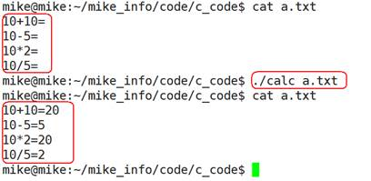

#### 10.3.3 按照格式化文件fprintf、fscanf

##### 1. 写文件

```c
#include <stdio.h>
int fprintf(FILE * stream, const char * format, ...);
```

> 功能：根据参数format字符串来转换并格式化数据，然后将结果输出到stream指定的文件中，指定出现字符串结束符 '\0' 为止。
>
> 参数：
>
> ​    stream：已经打开的文件
>
> ​    format：字符串格式，用法和printf()一样
>
> 返回值：
>
> ​    成功：实际写入文件的字符个数
>
> ​    失败：-1

```c
fprintf(fp, "%d %d %d\n", 1, 2, 3);
```

##### 2. 读文件

```c
#include <stdio.h>
int fscanf(FILE * stream, const char * format, ...);
```

> 功能：从stream指定的文件读取字符串，并根据参数format字符串来转换并格式化数据。
>
> 参数：
>
> ​    stream：已经打开的文件
>
> ​    format：字符串格式，用法和scanf()一样
>
> 返回值：
>
> ​    成功：参数数目，成功转换的值的个数
>
> ​    失败： - 1

```c
int a = 0;
int b = 0;
int c = 0;
fscanf(fp, "%d %d %d\n", &a, &b, &c);
printf("a = %d, b = %d, c = %d\n", a, b, c);
```

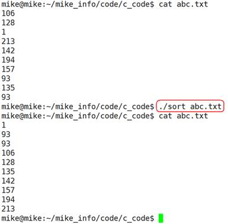

#### 10.3.4 按照块读写文件fread、fwrite

##### 1. 写文件

```c
#include <stdio.h>
size_t fwrite(const void *ptr, size_t size, size_t nmemb, FILE *stream);
```

> 功能：以数据块的方式给文件写入内容
>
> 参数：
>
> ​    ptr：准备写入文件数据的地址
>
> ​    size： size_t 为 unsigned int类型，此参数指定写入文件内容的块数据大小
>
> ​    nmemb：写入文件的块数，写入文件数据总大小为：size * nmemb
>
> ​    stream：已经打开的文件指针
>
> 返回值：
>
> ​    成功：实际成功写入文件数据的块数目，此值和 nmemb 相等
>
> ​    失败：0

```c
typedef struct Stu
{
	char name[50];
	int id; 
}Stu;

Stu s[3];
int i = 0;
for(i = 0; i < 3; i++)
{
    sprintf(s[i].name, "stu%d%d%d", i, i, i);
    s[i].id = i + 1;
}

int ret = fwrite(s, sizeof(Stu), 3, fp);
printf("ret = %d\n", ret);
```

##### 2. 读文件

```c
#include <stdio.h>
size_t fread(void *ptr, size_t size, size_t nmemb, FILE *stream);
```

> 功能：以数据块的方式从文件中读取内容
>
> 参数：
>
> ​    ptr：存放读取出来数据的内存空间
>
> ​    size： size_t 为 unsigned int类型，此参数指定读取文件内容的块数据大小
>
> ​    nmemb：读取文件的块数，读取文件数据总大小为：size * nmemb
>
> ​    stream：已经打开的文件指针
>
> 返回值：
>
> ​    成功：实际成功读取到内容的块数，如果此值比nmemb小，但大于0，说明读到文件的结尾。
>
> ​    失败：0
>
> ​    0: 表示读到文件结尾。(feof())

```c
typedef struct Stu
{
	char name[50];
    int id;
}Stu;

Stu s[3];
int ret = fread(s, sizeof(Stu), 3, fp);
printf("ret = %d\n", ret);

int i = 0;
for(i = 0; i < 3; i++)
{
    printf("s = %s, %d\n", s[i].name, s[i].id);
}
```

### 10.4 文件的随机读写

```c
#include <stdio.h>
int fseek(FILE *stream, long offset, int whence);
```

> 功能：移动文件流（文件光标）的读写位置。
>
> 参数：
>
> ​    stream：已经打开的文件指针
>
>  offset：根据whence来移动的位移数（偏移量），可以是正数，也可以负数，如果正数，则相对于whence往右移动，如果是负数，则相对于whence往左移动。如果向前移动的字节数超过了文件开头则出错返回，如果向后移动的字节数超过了文件末尾，再次写入时将增大文件尺寸。
>
> ​    whence：其取值如下：
>
> ​       SEEK_SET：从文件开头移动offset个字节
>
> ​       SEEK_CUR：从当前位置移动offset个字节
>
> ​       SEEK_END：从文件末尾移动offset个字节
>
> 返回值：
>
> ​    成功：0
>
> ​    失败：-1

```c
#include <stdio.h>
long ftell(FILE *stream);
```

> 功能：获取文件流（文件光标）的读写位置。
>
> 参数：
>
> ​    stream：已经打开的文件指针
>
> 返回值：
>
> ​    成功：当前文件流（文件光标）的读写位置
>
> ​    失败：-1

```c
#include <stdio.h>
void rewind(FILE *stream);
```

> 功能：把文件流（文件光标）的读写位置移动到文件开头。
>
> 参数：
>
> ​    stream：已经打开的文件指针
>
> 返回值：
>
> ​    无返回值

```c
typedef struct Stu
{
	char name[50];
	int id;
}Stu;

//假如已经往文件写入3个结构体
//fwrite(s, sizeof(Stu), 3, fp);
Stu s[3];
Stu tmp; 
int ret = 0;

//文件光标读写位置从开头往右移动2个结构体的位置
fseek(fp, 2 * sizeof(Stu), SEEK_SET);

//读第3个结构体
ret = fread(&tmp, sizeof(Stu), 1, fp);
if (ret == 1)
{
	printf("[tmp]%s, %d\n", tmp.name, tmp.id);
}

//把文件光标移动到文件开头
//fseek(fp, 0, SEEK_SET);
rewind(fp);

ret = fread(s, sizeof(Stu), 3, fp);
printf("ret = %d\n", ret);

int i = 0;
for (i = 0; i < 3; i++)
{
	printf("s === %s, %d\n", s[i].name, s[i].id);
}
```

### 10.5 Windows和Linux文本文件区别

- b是二进制模式的意思，b只是在Windows有效，在Linux用r和rb的结果是一样的
- Unix和Linux下所有的文本文件行都是\n结尾，而Windows所有的文本文件行都是\r\n结尾
- 在Windows平台下，以“文本”方式打开文件，不加b：
  - n 当读取文件的时候，系统会将所有的 "\r\n" 转换成 "\n"
  - n 当写入文件的时候，系统会将 "\n" 转换成 "\r\n" 写入 
  - <font color="red">n 以"二进制"方式打开文件，则读\写都不会进行这样的转换</font>
- 在Unix/Linux平台下，“文本”与“二进制”模式没有区别，"\r\n" 作为两个字符原样输入输出

判断文本文件是Linux格式还是Windows格式:

```c
#include <stdio.h>

int main(int argc, char **args)
{
    if(argc < 2)
        return 0;
    FILE *p = fopen(args[1], "rb");
    if(!p)
        return 0;
    char a[1024] = {0};
    fgets(a, sizeof(a),p);
    
    int len = 0;
    while(a[len])
    {
       	if(a[len] == '\n')
        {
            if(a[len - 1] == '\r')
            {
                printf("windows file\n");
            }else
            {
                printf("linux file\n");
            }
        }
    }
    
    fclose(p);
    
    return 0;
}
```

### 10.6 获取文件状态

```c
xxxxxxxxxx #include <sys/types.h>#include <sys/stat.h>int stat(const char *path, struct stat *buf);
```

> 功能：获取文件状态信息
>
> 参数：
>
> ​	path：文件名
>
> ​	buf：保存文件信息的结构体
>
> 返回值：
>
> ​	成功：0
>
> ​	失败-1

```c
struct stat {
	dev_t         st_dev;         //文件的设备编号
	ino_t         st_ino;          //节点
	mode_t        st_mode;   //文件的类型和存取的权限
	nlink_t       st_nlink;     //连到该文件的硬连接数目，刚建立的文件值为1
	uid_t         st_uid;         //用户ID
	gid_t         st_gid;         //组ID
	dev_t         st_rdev;      //(设备类型)若此文件为设备文件，则为其设备编号
	off_t         st_size;        //文件字节数(文件大小)
	unsigned long st_blksize;   //块大小(文件系统的I/O 缓冲区大小)
	unsigned long st_blocks;    //块数
	time_t        st_atime;     //最后一次访问时间
	time_t        st_mtime;    //最后一次修改时间
	time_t        st_ctime;     //最后一次改变时间(指属性)
};
```

```c
#include <sys/types.h>
#include <sys/stat.h>
#include <stdio.h>

int main(int argc, char **args)
{
	if(argc < 2)
        return 0;
    struct stat at = { 0 };
    stat(args[1], &st);
    int size = st.st_size;
    printf("%d\n", size);
    
    return 0;
}
```

### 10.7 删除文件、重命名文件名

```c
#include <stdio.h>
int remove(const char *pathname);
```

> 功能：删除文件
>
> 参数：
>
> ​    pathname：文件名
>
> 返回值：
>
> ​    成功：0
>
> ​    失败：-1

```c
#include <stdio.h>
int rename(const char *oldpath, const char *newpath);
```

> 功能：把oldpath的文件名改为newpath
>
> 参数：
>
> oldpath：旧文件名
>
> newpath：新文件名
>
> 返回值：
>
> 成功：0
>
> 失败： - 1

### 10.8 文件缓冲区

#### 10.8.1 文件缓冲区

ANSI C标准采用“缓冲文件系统”处理数据文件。

所谓缓冲文件系统是指系统自动地在内存区为程序中每一个正在使用的文件开辟一个文件缓冲区从内存向磁盘输出数据必须先送到内存中的缓冲区，装满缓冲区后才一起送到磁盘去。

如果从磁盘向计算机读入数据，则一次从磁盘文件将一批数据输入到内存缓冲区(充满缓冲区)，然后再从缓冲区逐个地将数据送到程序数据区(给程序变量) 。

#### 10.8.2 磁盘文件的存取

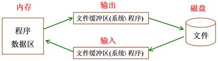

- 磁盘文件，一般保存在硬盘、U盘等掉电不丢失的磁盘设备中，在需要时调入内存
- 在内存中对文件进行编辑处理后，保存到磁盘中
- 程序与磁盘之间交互，不是立即完成，系统或程序可根据需要设置缓冲区，以提高存取效率

#### 10.8.3更新缓冲区

```c
#include <stdio.h>
int fflush(FILE *stream);
```

> 功能：更新缓冲区，让缓冲区的数据立马写到文件中。
>
> 参数：
>
> ​	stream：文件指针
>
> 返回值：
>
> ​	成功：0
>
> ​	失败：-1

