# C语言笔记

## 1. C语言概述

### 1.1 C语言

​	一提到语言这个词语，自然会想到的是像英语、汉语等这样的自然语言，因为它是人和人交换信息不可缺少的工具。

而今天计算机遍布了我们生活的每一个角落，除了人和人的相互交流之外，我们必须和计算机角落。

用什么的什么样的方式和计算机做最直接的交流呢？人们自然想到的是最古老也最方便的方式——语言，而C语言就是人和计算机交流的一种语言。

语言是用来交流沟通的。有一方说，有另一方听，必须有两方参与，这是语言最重要的功能：

>  说的一方传递信息，听的一方接收信息；

> 说的一方下达指令，听的一方遵循命令做事情。

<font color="red">语言是人和人交流，C语言是人和机器交流</font>。只是，人可以不听另外一个人，但是，计算机是无条件服从。

语言有独特的语法规则和定义，双方必须遵循这些规则和定义才能实现真正的交流。

#### 1.1.1  计算机结构组成

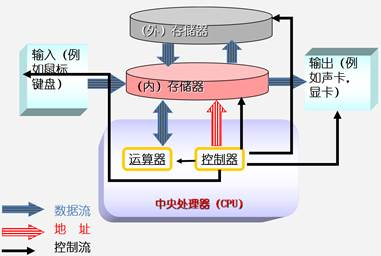

### 1.2 为什么学C语言

#### 1.2.1 C语言特点

- 优点
  - 代码量小
  - 执行速度快
  - 功能强大
  - 编程自由
- 缺点
  - 写代码实现周期长
  - 可移植性较差
  - 过于自由，经验不足易出错
  - 对平台库依赖较多 

#### 1.2.2 学习C语言理由

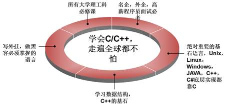

#### 1.2.3 C语言应用领域

C语言的应用极其广泛，从网站后台，到底层操作系统，从多媒体应用到大型网络游戏，均可使用C语言来开发：

- C语言可以写网站后台程序

- C语言可以专门针对某个主题写出功能强大的程序库

- C语言可以写出大型游戏的引擎

- C语言可以写出另一个语言来

- C语言可以写操作系统和驱动程序，并且只能用C语言编写

- 任何设备只要配置了微处理器，就都支持C语言。从微波炉到手机，都是由C语言技术来推动的

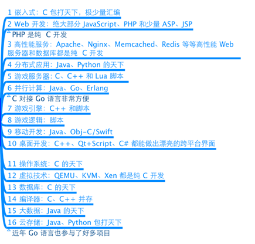

#### 1.2.4 C语言关键字

> C语言仅有32个关键字，9种控制语句，34种运算符，却能完成无数的功能：

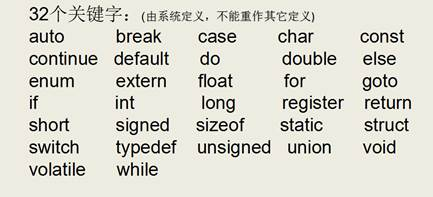

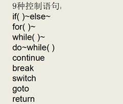

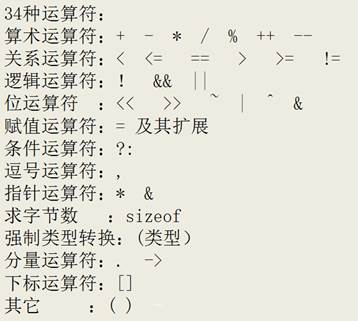

### 1.3 第一个C语言程序：HelloWorld

#### 1.3.1 编写C语言代码：hello.c

```c
#include <stdio.h>

int main(){
	// 第一个C语言程序
	printf("hello world\n");
	return 0;
}
```

> C语言的源代码文件是一个普通的文本文件，<font color="red">但扩展名必须是.c</font>

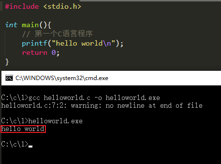

#### 1.3.2 通过gcc编译C代码

 ##### 1. gcc编译器介绍

编辑器(如vi、记事本)是指我用它来写程序的（编辑代码），而我们写的代码语句，电脑是不懂的，我们需要把它转成电脑能懂的语句，编译器就是这样的转化工具。就是说，<font color="red">我们用编辑器编写程序，由编译器编译后才可以运行！</font>

编译器是将易于编写、阅读和维护的高级计算机语言翻译为计算机能解读、运行的低级机器语言的程序

gcc（GNU Compiler Collection，GNU 编译器套件），是由 GNU 开发的编程语言编译器。gcc原本作为GNU操作系统的官方编译器，现已被大多数类Unix操作系统（如Linux、BSD、Mac OS X等）采纳为标准的编译器，gcc同样适用于微软的Windows

gcc最初用于编译C语言，随着项目的发展gcc已经成为了能够编译C、C++、Java、Ada、fortran、Object C、Object C++、Go语言的编译器大家族

编译命令格式：

```cmd
gcc [-option1] ... <filename>
g++ [-option1] ... <filename>
```

- 命令、选项和源文件之间使用空格分隔

- 一行命令中可以有零个、一个或多个选项

- 文件名可以包含文件的绝对路径，也可以使用相对路径

- 如果命令中不包含输出可执行文件的文件名，可执行文件的文件名会自动生成一个默认名，Linux平台为`a.out`，Windows平台为`a.exe`

gcc、g++编译常用选项说明：

| **选项** | **含义**                   |
| -------- | -------------------------- |
| -o file  | 指定生成的输出文件名为file |
| -E       | 只进行预处理               |
| -S(大写) | 只进行预处理和编译         |
| -c(小写) | 只进行预处理、编译和汇编   |

##### 2. Windows平台下gcc环境配置

> windows命令行界面下，默认是没有gcc编译器，我们需要配置一下环境
>
> `MinGW`, 安装使用教程参看：[MinGW安装教程](https://blog.csdn.net/wxh0000mm/article/details/100666329)

##### 3. linux平台下gcc环境配置

> 参考教程：[详解Linux安装GCC方法](https://blog.csdn.net/lydong_/article/details/79812402)

#### 1.3.3 代码分析

```php
#include <stdio.h>

/*
#include的意思是头文件包含,
#include <stdio.h>代表包含stdio.h这个头文件

使用C语言库函数需要提前包含库函数对应的头文件，如这里使用了printf()函数，需要包含stdio.h头文件
*/

int main(){
	// 第一个C语言程序
	printf("hello world\n"); // 可以通过man 3 printf查看printf所需的头文件
	return 0;
}
```

##### 1. include头文件包含

- `#include< >` 与 `#include ""`的区别：

- `< >` 表示系统<font color="red">直接</font>按系统指定的目录检索

- `" "` 表示系统<font color="red">先</font>在` " " `指定的路径(没写路径代表当前路径)查找头文件，如果找不到，<font color="red">再</font>按系统指定的目录检索

`stdio.h` 在操作系统`/usr/include/`目录下

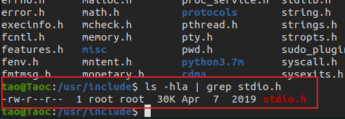

##### 2. main函数

- 一个完整的C语言程序，是由一个、<font color="red">且只能有一个</font>`main()`函数(又称主函数，必须有)和若干个其他函数结合而成（可选）
- `main`函数是C语言程序的入口，程序是从main函数开始执行

##### 3. {} 括号，程序体和代码块

- `{}`叫代码块，一个代码块内部可以有一条或者多条语句
- C语言每句可执行代码都是"`;`"分号结尾
- 所有的`#`开头的行，都代表预编译指令，预编译指令行结尾是没有分号的
- 所有的可执行语句必须是在代码块里面

##### 4.  注释

- `//`叫行注释，注释的内容编译器是忽略的，注释主要的作用是在代码中加一些说明和解释，这样有利于代码的阅读
- `/**/`叫块注释
- 块注释是C语言标准的注释方法
- 行注释是从C++语言借鉴过来的

##### 5. printf函数

- `printf`是C语言库函数，功能是向标准输出设备输出一个字符串

- `printf(“hello world\n”);` //`\n`的意思是回车换行

##### 6.  return语句

- `return` 代表函数执行完毕，返回return代表函数的终止

- 如果main定义的时候前面是`int`，那么return后面就需要写一个整数；如果main定义的时候前面是`void`，那么return后面什么也不需要写

- 在main函数中`return 0`代表程序执行成功，`return -1`代表程序执行失败

- `int main()`和`void main()`在C语言中是一样的，但C++只接受`int main`这种定义方式

### 1.4 system函数

#### 1.4.1 system函数的使用

```php
#include <stdlib.h>

int system(const char *command);
```

> 功能：在已经运行的程序中执行另外一个外部程序
> 参数：外部可执行程序名字
> 返回值：
> 成功：0
> 失败：任意数字

```c
#include <stdio.h>
#include <stdlib.h>

int main()
{
	//system("calc"); //windows平台
	system("ls"); //Linux平台, 需要头文件#include <stdlib.h>

	return 0;
}

```

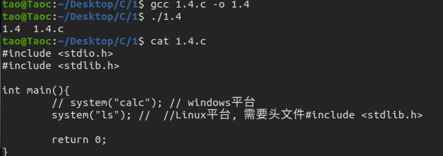

### 1.5 C语言编译过程

#### 1.5.1 C程序编译步骤

> C代码编译成可执行程序经过4步：

1. 预处理：宏定义展开、头文件展开、条件编译等，同时将代码中的注释删除，这里并不会检查语法
2. 编译：检查语法，将预处理后文件编译生成汇编文件
3. 汇编：将汇编文件生成目标文件(二进制文件)
4. 链接：C语言写的程序是需要依赖各种库的，所以编译之后还需要把库链接到最终的可执行程序中去

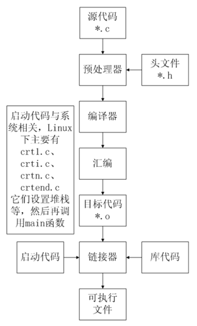

> VS 执行结果一闪而过的解决方法：

1. `system("pause");`

2. `项目->属性->配置属性->链接器->系统->子系统->控制台 增加“/SUBSYSTEM:CONSOLE”链接选项即可`

#### 1.5.2 gcc 编译过程

##### 1. 分步编译

> 预处理：`gcc -E introduce.c -o introduce.i`

> 编 译：`gcc -S introduce.i -o introduce.s`

> 汇 编：`gcc -c introduce.s -o introduce.o`

> 链 接：`gcc  introduce.o -o introduce`

| **选项** | **含义**                    |
| -------- | --------------------------- |
| -E       | 只进行预处理                |
| -S(大写) | 只进行预处理和编译          |
| -c(小写) | 只进行预处理、编译和汇编    |
| -o file  | 指定生成的输出文件名为 file |

 

| **文件后缀** | **含义**              |
| ------------ | --------------------- |
| .c           | C 语言文件            |
| .i           | 预处理后的 C 语言文件 |
| .s           | 编译后的汇编文件      |
| .o           | 编译后的目标文件      |

编译的时候最后两倒数第二步的时候用了大写`C`

`gcc -C introduce.s -o introduce.o`

`gcc introduce.o -o introduce`

导致了如下问题， 记录一下

/usr/bin/ld: /usr/lib/gcc/x86_64-linux-gnu/8/../../../x86_64-linux-gnu/Scrt1.o: in function `_start':
(.text+0x20): undefined reference to `main'
collect2: error: ld returned 1 exit status

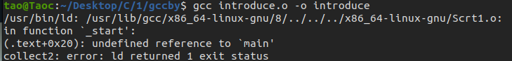

正确的编译过程

```bash
gcc -E introduce.c -o introduce.i
gcc -S introduce.i -o introduce.s
gcc -c introduce.s -o introduce.o
gcc introduce.o -o introduce
./introduce 
```

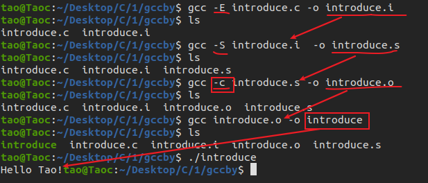

##### 2. 一步编译

`gcc introduce.c -o introduce1` // 自动完成：预处理、编译、汇编、链接的过程

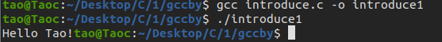

#### 1.5.3  查找程序所依赖的动态库

Windows平台下，需要相应软件(`Depends.exe`)：

> 工具下载地址：http://www.dependencywalker.com/

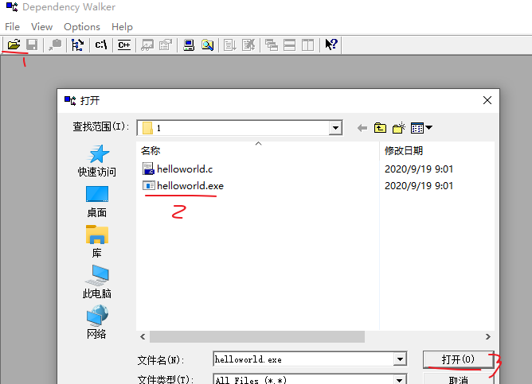

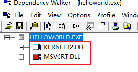

### 1.6 CPU内部结构与寄存器(了解)

#### 1.6.1 64位和32位系统区别

- 寄存器是CPU内部最基本的存储单元
- CPU对外是通过总线(地址、控制、数据)来和外部设备交互的，<font color="red">总线的宽度是8位，同时CPU的寄存器也是8位</font>，那么这个CPU就叫8位CPU

- 如果总线是32位，寄存器也是32位的，那么这个CPU就是32位CPU
- 有一种CPU内部的寄存器是32位的，但总线是16位，准32为CPU
- 所有的64位CPU兼容32位的指令，32位要兼容16位的指令，所以在64位的CPU上是可以识别32位的指令
- 在64位的CPU构架上运行了64位的软件操作系统，那么这个系统是64位
- 在64位的CPU构架上，运行了32位的软件操作系统，那么这个系统就是32位
- 64位的软件不能运行在32位的CPU之上

#### 1.6.2 寄存器名字(了解)

| **8**位 | **16**位 | **32**位 | **64**位 |
| ------- | -------- | -------- | -------- |
| A       | AX       | EAX      | RAX      |
| B       | BX       | EBX      | RBX      |
| C       | CX       | ECX      | RCX      |
| D       | DX       | EDX      | RDX      |

#### 1.6.3 寄存器、缓存、内存三者关系

按与CPU远近来分，离得最近的是寄存器，然后缓存(CPU缓存)，最后内存。

CPU计算时，先预先把要用的数据从硬盘读到内存，然后再把即将要用的数据读到寄存器。于是 CPU<--->寄存器<--->内存，这就是它们之间的信息交换。

那为什么有缓存呢？因为如果经常操作内存中的同一址地的数据，就会影响速度。于是就在寄存器与内存之间设置一个缓存。

因为从存提取的速度远高于内存。当然缓存的价格肯定远远高于内存，不然的话，机器里就没有内存的存在。

由此可以看出，从远近来看：<font color="red">CPU〈---〉寄存器〈---> 缓存 <---> 内存</font>

### 1.7 汇编语言

#### 1.7.1 VS中C语言嵌套汇编代码(了解)

```c
#include <stdio.h>

int main()
{
	//定义整型变量a, b, c
	int a;
	int b;
	int c;

	__asm
	{
		mov a, 3	//3的值放在a对应内存的位置
		mov b, 4	//4的值放在b对应内存的位置
		mov eax, a	//把a内存的值放在eax寄存器
		add eax, b	//eax和b相加，结果放在eax
		mov c, eax	//eax的值放在c中
	}
	
	printf("%d\n",  c);//把c的值输出

	return 0;//成功完成
}
```

#### 1.7.2 VS反编译

```c
#include <stdio.h>

int main()
{
	//定义整型变量a, b, c
	int a;
	int b;
	int c;

	a = 3;
	b = 4;
	c = a + b;
	
	printf("%d\n",  c);//把c的值输出

	return 0;//成功完成
}
```

### 1.8 集成开发环境IDE

集成开发环境（IDE，Integrated Development Environment ）是用于提供程序开发环境的应用程序，<font color="red">一般包括代码编辑器、编译器、调试器和图形用户界面工具</font>。集成了代码编写功能、分析功能、编译功能、调试功能等一体化的开发软件服务套。所有具备这一特性的软件或者软件套（组）都可以叫集成开发环境。

#### 1.8.1 Qt Creator

Qt Creator是跨平台的 Qt IDE， Qt Creator 是 Qt 被 Nokia 收购后推出的一款新的轻量级集成开发环境（IDE）。此 IDE 能够跨平台运行，支持的系统包括 Linux（32 位及 64 位）、Mac OS X 以及 Windows。根据官方描述，Qt Creator 的设计目标是使开发人员能够利用 Qt 这个应用程序框架更加快速及轻易的完成开发任务。

| **快捷键**  | **含义**                   |
| ----------- | -------------------------- |
| Ctrl + i    | 自动格式化代码             |
| Ctrl + /    | 注释/取消注释              |
| Alt + Enter | 自动完成类函数定义         |
| F4          | .h 文件和对应.cpp 文件切换 |
| F9          | 设置断点                   |
| F5          | 调试运行                   |
| Ctrl + r    | 编译，但不调试运行         |

| Ctrl + b | 编译，不运行 |
| -------- | ------------ |
| F10      | next调试     |
| F11      | step调试     |

#### 1.8.2 Microsoft Visual Studio

Microsoft Visual Studio（简称VS）是美国微软公司的开发工具包系列产品。VS是一个基本完整的开发工具集，它包括了整个软件生命周期中所需要的大部分工具，如UML工具、代码管控工具、集成开发环境(IDE)等等,所写的目标代码适用于微软支持的所有平台。Visual Studio是目前最流行的Windows平台应用程序的集成开发环境。

##### 1. VS常用快捷键

| **快捷键**        | **含义**       |
| ----------------- | -------------- |
| Ctrl + k,Ctrl + f | 自动格式化代码 |
| Ctrl + k,Ctrl + c | 注释代码       |
| Ctrl + k,Ctrl + u | 取消注释代码   |
| F9                | 设置断点       |
| F5                | 调试运行       |
| Ctrl + F5         | 不调试运行     |
| Ctrl + Shift + b  | 编译，不运行   |
| F10               | next调试       |
| F11               | step调试       |

##### 2. VS2013的C4996错误

由于微软在VS2013中不建议再使用C的传统库函数scanf,strcpy,sprintf等，所以直接使用这些库函数会提示C4996错误：

VS建议采用带_s的函数，如scanf_s、strcpy_s，但这些并不是标准C函数。

要想继续使用此函数，<font color="red">需要在源文件中添加以下指令就可以避免这个错误提示</font>：

```c
#define _CRT_SECURE_NO_WARNINGS     //这个宏定义最好要放到.c文件的第一行
#pragma warning(disable:4996)	//或者使用这个

```

## 2. 数据类型

### 2.1 常量与变量

#### 2.1.1 关键字

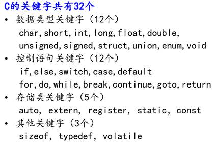

#### 2.1.2 数据类型

> 数据类型的作用：编译器预算对象（变量）分配的内存空间大小


#### 2.1.3 常量

常量：

- 在程序运行过程中，其值不能被改变的量
- 常量一般出现在表达式或赋值语句中

| 整型常量   | 100，200，-100，0      |
| ---------- | ---------------------- |
| 实型常量   | 3.14  ， 0.125，-3.123 |
| 字符型常量 | ‘a’,‘b’,‘1’,‘\n’       |
| 字符串常量 | “a”,“ab”，“12356”      |

#### 2.1.4 变量

##### 1. 变量

- 在程序运行过程中，其值可以改变
- <font color="red">变量在使用前必须先定义，定义变量前必须有相应的数据类型</font>

标识符命名规则：

- 标识符不能是关键字
- 标识符只能由字母、数字、下划线组成
- 第一个字符必须为字母或下划线
- 标识符中字母区分大小写

变量特点：

- 变量在编译时为其分配相应的内存空间
- 可以通过其<font color="red">名字</font>和<font color="red">地址</font>>访问相应内存

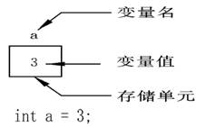

##### 2. 声明和定义区别

- 声明变量不需要建立存储空间，如：`extern int a;`
- 定义变量需要建立存储空间，如：`int b;`

```c
#include <stdio.h>

int main()
{
	//extern 关键字只做声明，不能做任何定义，后面还会学习，这里先了解
	//声明一个变量a，a在这里没有建立存储空间
	extern int a;
	a = 10;	//err, 没有空间，就不可以赋值

	int b = 10;	//定义一个变量b，b的类型为int，b赋值为10

	return 0;
}
```

从广义的角度来讲声明中包含着定义，即<font color="red">定义是声明的一个特例</font>，所以并非所有的声明都是定义：

- `int b` 它既是声明，同时又是定义

- 对于 `extern b`来讲它只是声明不是定义

> 一般的情况下，把建立存储空间的声明称之为“定义”，而把不需要建立存储空间的声明称之为“声明”

#### 2.1.5 使用示例

```c
#include <stdio.h>
#define MAX 10 //声明了一个常量，名字叫MAX，值是10，常量的值一旦初始化不可改

int main()
{
	int a;	//定义了一个变量，其类型为int，名字叫a

	const int b = 10; //定义一个const常量，名为叫b，值为10
	//b = 11; //err,常量的值不能改变

	//MAX = 100;	//err,常量的值不能改变

	a = MAX;//将abc的值设置为MAX的值
	a = 123;

	printf("%d\n", a); //打印变量a的值

	return 0;
}
```

### 2.2 整数：int

#### 2.2.1 整型变量的定义和输出

| **打印格式** | **含义**                                               |
| ------------ | ------------------------------------------------------ |
| %d           | 输出一个<font color="red">有符号</font>的10进制int类型 |
| %o(字母o)    | 输出8进制的int类型                                     |
| %x           | 输出16进制的int类型，字母以小写输出                    |
| %X           | 输出16进制的int类型，字母以大写输出                    |
| %u           | 输出一个10进制的<font color="red">无符号</font>数      |

```c
#include <stdio.h>

int main()
{
	int a = 123;	//定义变量a，以10进制方式赋值为123
	int b = 0567;	//定义变量b，以8进制方式赋值为0567
	int c = 0xabc;	//定义变量c，以16进制方式赋值为0xabc

	printf("a = %d\n", a);
	printf("8进制：b = %o\n", b);
	printf("10进制：b = %d\n", b);
	printf("16进制：c = %x\n", c);
	printf("16进制：c = %X\n", c);
	printf("10进制：c = %d\n", c);
	
	unsigned int d = 0xffffffff; //定义无符号int变量d，以16进制方式赋值
	printf("有符号方式打印：d = %d\n", d);
	printf("无符号方式打印：d = %u\n", d);
	return 0;
}
```

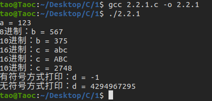

#### 2.2.2 整型变量的输入

```c
#include <stdio.h>

int main()
{
	int a;
	printf("请输入a的值：");

	//不要加"\n"
	scanf("%d", &a);
	printf("a = %d\n", a); //打印a的值
    
	return 0;
}

```

#### 2.2.3 short、int、long、long long

| **数据类型**        | **占用空间**                                    |
| ------------------- | ----------------------------------------------- |
| short(短整型)       | 2字节                                           |
| int(整型)           | 4字节                                           |
| long(长整形)        | Windows为4字节，Linux为4字节(32位)，8字节(64位) |
| long long(长长整形) | 8字节                                           |

> 注意：

- 整型数据在内存中占的字节数与所选择的操作系统有关。虽然 C 语言标准中没有明确规定整型数据的长度，但 long 类型整数的长度不能短于 int 类型， short 类型整数的长度不能长于 int 类型
- <font color="red">当一个小的数据类型赋值给一个大的数据类型，不会出错，因为编译器会自动转化。但当一个大的类型赋值给一个小的数据类型，那么就可能丢失高位</font>

| **整型常量** | **所需类型** |
| ------------ | ------------ |
| 10           | 代表int类型  |
| 10l, 10L     | 代表long类型               |
| 10ll, 10LL   | 代表long long类型          |
| 10u, 10U     | 代表unsigned int类型       |
| 10ul, 10UL   | 代表unsigned long类型      |
| 10ull, 10ULL | 代表unsigned long long类型 |

 

| **打印格式**                   | **含义**                                         |
| ------------------------------ | ------------------------------------------------ |
| %hd                            | 输出short类型                                    |
| <font color="red">%d  </font>  | <font color="red">  输出int类型 </font>          |
| %ld                            | 输出long类型                                     |
| %lld                           | 输出long long类型                                |
| %hu                            | 输出unsigned short类型                           |
| <font color="red">%u</font>    | <font color="red">输出unsigned int类型  </font>  |
| <font color="red">%lu  </font> | <font color="red">输出unsigned long类</型</font> |
| %llu                           | 输出unsigned long long类型                       |

```c
#include <stdio.h>

int main()
{
	short a = 10;
	int b = 10;
	long c = 10l; //或者10L
	long long d = 10ll; //或者10LL

	printf("sizeof(a) = %u\n", sizeof(a));
	printf("sizeof(b) = %u\n", sizeof(b));
	printf("sizeof(c) = %u\n", sizeof(c));
	printf("sizeof(c) = %u\n", sizeof(d));

	printf("short a = %hd\n", a);
	printf("int b = %d\n", b);
	printf("long c = %ld\n", c);
	printf("long long d = %lld\n", d);

	unsigned short a2 = 20u;
	unsigned int b2 = 20u;
	unsigned long c2= 20ul; 
	unsigned long long d2 = 20ull; 

	printf("unsigned short a = %hu\n", a2);
	printf("unsigned int b = %u\n", b2);
	printf("unsigned long c = %lu\n", c2);
	printf("unsigned long long d = %llu\n", d2);

	return 0;
}

```

输出：

```bash
tao@Taoc:~/Desktop/C/2$ ./2.2.3 
sizeof(a) = 2
sizeof(b) = 4
sizeof(c) = 8
sizeof(c) = 8
short a = 10
int b = 10
long c = 10
long long d = 10
unsigned short a = 20
unsigned int b = 20
unsigned long c = 20
unsigned long long d = 20
```

#### 2.2.4 有符号数和无符号数区别

##### 1. 有符号数

> 有符号数是最高位为符号位，0代表正数，1代表负数

```c
#include <stdio.h>

int main()
{
	signed int a = -1089474374; //定义有符号整型变量a
	printf("%X\n", a); //结果为 BF0FF0BA

	//B    F    0    F    F    0    B	 A
	//1011 1111 0000 1111 1111 0000 1011 1010

	return 0;
}
```

> 输出： BF0FF0BA

##### 2. 无符号数

<font color="red">无符号数最高位不是符号位</font>, 而就是数的一部分，无符号数不可能是负数

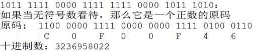

```c
#include <stdio.h>

int main()
{
	unsigned int a = 3236958022; //定义无符号整型变量a
	printf("%X\n", a); //结果为 C0F00F46

	return 0;
}
```

> 当我们写程序要处理一个不可能出现负值的时候，一般用无符号数，这样可以增大数的表达最大值

##### 3. 有符号和无符号整型取值范围

| **数据类型**   | **占用空间** | **取值范围**                                        |
| -------------- | ------------ | --------------------------------------------------- |
| short          | 2字节        | -32768 到 32767 ($-2^{15}$  ~ 2$^{15}$-1)           |
| int            | 4字节        | -2147483648 到  2147483647 ($-2^{31}$ ~ $2^{31}$-1) |
| long           | 4字节        | -2147483648 到  2147483647($-2^{31}$ ~ $2^{31}$-1)  |
| unsigned short | 2字节        | 0 到 65535 (0 ~ 2$^{16}$-1)                         |
| unsigned int   | 4字节        | 0 到 4294967295 (0  ~ 2$^{32}$-1)                   |
| unsigned long  | 4字节        | 0 到 4294967295 (0  ~ 2$^{32}$-1)                   |

### 2.3 sizeof 关键字

- `sizeof`不是函数，所以不需要包含任何头文件，它的功能是<font color="red">计算一个数据类型的大小</font>，单位为字节
- `sizeof`的返回值为`size_t`
- `size_t`类型在32位操作系统下是`unsigned int`，是一个无符号的整数

```c
#include <stdio.h>

int main()
{
	int a;
	int b = sizeof(a);//sizeof得到指定值占用内存的大小，单位：字节
	printf("b = %d\n", b);

	size_t c = sizeof(a);
	printf("c = %u\n", c);//用无符号数的方式输出c的值

	return 0;
}
```

输出：

```bash
tao@Taoc:~/Desktop/C/2$ ./2.3 
b = 4
c = 4
```

### 2.4  字符型：char

#### 2.4.1 字符变量的定义和输出

字符型变量用于存储一个单一字符，在 C 语言中用 char 表示，其中每个字符变量都会占用 1 个字节。在给字符型变量赋值时，需要用一对英文半角格式的单引号(`' '`)把字符括起来

字符变量实际上并不是把该字符本身放到变量的内存单元中去，而是将该字符对应的 ASCII 编码放到变量的存储单元中。<font color="red">char的本质就是一个1字节大小的整型</font>

```c
#include <stdio.h>

int main()
{
	char ch = 'a';
	printf("sizeof(ch) = %u\n", sizeof(ch));

	printf("ch[%%c] = %c\n", ch); //打印字符
	printf("ch[%%d] = %d\n", ch); //打印‘a’ ASCII的值

	char A = 'A';
	char a = 'a';
	printf("a = %d\n", a);		//97
	printf("A = %d\n", A);	//65

	printf("A = %c\n", 'a' - 32); //小写a转大写A
	printf("a = %c\n", 'A' + 32); //大写A转小写a

	ch = ' ';
	printf("空字符：%d\n", ch); //空字符ASCII的值为32
	printf("A = %c\n", 'a' - ' '); //小写a转大写A
	printf("a = %c\n", 'A' + ' '); //大写A转小写a

	return 0;
}
```

输出结果：

```c
ao@Taoc:~/Desktop/C/2$ ./2.4.1 
sizeof(ch) = 1
ch[%c] = a
ch[%d] = 97
a = 97
A = 65
A = A
a = a
空字符：32
A = A
a = a
```

#### 2.4.2 字符变量的输入

```c
#include <stdio.h>

int main()
{
	char ch;
	printf("请输入ch的值：");

	//不要加“\n”
	scanf("%c", &ch);
	printf("ch = %c\n", ch); //打印ch的字符

	return 0;
}
```

输出：

```bash
tao@Taoc:~/Desktop/C/2$ ./2.4.2 
请输入ch的值：a
ch = a
```

#### 2.4.3 ASCII 对照表

| <font color="blue">**ASCII值**</font> | <font color="blue"> **控制字符**  </font> | <font color="blue">**ASCII值**</font> | <font color="blue"> **字符**  </font> | <font color="blue">**ASCII值**</font> | <font color="blue"> **字符**  </font> | <font color="blue">**ASCII值**</font> | <font color="blue"> **字符**  </font> |
| ------------------------------------- | ----------------------------------------- | ------------------------------------- | ------------------------------------- | ------------------------------------- | ------------------------------------- | ------------------------------------- | ------------------------------------- |
| 0                                     | NUT                                       | 32                                    | (space)                               | 64                                    | @                                     | 96                                    | 、                                    |
| 1                                     | SOH                                       | 33                                    | !                                     | 65                                    | A                                     | 97                                    | a                                     |
| 2                                     | STX                                       | 34                                    | "                                     | 66                                    | B                                     | 98                                    | b                                     |
| 3                                     | ETX                                       | 35                                    | #                                     | 67                                    | C                                     | 99                                    | c                                     |
| 4                                     | EOT                                       | 36                                    | $                                     | 68                                    | D                                     | 100                                   | d                                     |
| 5                                     | ENQ                                       | 37                                    | %                                     | 69                                    | E                                     | 101                                   | e                                     |
| 6                                     | ACK                                       | 38                                    | &                                     | 70                                    | F                                     | 102                                   | f                                     |
| 7                                     | BEL                                       | 39                                    | ,                                     | 71                                    | G                                     | 103                                   | g                                     |
| 8                                     | BS                                        | 40                                    | (                                     | 72                                    | H                                     | 104                                   | h                                     |
| 9                                     | HT                                        | 41                                    | )                                     | 73                                    | I                                     | 105                                   | i                                     |
| 10                                    | LF                                        | 42                                    | *                                     | 74                                    | J                                     | 106                                   | j                                     |
| 11                                    | VT                                        | 43                                    | +                                     | 75                                    | K                                     | 107                                   | k                                     |
| 12                                    | FF                                        | 44                                    | ,                                     | 76                                    | L                                     | 108                                   | l                                     |
| 13                                    | CR                                        | 45                                    | -                                     | 77                                    | M                                     | 109                                   | m                                     |
| 14                                    | SO                                        | 46                                    | .                                     | 78                                    | N                                     | 110                                   | n                                     |
| 15                                    | SI                                        | 47                                    | /                                     | 79                                    | O                                     | 111                                   | o                                     |
| 16                                    | DLE                                       | 48                                    | 0                                     | 80                                    | P                                     | 112                                   | p                                     |
| 17                                    | DCI                                       | 49                                    | 1                                     | 81                                    | Q                                     | 113                                   | q                                     |
| 18                                    | DC2                                       | 50                                    | 2                                     | 82                                    | R                                     | 114                                   | r                                     |
| 19                                    | DC3                                       | 51                                    | 3                                     | 83                                    | S                                     | 115                                   | s                                     |
| 20                                    | DC4                                       | 52                                    | 4                                     | 84                                    | T                                     | 116                                   | t                                     |
| 21                                    | NAK                                       | 53                                    | 5                                     | 85                                    | U                                     | 117                                   | u                                     |
| 22                                    | SYN                                       | 54                                    | 6                                     | 86                                    | V                                     | 118                                   | v                                     |
| 23                                    | TB                                        | 55                                    | 7                                     | 87                                    | W                                     | 119                                   | w                                     |
| 24                                    | CAN                                       | 56                                    | 8                                     | 88                                    | X                                     | 120                                   | x                                     |
| 25                                    | EM                                        | 57                                    | 9                                     | 89                                    | Y                                     | 121                                   | y                                     |
| 26                                    | SUB                                       | 58                                    | :                                     | 90                                    | Z                                     | 122                                   | z                                     |
| 27                                    | ESC                                       | 59                                    | ;                                     | 91                                    | [                                     | 123                                   | {                                     |
| 28                                    | FS                                        | 60                                    | <                                     | 92                                    | /                                     | 124                                   | \|                                    |
| 29                                    | GS                                        | 61                                    | =                                     | 93                                    | ]                                     | 125                                   | }                                     |
| 30                                    | RS                                        | 62                                    | >                                     | 94                                    | ^                                     | 126                                   | `                                     |
| 31                                    | US                                        | 63                                    | ?                                     | 95                                    | _                                     | 127                                   | DEL                                   |

ASCII 码大致由以下两部分组成：

- ASCII 非打印控制字符： ASCII 表上的数字 0-31 分配给了控制字符，用于控制像打印机等一些外围设备
- ASCII 打印字符：数字 32-126 分配给了能在键盘上找到的字符，当查看或打印文档时就会出现。数字 127 代表 Del 命令

#### 2.4.4 转义字符

| **转义字符**                   | **含义**                            | **ASCII****码值（十进制）** |
| ------------------------------ | ----------------------------------- | --------------------------- |
| <font color="red">\a</font>    | 警报                                | 007                         |
| <font color="red">\b  </font>  | 退格(BS) ，将当前位置移到前一列     | 008                         |
| <font color="red">\f  </font>  | 换页(FF)，将当前位置移到下页开头    | 012                         |
| <font color="red">\n  </font>  | 换行(LF) ，将当前位置移到下一行开头 | 010                         |
| <font color="red"> \r  </font> | 回车(CR) ，将当前位置移到本行开头   | 013                         |
| <font color="red">\t  </font>  | 水平制表(HT)  （跳到下一个TAB位置） | 009                         |
| <font color="red"> \v  </font> | 垂直制表(VT)                        | 011                         |
| `\\  `                         | 代表一个反斜线字符"\"               | 092                         |
| ` \'  `                        | 代表一个单引号（撇号）字符          | 039                         |
| `\" `                          | 代表一个双引号字符                  | 034                         |
| ` \?  `                        | 代表一个问号                        | 063                         |
| `\0 `                          | 数字0                               | 000                         |
| ` \ddd  `                      | 8进制转义字符，d范围0~7             | 3位8进制                    |
| `  \xhh `                      | 16进制转义字符，h范围0~9，a~f，A~F  | 3位16进制                   |

> 注意：红色字体标注的为不可打印字符

```c
#include <stdio.h>

int main()
{
	printf("abc");
	printf("\refg\n"); //\r切换到句首， \n为换行键

	printf("abc");
	printf("\befg\n");//\b为退格键， \n为换行键

	printf("%d\n", '\123');// '\123'为8进制转义字符，0123对应10进制数为83
	printf("%d\n", '\x23');// '\x23'为16进制转义字符，0x23对应10进制数为35

	return 0;
}

```

输出结果：

```bash
tao@Taoc:~/Desktop/C/2$ ./2.4.4 
efg
abefg
83
35
```

### 2.5 实型(浮点型)：float、double

实型变量也可以称为浮点型变量，浮点型变量是用来存储小数数值的。在C语言中， 浮点型变量分为两种： 单精度浮点数(`float`)、 双精度浮点数(`double`)， 但是`double`型变量所表示的浮点数比 float 型变量更精确。

由于浮点型变量是由有限的存储单元组成的，因此只能提供有限的有效数字。在有效位以外的数字将被舍去，这样可能会产生一些误差。

不以f结尾的常量是`double`类型，以f结尾的常量(如3.14f)是`float`类型

```c
#include <stdio.h>

int main()
{
	//传统方式赋值
	float a = 3.14f; //或3.14F
	double b = 3.14;

	printf("a = %f\n", a);
	printf("b = %lf\n", b);

	//科学法赋值
	a = 3.2e3f; //3.2*1000 = 3200，e可以写E
	printf("a1 = %f\n", a);

	a = 100e-3f; //100*0.001 = 0.1
	printf("a2 = %f\n", a);

	a = 3.1415926f;
	printf("a3 = %f\n", a); //结果为3.141593

	return 0;
}
```

输出结果：

```bash
tao@Taoc:~/Desktop/C/2$ ./2.5 
a = 3.140000
b = 3.140000
a1 = 3200.000000
a2 = 0.100000
a3 = 3.141593
```

### 2.6 进制

进制也就是进位制，是人们规定的一种进位方法。 对于任何一种进制—X进制，就表示某一位置上的数运算时是逢X进一位。 十进制是逢十进一，十六进制是逢十六进一，二进制就是逢二进一，以此类推，x进制就是逢x进位

| **十进制** | **二进制** | **八进制** | **十六进制** |
| ---------- | ---------- | ---------- | ------------ |
| 0          | 0          | 0          | 0            |
| 1          | 1          | 1          | 1            |
| 2          | 10         | 2          | 2            |
| 3          | 11         | 3          | 3            |
| 4          | 100        | 4          | 4            |
| 5          | 101        | 5          | 5            |
| 6          | 110        | 6          | 6            |
| 7          | 111        | 7          | 7            |
| 8          | 1000       | 10         | 8            |
| 9          | 1001       | 11         | 9            |
| 10         | 1010       | 12         | A            |
| 11         | 1011       | 13         | B            |
| 12         | 1100       | 14         | C            |
| 13         | 1101       | 15         | D            |
| 14         | 1110       | 16         | E            |
| 15         | 1111       | 17         | F            |
| 16         | 10000      | 20         | 10           |

#### 2.6.1 二进制

二进制是计算技术中广泛采用的一种数制。二进制数据是用0和1两个数码来表示的数。它的基数为2，进位规则是“逢二进一”，借位规则是“借一当二”

> 当前的计算机系统使用的基本上是二进制系统，<font color="red">数据在计算机中主要是以补码的形式存储的</font>

| **术语**     | **含义**                                                     |
| ------------ | ------------------------------------------------------------ |
| bit(比特)    | 一个二进制代表一位，一个位只能表示0或1两种状态。数据传输是习惯以“位”（bit）为单位。 |
| Byte(字节)   | 一个字节为8个二进制，称为8位，<font color="red">计算机中存储的最小单位是字节</font>。数据存储是习惯以“字节”（Byte）为单位。 |
| WORD(双字节) | 2个字节，16位                                                |
| DWORD        | 两个WORD，4个字节，32位                                      |
| 1b           | 1bit，1位                                                    |
| 1B           | 1Byte,1字节，8位                                             |
| 1k，1K       | 1024                                                         |
| 1M(1兆)      | 1024k, 1024*1024                                             |
| 1G           | 1024M                                                        |
| 1T           | 1024G                                                        |
| 1Kb(千位)    | 1024bit,1024位                                               |
| 1KB(千字节)  | 1024Byte，1024字节                                           |
| 1Mb(兆位)    | 1024Kb = 1024 * 1024bit                                      |
| 1MB(兆字节)  | 1024KB = 1024 * 1024Byte                                     |

十进制转化二进制的方法：用十进制数除以2，分别取余数和商数，商数为0的时候，将余数倒着数就是转化后的结果

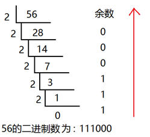

十进制的小数转换成二进制：小数部分和2相乘，取整数，不足1取0，<font color="red">每次相乘都是小数部分</font>，顺序看取整后的数就是转化后的结果

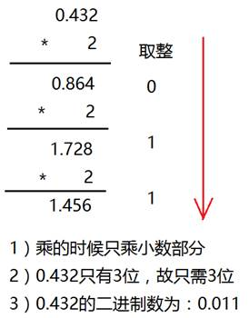

#### 2.6.2 八进制

八进制，`Octal`，缩写OCT或O，一种以8为基数的计数法，采用0，1，2，3，4，5，6，7八个数字，逢八进1。一些编程语言中常常以数字0开始表明该数字是八进制

八进制的数和二进制数可以按位对应（<font color="red">八进制一位对应二进制三位</font>），因此常应用在计算机语言中

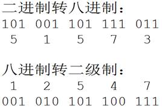

十进制转化八进制的方法：

用十进制数除以8，分别取余数和商数，商数为0的时候，将余数倒着数就是转化后的结果

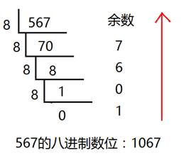

#### 2.6.3 十六进制

十六进制（英文名称：Hexadecimal），同我们日常生活中的表示法不一样，它由0-9，A-F组成，<font color="red">字母不区分大小写</font>。与10进制的对应关系是：0-9对应0-9，A-F对应10-15

十六进制的数和二进制数可以按位对应（<font color="red">十六进制一位对应二进制四位</font>），因此常应用在计算机语言中

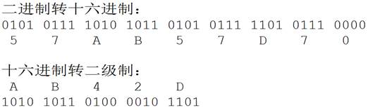

十进制转化十六进制的方法：

用十进制数除以16，分别取余数和商数，商数为0的时候，将余数倒着数就是转化后的结果

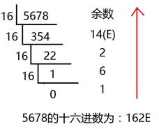

#### 2.6.4 C语言如何表示相应进制数

| 十进制   | 以正常数字1-9开头，如123  |
| -------- | ------------------------- |
| 八进制   | 以数字0开头，如0123       |
| 十六进制 | 以0x开头，如0x123         |
| 二进制   | C语言不能直接书写二进制数 |

```c
#include <stdio.h>

int main()
{
	int a = 123;		//十进制方式赋值
	int b = 0123;		//八进制方式赋值， 以数字0开头
	int c = 0xABC;	//十六进制方式赋值

	//如果在printf中输出一个十进制数那么用%d，八进制用%o，十六进制是%x
	printf("十进制：%d\n",a );
	printf("八进制：%o\n", b);	//%o,为字母o,不是数字
	printf("十六进制：%x\n", c);

	return 0;
}
```

输出：

```bash
tao@Taoc:~/Desktop/C/2$ ./2.6.4 
十进制：123
八进制：123
十六进制：abc
```

### 2.7 计算机内存数值存储方式

>  [原码, 反码, 补码 详解](https://www.cnblogs.com/zhangziqiu/archive/2011/03/30/ComputerCode.html)

#### 2.7.1 原码

一个数的原码(原始的二进制码)有如下特点：

- 最高位做为符号位，0表示正,为1表示负
- 其它数值部分就是数值本身绝对值的二进制数
- 负数的原码是在其绝对值的基础上，最高位变为1

下面数值以1字节的大小描述：

| **十进制数** | **原码**  |
| ------------ | --------- |
| +15          | 0000 1111 |
| -15          | 1000 1111 |
| +0           | 0000 0000 |
| -0           | 1000 0000 |

原码表示法简单易懂，与带符号数本身转换方便，只要符号还原即可，但当两个正数相减或不同符号数相加时，必须比较两个数哪个绝对值大，才能决定谁减谁，才能确定结果是正还是负，所以原码不便于加减运算

#### 2.7.2 反码

- 对于正数，反码与原码相同
- <font color="red">对于负数，符号位不变，其它部分取反(1变0,0变1)</font>

| **十进制数** | **反码**  |
| ------------ | --------- |
| +15          | 0000 1111 |
| -15          | 1111 0000 |
| +0           | 0000 0000 |
| -0           | 1111 1111 |

>  反码运算也不方便，通常用来作为求补码的中间过渡

#### 2.7.3 补码

<font color="red">**在计算机系统中，数值一律用补码来存储**</font>

补码特点：

- 对于正数，原码、反码、补码相同
- <font color="red">对于负数，其补码为它的反码加1</font>
- 补码符号位不动，其他位求反，最后整个数加1，得到原码

| **十进制数** | **补码**  |
| ------------ | --------- |
| +15          | 0000 1111 |
| -15          | 1111 0001 |
| +0           | 0000 0000 |
| -0           | 0000 0000 |

```c
#include <stdio.h>

int main()
{
	int  a = -15;

	printf("%x\n", a);
	//结果为 fffffff1
	//fffffff1对应的二进制：1111 1111 1111 1111 1111 1111 1111 0001
	//符号位不变，其它取反：1000 0000 0000 0000 0000 0000 0000 1110
	//上面加1：1000 0000 0000 0000 0000 0000 0000 1111  最高位1代表负数，就是-15

	return 0;
}
```

#### 2.7.4 补码的意义

示例1：用8位二进制数分别表示+0和-0

| **十进制数** | **原码**  |
| ------------ | --------- |
| +0           | 0000 0000 |
| -0           | 1000 0000 |

| **十进制数** | **反码**  |
| ------------ | --------- |
| +0           | 0000 0000 |
| -0           | 1111 1111 |

不管以原码方式存储，还是以反码方式存储，0也有两种表示形式。为什么同样一个0有两种不同的表示方法呢？

但是如果以补码方式存储，补码统一了零的编码：

| **十进制数** | **补码**                                              |
| ------------ | ----------------------------------------------------- |
| +0           | 0000 0000                                             |
| -0           | 10000 0000由于只用8位描述，最高位1丢弃，变为0000 0000 |

示例2：计算9-6的结果

以原码方式相加：

| **十进制数** | **原码**  |
| ------------ | --------- |
| 9            | 0000 1001 |
| -6           | 1000 0110 |

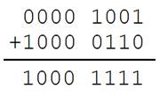

结果为-15，不正确。

以补码方式相加：

| **十进制数** | **补码**  |
| ------------ | --------- |
| 9            | 0000 1001 |
| -6           | 1111 1010 |


最高位的1溢出,剩余8位二进制表示的是3，正确

<font color="red">**在计算机系统中，数值一律用补码来存储**</font>主要原因是：

- 统一了零的编码
- 将符号位和其它位统一处理
- 将减法运算转变为加法运算
- 两个用补码表示的数相加时，如果最高位(符号位)有进位，则进位被舍弃

#### 2.7.5 数值溢出

当超过一个数据类型能够存放最大的范围时，数值会溢出

有符号位最高位溢出的区别：符号位溢出会导致数的正负发生改变，但最高位的溢出会导致最高位丢失

| **数据类型**  | **占用空间** | **取值范围**                      |
| ------------- | ------------ | --------------------------------- |
| char          | 1字节        | -128到 127(-2$^{7}$  ~ 2$^{7}$-1) |
| unsigned char | 1字节        | 0 到 255(0 ~ 2$^{8}$-1)           |

```c
#include <stdio.h>

int main()
{
	char ch;

	//符号位溢出会导致数的正负发生改变
	ch = 0x7f + 2; //127+2
	printf("%d\n", ch);
	//	0111 1111
	//+2后 1000 0001，这是负数补码，其原码为 1111 1111，结果为-127

	//最高位的溢出会导致最高位丢失
	unsigned char ch2;
	ch2 = 0xff+1; //255+1
	printf("%u\n", ch2);
	//	  1111 1111
	//+1后 10000 0000， char只有8位最高位的溢出，结果为0000 0000，十进制为0

	ch2 = 0xff + 2; //255+1
	printf("%u\n", ch2);
	//	  1111 1111
	//+1后 10000 0001， char只有8位最高位的溢出，结果为0000 0001，十进制为1

	return 0;
}
```

```c
tao@Taoc:~/Desktop/C/2$ gcc 2.7.5.c -o 2.7.5
2.7.5.c: In function ‘main’:
2.7.5.c:15:8: warning: unsigned conversion from ‘int’ to ‘unsigned char’ changes value from ‘256’ to ‘0’ [-Woverflow]
  ch2 = 0xff+1; //255+1
        ^~~~
2.7.5.c:20:8: warning: unsigned conversion from ‘int’ to ‘unsigned char’ changes value from ‘257’ to ‘1’ [-Woverflow]
  ch2 = 0xff + 2; //255+1
        ^~~~
tao@Taoc:~/Desktop/C/2$ ./2.7.5 
-127
0
1
```

### 2.8 类型限定符

| **限定符** | **含义**                                                     |
| ---------- | ------------------------------------------------------------ |
| extern     | 声明一个变量，extern声明的变量没有建立存储空间。  extern int a;//变量在定义的时候创建存储空间 |
| const      | 定义一个常量，常量的值不能修改。  const int a = 10;          |
| Volatile   | 防止编译器优化代码                                           |
| register   | 定义寄存器变量，提高效率。register是建议型的指令，而不是命令型的指令，如果CPU有空闲寄存器，那么register就生效，如果没有空闲寄存器，那么register无效。 |

### 2.9 字符串格式化输出和输入

#### 2.9.1 字符串常量

- 字符串是内存中一段连续的char空间，以'`\0`'(数字0)结尾
- 字符串常量是由双引号括起来的字符序列，如“china”、“C program”，“$12.5”等都是合法的字符串常量

字符串常量与字符常量的不同：

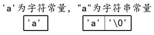

每个字符串的结尾，编译器会自动的添加一个结束标志位'`\0`'，即 "a" 包含两个字符'`a`'和’`\0`’

#### 2.9.2  printf函数和putchar函数

`printf`是输出一个字符串，`putchar`输出一个char

printf格式字符：

| **打印格式** | **对应数据类型** | **含义**                                                     |
| ------------ | ---------------- | ------------------------------------------------------------ |
| %d           | int              | 接受整数值并将它表示为有符号的十进制整数                     |
| %hd          | short int        | 短整数                                                       |
| %hu          | unsigned short   | 无符号短整数                                                 |
| %o           | unsigned int     | 无符号8进制整数                                              |
| %u           | unsigned int     | 无符号10进制整数                                             |
| %x,%X        | unsigned int     | 无符号16进制整数，x对应的是abcdef，X对应的是ABCDEF           |
| %f           | float            | 单精度浮点数                                                 |
| %lf          | double           | 双精度浮点数                                                 |
| %e,%E        | double           | 科学计数法表示的数，此处"e"的大小写代表在输出时用的"e"的大小写 |
| %c           | char             | 字符型。可以把输入的数字按照ASCII码相应转换为对应的字符      |
| %s           | char *           | 字符串。输出字符串中的字符直至字符串中的空字符（字符串以'\0‘结尾，这个'\0'即空字符） |
| %p           | void *           | 以16进制形式输出指针                                         |
| %%           | %                | 输出一个百分号                                               |

printf附加格式：

| **字符**          | **含义**                                                     |
| ----------------- | ------------------------------------------------------------ |
| l(字母l)          | 附加在d,u,x,o前面，表示长整数                                |
| -                 | 左对齐                                                       |
| m(代表一个整数)   | 数据最小宽度                                                 |
| 0(数字0)          | 将输出的前面补上0直到占满指定列宽为止不可以搭配使用-         |
| m.n(代表一个整数) | m指域宽，即对应的输出项在输出设备上所占的字符数。n指精度，用于说明输出的实型数的小数位数。对数值型的来说，未指定n时，隐含的精度为n=6位。 |

```c
#include <stdio.h>
int main()
{
	int a = 100;
	printf("a = %d\n", a);//格式化输出一个字符串
	printf("%p\n", &a);//输出变量a在内存中的地址编号
	printf("%%d\n");

	char c = 'a';
	putchar(c);//putchar只有一个参数，就是要输出的char
	long a2 = 100;
	printf("%ld, %lx, %lo\n", a2, a2, a2);

	long long a3 = 1000;
	printf("%lld, %llx, %llo\n", a3, a3, a3);

	int abc = 10;
	printf("abc = '%6d'\n", abc);
	printf("abc = '%-6d'\n", abc);
	printf("abc = '%06d'\n", abc);
	printf("abc = '%-06d'\n", abc);

	double d = 12.3;
	printf("d = \' %-10.3lf \'\n", d);

	return 0;
}
```

输出结果：

```bash
tao@Taoc:~/Desktop/C/2$ ./2.9.2 
a = 100
0x7ffd3443b718
%d
a100, 64, 144
1000, 3e8, 1750
abc = '    10'
abc = '10    '
abc = '000010'
abc = '10    '
d = ' 12.300     '
```

#### 2.9.3 scanf函数与getchar函数

- getchar是从标准输入设备读取一个char
- scanf通过%转义的方式可以得到用户通过标准输入设备输入的数据

```c
#include <stdio.h>

int main()
{
	char ch1;
	char ch2;
	char ch3;
	int a;
	int b;

	printf("请输入ch1的字符：");
	ch1 = getchar();
	printf("ch1 = %c\n", ch1);

	getchar(); //测试此处getchar()的作用

	printf("请输入ch2的字符：");
	ch2 = getchar();
	printf("\'ch2 = %ctest\'\n", ch2);

	getchar(); //测试此处getchar()的作用
	printf("请输入ch3的字符：");
	scanf("%c", &ch3);//这里第二个参数一定是变量的地址，而不是变量名
	printf("ch3 = %c\n", ch3);

	printf("请输入a的值：");
	scanf("%d", &a);
	printf("a = %d\n", a);

	printf("请输入b的值：");
	scanf("%d", &b);
	printf("b = %d\n", b);

	return 0;
}

```

```bash
tao@Taoc:~/Desktop/C/2$ gcc 2.9.3.c -o 2.9.3
tao@Taoc:~/Desktop/C/2$ ./2.9.3 
请输入ch1的字符：a
ch1 = a
请输入ch2的字符：b
'ch2 = btest'
请输入ch3的字符：c
ch3 = c
请输入a的值：d
a = 1513391056
请输入b的值：b = 32765
```

## 3. 运算符与表达式

### 3.1 常用运算符分类

| **运算符类型** | **作用**                               |
| -------------- | -------------------------------------- |
| 算术运算符     | 用于处理四则运算                       |
| 赋值运算符     | 用于将表达式的值赋给变量               |
| 比较运算符     | 用于表达式的比较，并返回一个真值或假值 |
| 逻辑运算符     | 用于根据表达式的值返回真值或假值       |
| 位运算符       | 用于处理数据的位运算                   |
| sizeof运算符   | 用于求字节数长度                       |

### 3.2 算术运算符

| **运算符** | **术语**   | **示例**    | **结果**  |
| ---------- | ---------- | ----------- | --------- |
| +          | 正号       | +3          | 3         |
| -          | 负号       | -3          | -3        |
| +          | 加         | 10 + 5      | 15        |
| -          | 减         | 10 - 5      | 5         |
| *          | 乘         | 10 * 5      | 50        |
| /          | 除         | 10 / 5      | 2         |
| %          | 取模(取余) | 10 % 3      | 1         |
| ++         | 前自增     | a=2; b=++a; | a=3; b=3; |
| ++         | 后自增     | a=2; b=a++; | a=3; b=2; |
| --         | 前自减     | a=2; b=--a; | a=1; b=1; |
| --         | 后自减     | a=2; b=a--; | a=1; b=2; |

### 3.3 赋值运算符

| **运算符** | **术语** | **示例**   | **结果**  |
| ---------- | -------- | ---------- | --------- |
| =          | 赋值     | a=2; b=3;  | a=2; b=3; |
| +=         | 加等于   | a=0; a+=2; | a=2;      |
| -=         | 减等于   | a=5; a-=3; | a=2;      |
| *=         | 乘等于   | a=2; a*=2; | a=4;      |
| /=         | 除等于   | a=4; a/=2; | a=2;      |
| %=         | 模等于   | a=3; a%2;  | a=1;      |

### 3.4 比较运算符

> C 语言的比较运算中， “`真`”用数字“`1`”来表示， “`假`”用数字“`0`”来表示

| **运算符** | **术语** | **示例** | **结果** |
| ---------- | -------- | -------- | -------- |
| ==         | 相等于   | 4 == 3   | 0        |
| !=         | 不等于   | 4 != 3   | 1        |
| <          | 小于     | 4 < 3    | 0        |
| >          | 大于     | 4 > 3    | 1        |
| <=         | 小于等于 | 4 <= 3   | 0        |
| >=         | 大于等于 | 4 >= 1   | 1        |

### 3.5 逻辑运算符

| **运算符** | **术语** | **示例** | **结果**                                                 |
| ---------- | -------- | -------- | -------------------------------------------------------- |
| !          | 非       | !a       | 如果a为假，则!a为真；  如果a为真，则!a为假。             |
| &&         | 与       | a && b   | 如果a和b都为真，则结果为真，否则为假。                   |
| \|\|       | 或       | a \|\| b | 如果a和b有一个为真，则结果为真，二者都为假时，结果为假。 |

### <font color="red">3.6 运算符优先级</font>

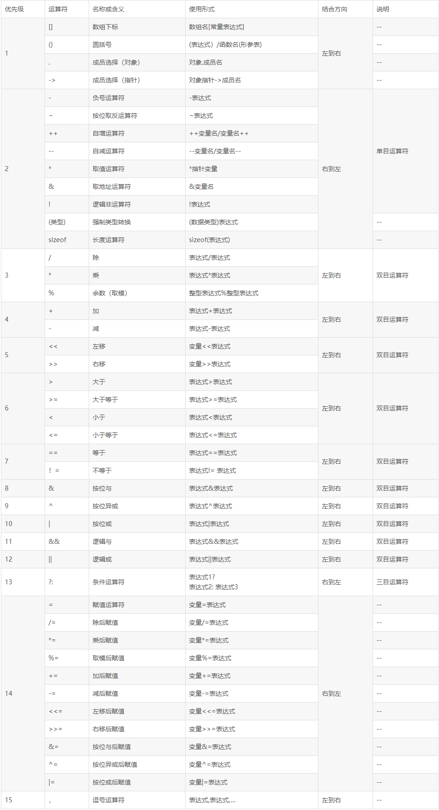

### 3.7 类型转换

数据有不同的类型，不同类型数据之间进行混合运算时必然涉及到类型的转换问题

转换的方法有两种：

- 自动转换(隐式转换)：遵循一定的规则,由编译系统自动完成。
- 强制类型转换：把表达式的运算结果强制转换成所需的数据类型。

类型转换的原则：<font color="red">占用内存字节数少(值域小)的类型，向占用内存字节数多(值域大)的类型转换，以保证精度不降低</font>

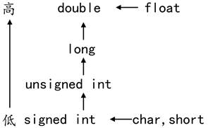

#### 3.7.1 隐式转换

```c
#include <stdio.h>

int main()
{
	int num = 5;
	printf("s1=%d\n", num / 2);
	printf("s2=%lf\n", num / 2.0);

	return 0;
}
```

输出结果：

```c
tao@Taoc:~/Desktop/C/3$ ./3.7.1 
S1 = 2
S2 = 2.500000
```

#### 3.7.2 强制转换

强制类型转换指的是使用强制类型转换运算符，将一个变量或表达式转化成所需的类型，其基本语法格式如下所示：

`(类型说明符) (表达式)`

```c
#include <stdio.h>

int main(){
	float x = 0;
	int i = 0;
	x = 3.6f;
	
	i = x;
	i = (int)x;
	
	printf("x=%f, i=%d\n", x, i);
	
	return 0;
}
```

输出结果：

```bash
tao@Taoc:~/Desktop/C/3$ ./3.7.2 
x=3.600000, i=3
```

## 4. 程序流程结构

### 4.1 概述

C语言支持最基本的三种程序运行结构：顺序结构、选择结构、循环结构。

- 顺序结构：程序按顺序执行，不发生跳转。

- 选择结构：依据是否满足条件，有选择的执行相应功能。

- 循环结构：依据条件是否满足，循环多次执行某段代码。

### 4.2 选择结构

#### 4.2.1 if语句


```c
#include <stdio.h>

int main()
{
	int a = 1;
	int b = 2;

	if (a > b)
	{
		printf("%d\n", a);
	}

	return 0;
} 
```

#### 4.2.2 if…else语句


```c
#include <stdio.h>
int main()
{
	int a = 1;
	int b = 2;

	if (a > b)
	{
		printf("%d\n", a);
	}
	else
	{
		printf("%d\n", b);
	}
	return 0;
}

```

#### 4.2.3 if…else if…else语句

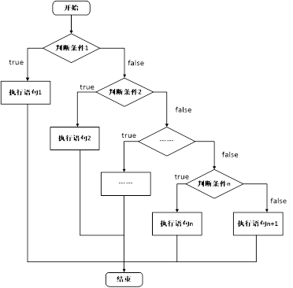

```c
#include <stdio.h>

int main()
{
	unsigned int a;
	scanf("%u", &a);

	if (a < 10)
	{
		printf("个位\n");
	}
	else if (a < 100)
	{
		printf("十位\n");
	}
	else if (a < 1000)
	{
		printf("百位\n");
	}
	else
	{
		printf("很大\n");
	}

	return 0;
}
```

#### 4.2.4 三目运算符

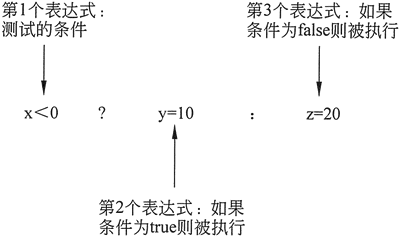

```c
#include <stdio.h>

int main()
{
	int a = 10;
	int b = 20;
	int c;

	if (a > b)
	{
		c = a;
	}
	else
	{
		c = b;
	}
	printf("c1 = %d\n", c);

	a = 1;
	b = 2;
	c = ( a > b ? a : b );
	printf("c2 = %d\n", c);

	return 0;
}

```

#### 4.2.5 switch语句

```c
#include <stdio.h>

int main()
{
	char c;
	c = getchar();

	switch (c) //参数只能是整型变量
	{
	case '1':
		printf("OK\n");
		break;//switch遇到break就中断了
	case '2':
		printf("not OK\n");
		break;
	default://如果上面的条件都不满足，那么执行default
		printf("are u ok?\n");
	}
	return 0;
}
```

输出结果：

```bash
tao@Taoc:~/Desktop/C/4$ ./4.2.5 
t
are u ok?
```

### 4.3 循环语句

#### 4.3.1 while语句


```c
#include <stdio.h>

int main()
{
	int a = 20;
	while (a > 10)
	{
		scanf("%d", &a);
		printf("a = %d\n", a);
	}

	return 0;
}
```

#### 4.3.2 do…while语句


```c
#include <stdio.h>

int main()
{
	int a = 1;
	do
	{
		a++;
		printf("a = %d\n", a);
	} while (a < 10);

	return 0;
}

```

#### 4.3.3 for 语句

```cmd
#include <stdio.h>

int main()
{
	int i;
	int sum = 0;
	for (i = 0; i <= 100; i++)
	{
		sum += i;

	}

	printf("sum = %d\n", sum);

	return 0;
}
```

#### 4.3.4 嵌套循环

```c
#include <stdio.h>

int main()
{
	int num = 0;
	int i, j, k;
	for (i = 0; i < 10; i++)
	{
		for (j = 0; j < 10; j++)
		{
			for (k = 0; k < 10; k++)
			{
				printf("hello world\n");
				num++;
			}
		}
	}

	printf("num = %d\n", num);

	return 0;
}

```

### 4.4 跳转语句break、continue、goto

#### 4.3.1 break 语句

在switch条件语句和循环语句中都可以使用`break`语句：

- 当它出现在`switch`条件语句中时，作用是终止某个`case`并跳出`switch`结构。
- 当它出现在循环语句中，作用是跳出当前内循环语句，执行后面的代码。
- 当它出现在嵌套循环语句中，跳出最近的内循环语句，执行后面的代码

```bash
#include <stdio.h>

int main()
{
	int i = 0;
	while (1)
	{
		i++;
		printf("i = %d\n", i);

		if (i == 10)
		{
			break; //跳出while循环
		}
	}

	int flag = 0;
	int m = 0;
	int n = 0;

	for (m = 0; m < 10; m++)
	{
		for (n = 0; n < 10; n++)
		{
			if (n == 5)
			{
				flag = 1;
				break; //跳出for (n = 0; n < 10; n++)
			}
		}

		if (flag == 1)
		{
			break; //跳出for (m = 0; m < 10; m++)
		}
	}

	return 0;
}
```

输出结果：

```bash
tao@Taoc:~/Desktop/C/4$ ./4.3.1
i = 1
i = 2
i = 3
i = 4
i = 5
i = 6
i = 7
i = 8
i = 9
i = 10
```

#### 4.4.2 continue语句

在循环语句中，如果希望立即终止本次循环，并执行下一次循环，此时就需要使用`continue`语句

```c
#include<stdio.h>

int main()
{
	int sum = 0;           //定义变量sum

	for (int i = 1; i <= 100; i++)
	{
		if (i % 2 == 0)   //如果i是一个偶数，执行if语句中的代码
		{
			continue;      //结束本次循环
		}
		sum += i;          //实现sum和i的累加
	}

	printf("sum = %d\n", sum);

	return 0;
}
```

```bash
tao@Taoc:~/Desktop/C/4$ ./4.4.2
sum = 2500
```

#### 4.4.3 goto语句(无条件跳转，尽量少用)

```c
#include <stdio.h>

int main()
{
	goto End; //无条件跳转到End的标识
	printf("aaaaaaaaa\n");

End:
	printf("bbbbbbbb\n");

	return 0;
}
```

输出结果：

```c
tao@Taoc:~/Desktop/C/4$ ./4.4.3 
bbbbbbbb
```

## 5. 数组和字符串

### 5.1 概述

> 在程序设计中，为了方便处理数据把具有相同类型的若干变量按有序形式组织起来——称为数组

<font color="red">数组就是在内存中连续的相同类型的变量空间</font>。同一个数组所有的成员都是相同的数据类型，同时所有的成员在内存中的地址是连续的

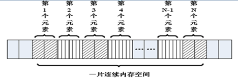

数组属于构造数据类型：

- 一个数组可以分解为多个数组元素：这些数组元素可以是基本数据类型或构造类型

- ```c
  int a[10];
  struct Stu boy[10]
  ```

- 按数组元素类型的不同，数组可分为：数值数组、字符数组、指针数组、结构数组等类别

- ```c
  int a[10];
  char s[10];
  char *p[10];
  ```

  通常情况下，数组元素下标的个数也称为维数，根据维数的不同，可将数组分为一维数组、二维数组、三维数组、四维数组等。通常情况下，<font color="red">我们将二维及以上的数组称为多维数组</font>

### 5.2 一维数组

#### 5.2.1  一维数组的定义和使用

- 数组名字符合标识符的书写规定(数字、英文字母、下划线)

- <font color="red">数组名不能与其它变量名相同，同一作用域内是唯一的</font>

- 方括号[]中常量表达式表示数组元素的个数

- ```c
  int a[3]表示数组a有3个元素
  其下标从0开始计算，因此3个元素分别a[0],a[1],a[2]
  ```

- <font color="red">定义数组时[]内最好是常量，使用数组时[]内即可是常量，也可以是变量</font>

```c
#include <stdio.h>

int main()
{
	int a[10];//定义了一个数组，名字叫a，有10个成员，每个成员都是int类型
	//a[0]…… a[9]，没有a[10]
	//没有a这个变量，a是数组的名字，但不是变量名，它是常量
	a[0] = 0;
	//……
	a[9] = 9;

	int i = 0;
	for (i = 0; i < 10; i++)
	{
		a[i] = i; //给数组赋值
	}

	//遍历数组，并输出每个成员的值
	for (i = 0; i < 10; i++)
	{
		printf("%d ", a[i]);
	}
	printf("\n");

	return 0;
}
```

输出结果：

```bash
tao@Taoc:~/Desktop/C/5$ ./5.2.1 
0123456789
```

#### 5.2.2 一维数组的初始化

在定义数组的同时进行赋值，称为初始化。全局数组若不初始化，编译器将其初始化为零。<font color="red">局部数组若不初始化，内容为随机值。</font>

```c
int a[10] = { 1, 2, 3, 4, 5, 6, 7, 8, 9, 10 };//定义一个数组，同时初始化所有成员变量
int a[10] = { 1, 2, 3 };//初始化前三个成员，后面所有元素都设置为0
int a[10] = { 0 };//所有的成员都设置为0
//[]中不定义元素个数，定义时必须初始化
int a[] = { 1, 2, 3, 4, 5 };//定义了一个数组，有5个成员
```

#### 5.2.3 数组名

<font color="red">数组名是一个地址的常量，代表数组中首元素的地址</font>

```c
#include <stdio.h>

int main()
{
	int a[10] = { 1, 2, 3, 4, 5, 6, 7, 8, 9, 10 };//定义一个数组，同时初始化所有成员变量

	printf("a = %p\n", a);
	printf("&a[0] = %p\n", &a[0]);

	int n = sizeof(a); //数组占用内存的大小，10个int类型，10 * 4  = 40
	int n0 = sizeof(a[0]);//数组第0个元素占用内存大小，第0个元素为int，4

	int i = 0;
	for (i = 0; i < sizeof(a) / sizeof(a[0]); i++)
	{
		printf("%d ", a[i]);
	}
	printf("\n");

	return 0;
}

```

输出结果：

```bash
tao@Taoc:~/Desktop/C/5$ ./5.2.3 
a = 0x7ffcfbfe16d0
&a[0]=0x7ffcfbfe16d0
12345678910
```

#### 5.2.4 强化训练

##### 1. 一维数组的最值

```c
#include <stdio.h>

int main()
{
	int a[] = {  1, -2, 3,- 4, 5, -6, 7, -8, -9, 10 };//定义一个数组，同时初始化所有成员变量

	int i = 0;
	int max = a[0];
	for (i = 1; i < sizeof(a) / sizeof(a[0]); i++)
	{
		if (a[i] > max)
		{
			max = a[i];
		}
	}
	printf("数组中最大值为：%d\n", max);

	return 0;
}
```

输出结果：

```bash
tao@Taoc:~/Desktop/C/5$ ./5.2.4-1 
数组中最大值为:10
```

##### 2. 一维数组的逆置

```c
#include <stdio.h>

int main(){
	int a[] = {  1, -2, 3,- 4, 5, -6, 7, -8, -9, 10 };
	int i = 0;
	int j = sizeof(a) / sizeof(a[0]) - 1;
	int tmp;

	while (i < j){
		tmp = a[i];
		a[i] = a[j];
		a[j] = tmp;	
		i++;
		j--;
	}
	for(i = 0; i < sizeof(a)/sizeof(a[0]); i++){
		printf("%d, ", a[i]);
	}
	printf("\n");

	return 0;
}

```

输出结果：

```
tao@Taoc:~/Desktop/C/5$ ./5.2.4-2 
10, -9, -8, 7, -6, 5, -4, 3, -2, 1, 
```

> 源文件的代码是有问题的，因为它`i++, j++` 放在了交换位置的前面，导致数组的第一个没有反转

##### 3. 冒泡排序

```bash
#include <stdio.h>

int main()
{
	int a[] = {  1, -2, 3,- 4, 5, -6, 7, -8, -9, 10 };
	int i = 0;
	int j = 0;
	int n = sizeof(a)/sizeof(a[0]);
	int tmp;

	// 1. 流程
	// 2. 试数
	for(i = 0; i < n; i++)
	{
		for(j = 0; j < n - i - 1; j++)
		{
			if(a[j] > a[j+1])
			{
				tmp = a[j];
				a[j] = a[j+1];
				a[j+1] = tmp;
			}
		}
	}

	for(i = 0; i < n; i++)
	{
		printf("%d",a[i]);
	}
	printf("\n");

	return 0;

}
```

输出结果：

```bash
tao@Taoc:~/Desktop/C/5$ ./5.2.4-3 
-9-8-6-4-2135710
```

### 5.3 二维数组

####  5.3.1 二维数组的定义和使用

> 二维数组定义的一般形式是：
>
> `类型说明符 数组名[常量表达式1][常量表达式2]`

其中常量表达式1表示第一维下标的长度，常量表达式2 表示第二维下标的长度。

`int a[3][4];`

- 命名规则同一维数组
- 定义了一个三行四列的数组，数组名为a其元素类型为整型，该数组的元素个数为3×4个，即：

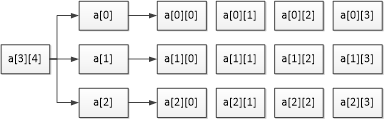

二维数组a是按行进行存放的，先存放a[0]行，再存放a[1]行、a[2]行，并且每行有四个元素，也是依次存放的

- 二维数组在概念上是二维的：其下标在两个方向上变化，对其访问一般需要两个下标。
- 在内存中并不存在二维数组，二维数组实际的硬件存储器是连续编址的，<font color="red">也就是说内存中只有一维数组</font>，即放完一行之后顺次放入第二行，和一维数组存放方式是一样的。

```c
#include <stdio.h>

int main()
{
	// 定义一个二维数组，名字叫a
    // 由3个一维数组组成，这个一维数组是int[4]
    // 这3个一维数组的数组名分别为a[0],a[1],a[2]
    int a[3][4];
    
    a[0][0] = 0;
    
    a[2][3] = 12;
    
    // 给数组每个元素赋值
    int i = 0;
    int j = 0;
    int num = 0;
    
    for(i=0; j < 4; i++)
    {
        for(j = 0; j < 4; j++)
        {
            a[i][j] = num++;
        }
    }
    
    // 遍历数组，并输出每个成员的值
    for(i = 0; i < 3; i++)
    {
        for(j = 0; j < 4; j++)
        {
            printf("%d", a[i][j]);
        }
        printf("\n");
    }
    
    return 0;
    
}
```

#### 5.3.2 二维数组的初始化

```c
//分段赋值 	int a[3][4] = {{ 1, 2, 3, 4 },{ 5, 6, 7, 8, },{ 9, 10, 11, 12 }};

int a[3][4] = 
	{ 
		{ 1, 2, 3, 4 },
		{ 5, 6, 7, 8, },
		{ 9, 10, 11, 12 }
	};
	// 连续赋值
	int a[3][4] = { 1, 2, 3, 4 , 5, 6, 7, 8, 9, 10, 11, 12  };
	// 可以只给部分元素赋初值，未初始化则为0
	int a[3][4] = { 1, 2, 3, 4  };
	
	//所有的成员都设置为0
	int a[3][4] = {0};
	
	//[]中不定义元素个数，定义时必须初始化
	int a[][4] = { 1, 2, 3, 4, 5, 6, 7, 8};
```

#### 5.3.3 数组名

<font color="red">数组名是一个地址的常量，代表数组中首元素的地址</font>

```c
#include <stdio.h>

int main()
{
	//定义了一个二维数组，名字叫a
	//二维数组是本质上还是一维数组，此一维数组有3个元素
//每个元素又是一个一维数组int[4]
	int a[3][4] = { 1, 2, 3, 4 , 5, 6, 7, 8, 9, 10, 11, 12  };

	//数组名为数组首元素地址，二维数组的第0个元素为一维数组
	//第0个一维数组的数组名为a[0]
	printf("a = %p\n", a);
	printf("a[0] = %p\n", a[0]);
	
	//测二维数组所占内存空间，有3个一维数组，每个一维数组的空间为4*4
	//sizeof(a) = 3 * 4 * 4 = 48
	printf("sizeof(a) = %d\n", sizeof(a));

	//测第0个元素所占内存空间，a[0]为第0个一维数组int[4]的数组名，4*4=16
	printf("sizeof(a[0]) = %d\n", sizeof(a[0]) );

	//测第0行0列元素所占内存空间，第0行0列元素为一个int类型，4字节
	printf("sizeof(a[0][0]) = %d\n", sizeof(a[0][0]));

	//求二维数组行数
	printf("i = %d\n", sizeof(a) / sizeof(a[0]));

	// 求二维数组列数
	printf("j = %d\n", sizeof(a[0]) / sizeof(a[0][0]));

	//求二维数组行*列总数
	printf("n = %d\n", sizeof(a) / sizeof(a[0][0]));

	return 0;
}

```

输出结果：

```c
tao@Taoc:~/Desktop/C/5$ ./5.3.3 
a = 0x7ffe09fd1e60
a[0] = 0x7ffe09fd1e60
sizeof(a) = 48
sizeof(a[0]) = 16
sizeof(a[0][0]) = 4
i = 3
j = 4
n = 12
```

#### 5.3.4 强化训练

```php
#include <stdio.h>

int main()
{
    //二维数组：  五行、三列
	//行代表人：  老大到老五
	//列代表科目：语、数、外

    float a[5][3] =  { { 80, 75, 56 }, { 59, 65, 71 }, { 59, 63, 70 }, { 85, 45, 90 }, { 76, 77, 45 } };
   	
    int i,j,person_low[3] = {0};
    float s=0,lesson_aver[3] = {0};
    
    for(i = 0; i < 3; i++)
    {
        for(j = 0;j < 5; j++)
        {
            s = s + a[i][j];
            if(a[i][j] < 60)
            {
                person_low[i]++;
            }
        }
        lesson_aver[i] = s/5;
        s = 0;
    }
    printf("各科的平均成绩:\n");
	for (i = 0; i < 3; i++)
	{
		printf("%.2f\n", lesson_aver[i]);
	}
		
	printf("各科不及格的人数:\n");
	for (i = 0; i < 3; i++)
	{
		printf("%d\n", person_low[i]);
	}
		
	return 0;
}
```

输出结果：

```bash
tao@Taoc:~/Desktop/C/5$ ./5.3.4 
各科的平均成绩:
67.00
63.40
64.40
各科不及格的人数:
2
2
2
```

### 5.4 多维数组(了解)

多维数组的定义与二维数组类似，其语法格式具体如下：

`数组类型修饰符 数组名 [n1][n2]…[nn];`

```c
int a[3][4][5];
```

定义了一个三维数组，数组的名字是a，数组的长度为3，每个数组的元素又是一个二维数组，这个二维数组的长度是4，并且这个二维数组中的每个元素又是一个一维数组，这个一维数组的长度是5，元素类型是`int`;

```c
#include <stdio.h>

int main(){
	// int a[3][4][5]; //定义了一个三维数组，有3个二维数组int[4][5]
	int a[3][4][5] = { { { 1, 2, 3, 4, 5 }, { 6, 7, 8, 9, 10 }, { 0 }, { 0 } }, { { 0 }, { 0 }, { 0 }, { 0 } }, { { 0 }, { 0 }, { 0 }, { 0 } } };
    int i, j, k;
	for (i = 0; i < 3; i++)
	{
		for (j = 0; j < 4; j++)
		{
			for (k = 0; k < 5; k++)
			{
				//添加访问元素代码
				printf("%d, ", a[i][j][k]);
			}
			printf("\n");
		}
	}
	return 0;
}
```

输出结果：

```c
tao@Taoc:~/Desktop/C/5$ ./5.4 
1, 2, 3, 4, 5, 
6, 7, 8, 9, 10, 
0, 0, 0, 0, 0, 
0, 0, 0, 0, 0, 
0, 0, 0, 0, 0, 
0, 0, 0, 0, 0, 
0, 0, 0, 0, 0, 
0, 0, 0, 0, 0, 
0, 0, 0, 0, 0, 
0, 0, 0, 0, 0, 
0, 0, 0, 0, 0, 
0, 0, 0, 0, 0, 
```

### 5.5 字符数组与字符串

#### 5.5.1 字符数组与字符串区别

- C语言中没有字符串这种数据类型，可以通过char的数组来替代；
- 字符串一定是一个char的数组，但char的数组未必是字符串；
- <font color="red">数字0(和字符‘`\0`’等价)结尾的char数组就是一个字符串</font>，但如果char数组没有以数字0结尾，那么就不是一个字符串，只是普通字符数组，所以<font color="red">字符串是一种特殊的char的数组</font>

```c
#include <stdio.h>

int main()
{
	char c1[] = { 'c', ' ', 'p', 'r', 'o', 'g' }; //普通字符数组
	printf("c1 = %s\n", c1); //乱码，因为没有’\0’结束符

	//以‘\0’(‘\0’就是数字0)结尾的字符数组是字符串
	char c2[] = { 'c', ' ', 'p', 'r', 'o', 'g', '\0'}; 
	printf("c2 = %s\n", c2);

	//字符串处理以‘\0’(数字0)作为结束符，后面的'h', 'l', 'l', 'e', 'o'不会输出
	char c3[] = { 'c', ' ', 'p', 'r', 'o', 'g', '\0', 'h', 'l', 'l', 'e', 'o', '\0'};
	printf("c3 = %s\n", c3);

	return 0;
}

```

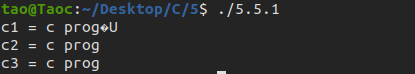

#### 5.5.2 字符串的初始化

```c
#include <stdio.h>

// C语言没有字符串类型，通过字符数组模拟
// C语言字符串，以字符'\0', 数字0

int main()
{
    //不指定长度, 没有0结束符，有多少个元素就有多长
    char buf[] = {'a', 'b', 'c'};
    printf("buf = %s\n", buf);	//乱码
    
    //指定长度，后面没有赋值的元素，自动补0
	char buf2[100] = { 'a', 'b', 'c' };
	char buf[1000]={"hello"};
	printf("buf2 = %s\n", buf2);

    //所有元素赋值为0
	char buf3[100] = { 0 };
    //char buf4[2] = { '1', '2', '3' };//数组越界
    char buf5[50] = { '1', 'a', 'b', '0', '7' };
	printf("buf5 = %s\n", buf5);

	char buf6[50] = { '1', 'a', 'b', 0, '7' };
	printf("buf6 = %s\n", buf6);
    
    char buf7[50] = { '1', 'a', 'b', '\0', '7' };
	printf("buf7 = %s\n", buf7);

    //使用字符串初始化，编译器自动在后面补0，常用
	char buf8[] = "agjdslgjlsdjg";

    //'\0'后面最好不要连着数字，有可能几个数字连起来刚好是一个转义字符
	//'\ddd'八进制字义字符，'\xdd'十六进制转移字符
	// \012相当于\n
	char str[] = "\012abc";
	printf("str == %s\n", str);	
    
    return 0;
}
```

#### 5.5.3 字符串的输入输出

> 由于字符串采用了'\0'标志，字符串的输入输出将变得简单方便

```c
#include <stdio.h>

int main()
{
	char str[100];
   
	printf("input string1 : \n");
	scanf("%s", str);//scanf(“%s”,str)默认以空格分隔
	printf("output:%s\n", str);

	return 0;
}
```

##### 1. gets()

```c
#include <stdio.h>
char *gets(char *s);
```

功能：从标准输入读入字符，并保存到s指定的内存空间，直到出现换行符或读到文件结尾为止。
参数：
	`s`：字符串首地址
返回值：
	成功：读入的字符串
	失败：NULL

`gets(str)`与`scanf(“%s”,str)`的区别：

- `gets(str)`允许输入的字符串含有空格
- `scanf(“%s”,str)`不允许含有空格

> 注意：由于`scanf()`和`gets()`无法知道字符串s大小，必须遇到换行符或读到文件结尾为止才接收输入，因此容易导致字符数组越界(缓冲区溢出)的情况

```c
char str[100];
	printf("请输入str: ");
	gets(str);
	printf("str = %s\n", str);
```

##### 2. fgets()

```c
#include <stdio.h>
char *fgets(char *s, int size, FILE *stream);
```

>  功能：从stream指定的文件内读入字符，保存到s所指定的内存空间，直到出现换行字符、读到文件结尾或是已读了`size - 1`个字符为止，最后会自动加上字符 '`\0`' 作为字符串结束。
> 参数：
> 	`s`：字符串
> 	`size`：指定最大读取字符串的长度（size - 1）
> 	`stream`：文件指针，如果读键盘输入的字符串，固定写为stdin
> 返回值：
> 	成功：成功读取的字符串
> 	读到文件尾或出错： NULL
>
> 

>  `fgets()`在读取一个用户通过键盘输入的字符串的时候，同时把用户输入的回车也做为字符串的一部分。通过`scanf`和`gets`输入一个字符串的时候，不包含结尾的“`\n`”，但通过`fgets`结尾多了“`\n`”。`fgets()`函数是安全的，不存在缓冲区溢出的问题

```c
char str[100];
	printf("请输入str: ");
	fgets(str, sizeof(str), stdin);
	printf("str = \"%s\"\n", str);
```

##### 3. puts()

```c
#include <stdio.h>
int puts(const char *s);
```

> 功能：标准设备输出s字符串，<font color="red">在输出完成后自动输出一个'\n'。</font>
>
> 参数：
>
> ​    s：字符串首地址
>
> 返回值：
>
> ​    成功：非负数
>
> ​    失败：-1

```c
#include <stdio.h>

int main()
{
	printf("hello world");
	puts("hello world");

	return 0;
}
```

##### 4. fputs()

```c
#include <stdio.h>
int fputs(const char * str, FILE * stream);
```

> 功能：将str所指定的字符串写入到stream指定的文件中， 字符串结束符 '\0'  不写入文件。 
>
> 参数：
>
> ​    str：字符串
>
> ​    stream：文件指针，<font color="red">如果把字符串输出到屏幕，固定写为stdout</font>
>
> 返回值：
>
> ​    成功：0
>
> ​    失败：-1

`fputs()`是`puts()`的文件操作版本，但`fputs()`<font color="red">不会</font>自动输出一个'`\n`'

```c
    printf("hello world");
    puts("hello world");
    fputs("hello world", stdout);
```

##### 5. strlen()

```c
#include <string.h>
size_t strlen(const char *s);
```

> 功能：计算指定指定字符串s的长度，<font color="red">不包含字符串结束符‘`\0`’</font>
>
> 参数：
>
> ​	s：字符串首地址
>
> 返回值：字符串s的长度，size_t为unsigned int类型

```c
	char str[] = "abc\0defg";
	int n = strlen(str);
	printf("n = %d\n", n);

// 输出 n = 3
```

#### 5.5.4 字符串追加

```c
#include <stdio.h>

int main()
{
	char str1[] = "abcdef";
	char str2[] = "123456";
	char dst[100];

	int i = 0;
	while (str1[i] != 0)
	{
		dst[i] = str1[i];
		i++;
	}

	int j = 0;
	while (str2[j] != 0)
	{
		dst[i + j] = str2[j];
		j++;
	}
	dst[i + j] = 0; //字符串结束符

	printf("dst = %s\n", dst);

	return 0;
}
```

